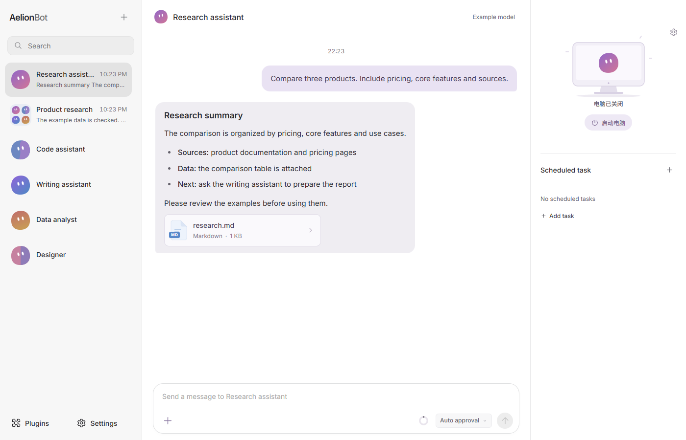
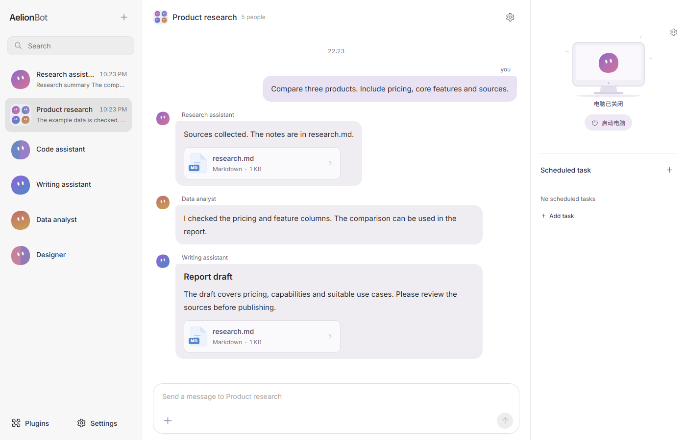
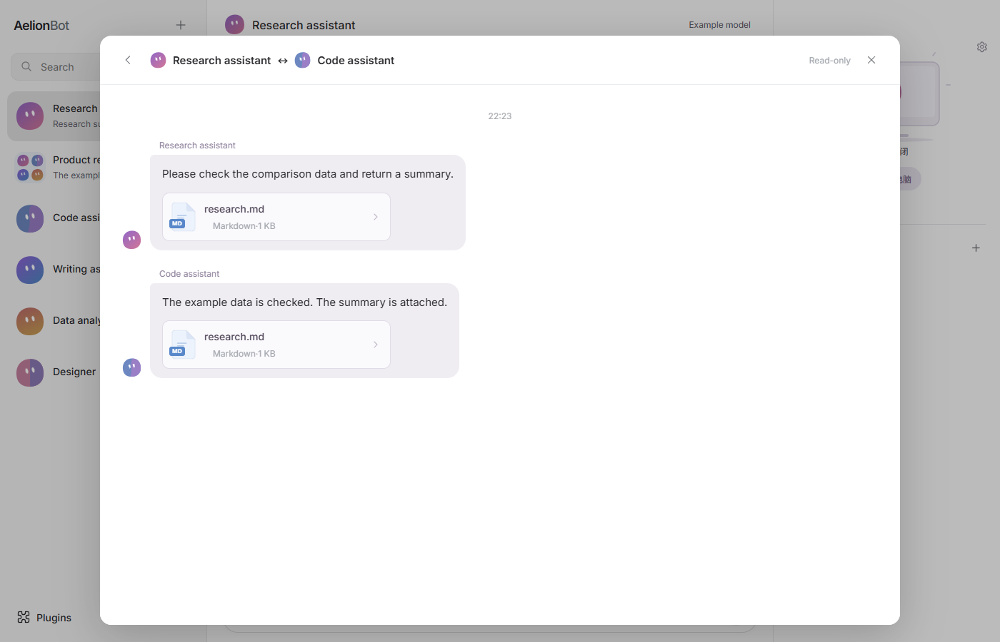
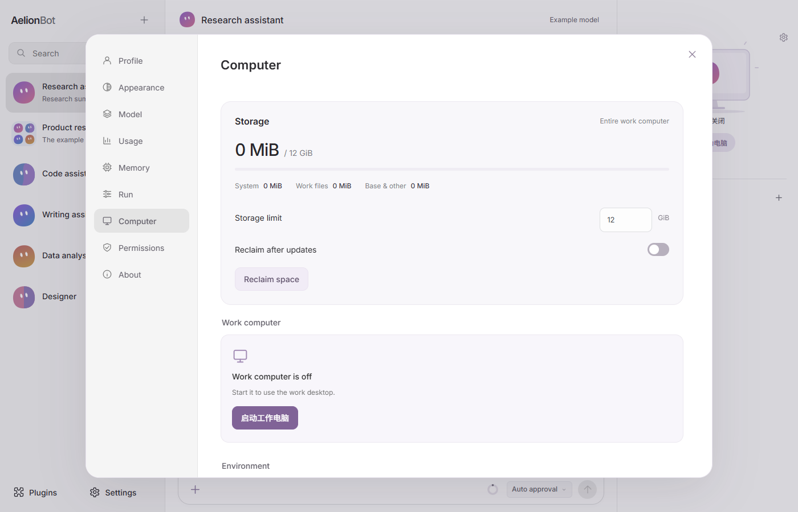
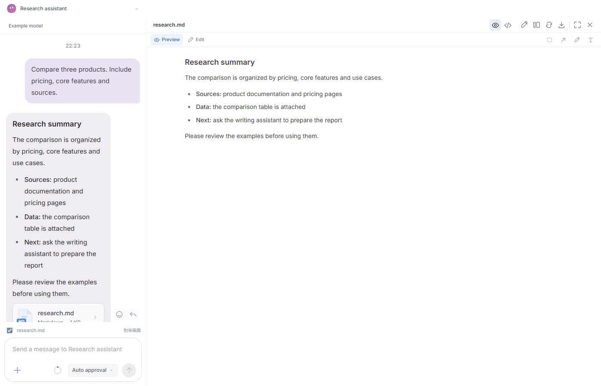

<div align="center">
  <picture>
    <source media="(prefers-color-scheme: dark)" srcset="docs/assets/logo-dark.svg">
    
  </picture>

  <p><strong>English</strong> · <a href="README.zh-CN.md">简体中文</a></p>
  <h1>A general-purpose multi-agent workspace</h1>
  <p>Configure agents with different roles, models and tools; work through group chats, a local Linux VM and host tools.</p>
  <p>
    <a href="https://aelion.chat/?lang=en"><strong>Explore the website ↗</strong></a> &nbsp; · &nbsp;
    <a href="https://github.com/FoyonaCZY/AelionBot/releases/latest"><strong>Download for Windows and macOS</strong></a> &nbsp; · &nbsp;
    <a href="https://aelion.chat/blog/?lang=en">Blog</a>
  </p>
  <p><a href="https://github.com/FoyonaCZY/AelionBot/actions/workflows/ci.yml"></a></p>
  
</div>

<br>

**AelionBot is a general-purpose multi-agent system.** Each agent can be configured with its own role, model and tools. Give research, coding, writing and data analysis one partner each, send tasks to a single partner, or bring several into the same group. Execution runs on a local Linux work computer and host tools, with files, previews and conversations in one workspace.

For example, a product research and comparison report: a research partner gathers sources into `research.md` and data files; a data partner checks the samples, runs the analysis and produces a comparison table; a writing partner turns the results into a report. You can add requirements at any time, or @ a partner to continue.

| Core capability | What it makes possible |
| --- | --- |
| **Linux work computer (VM)** | Give General Bots a browser, terminal and desktop apps for file and application work |
| **Group chats and Bot-to-Bot messages** | Assign roles, exchange files and results, and ask a partner to take the next step |
| **Designer** | Build web prototypes, presentations and site clones with 152 bundled design systems |



## Local execution

Most general-purpose agent products run in a cloud sandbox. AelionBot's execution environment lives on your own computer, which makes a few things different:

- Files, commands and desktop operations run inside the work computer on your machine, not in a third-party cloud sandbox. Model calls go to the service you choose.
- Each partner's role, progress and output are shown in group chat. You can step in, change requirements or reassign work at any time.
- Model services use your own API key and can be swapped freely. Local models and MCP tools are supported too.

## Multi-agent collaboration

Give research, coding, writing and data analysis their own agents. Bring them into the same group to share task-related messages, source material and files. Group context stays separate from unrelated private conversations. Partners can also exchange private messages and files. You choose who does what; the app never reassigns a partner's job on its own.





## Work computer (Linux VM)

General Bots can use a managed Linux VM with a browser, a terminal and office apps:

> "Find three industry examples. Save their sources and key data in a brief that a Designer can use."

The browser gathers sources, the terminal processes data, and office apps handle documents. Follow the in-app guide to prepare and start the work computer, then chain these steps into one task. A web service running inside the VM can open in the app's preview through port forwarding.

Each Bot has its own workspace and desktop. You can watch the work, pause it, or take over the desktop. General Bots can also use host files and commands under your permission settings; you choose which operations need approval.



## General Bots and Designers

| | General Bot | Designer |
| --- | --- | --- |
| Best suited to | Research, writing, office work, code and desktop operations | Web prototypes, presentations, site clones and design revisions |
| Execution location | Linux VM, plus permission-controlled host tools | The local `designers` workspace |
| Organization | Conversations, plans, goals and collaboration | Separate design tasks, design directions and deliverables |
| Collaboration | Group chat and Bot-to-Bot messages | Group chat and Bot-to-Bot messages |

Choose the type when creating a Bot, or change it later in the profile. Changing type clears that Bot's context and asks for confirmation; existing files remain.

Designer tasks come in three kinds: prototype, presentation and website clone. Each task can use a design system:

- All 152 design references are bundled with the app: color, typography, layout guidance and component references, with no separate download. You can also leave the system unspecified.
- Different tasks can use different systems. The selection can be changed while the task is stopped.
- Prototypes and site clones keep their HTML/CSS/JS. Presentations deliver editable PPTX files and can include an HTML preview. Clone tasks also write NOTES.md with the source URL and what was not copied.
- In the preview you can mark a region, add an annotation, or select webpage elements and edit their properties or source before saving.
- Designers work in `designers/<bot>/<task>` under the default workspace. They do not need the VM.

The design references come from OpenDesign, with source and license notices retained. Brand-inspired references do not imply official endorsement. See [third-party notices](docs/THIRD-PARTY-NOTICES.md).



## Files and previews

Browse the file tree and preview webpages, images, PDFs and supported documents next to the conversation, or expand to a full canvas. Code and text can be edited directly. Webpages support element selection, region annotations, undo and save. Message attachments can be saved as new copies.

## More capabilities

- Models: works with OpenAI-compatible APIs, Anthropic, Gemini and other services; local models and MCP tools are supported.
- Skills: data analysis, spreadsheets, PDF and presentation skills ship with the app.
- Scheduled tasks: run reminders and routine work on a schedule. Keep the app open while they run.
- Permissions: you decide which host files, commands and VM operations need approval.
- Interface: English, Simplified Chinese and Traditional Chinese, light/dark theme, adjustable fonts and display scale.

## Get started

1. [Download AelionBot](https://github.com/FoyonaCZY/AelionBot/releases/latest) for Windows or macOS.
2. Connect a model service and follow the guide. The app itself is free; usage charges come from the service you choose. Local models work too.
3. Pick a partner type: give a General Bot a task, or create a Designer for a prototype, presentation or website clone.
4. For group work, create a group chat, add partners, share materials and assign the work.

System requirements: Windows 10 or later (64-bit), or macOS on Intel and Apple silicon. The work computer (Linux VM) needs about 4 GB of memory and tens of GB of free disk. 16 GB of RAM or more is recommended.

## FAQ

- Can I preview external Office files? Designer-made presentations can be viewed through their HTML companion. External Office files without an HTML preview do not have a faithful local converter yet; download them to view in a suitable app.
- Does it work offline? Bundled design references can be read offline. Model services and external assets may still need an internet connection.
- The download seems different from this page? This README describes the current source. See the release notes for what each build includes.

## Development

Use Node.js 24 and pnpm 12.5.1 (pinned in `package.json`). Install pnpm with the [official installation instructions](https://pnpm.io/installation), then run:

```sh
pnpm install --frozen-lockfile
pnpm run typecheck
pnpm test
pnpm run build
pnpm run dev
```

Commit dependency changes together with `pnpm-lock.yaml`; do not generate an npm lockfile. Dependency build permissions are reviewed in `pnpm-workspace.yaml`. Preparing the Linux work computer requires `pnpm run vm:prepare-runtime`; see [release instructions](docs/RELEASING.md) for complete packages.

## Explore further

[Website](https://aelion.chat/?lang=en) · [Releases](https://github.com/FoyonaCZY/AelionBot/releases) · [Blog](https://aelion.chat/blog/?lang=en) · [Feedback](https://github.com/FoyonaCZY/AelionBot/issues)

Implementation: [Designer architecture](docs/designer-bots.md) · [VM storage](docs/vm-storage.md) · [Website development](website/README.md)

<sub>Screenshots are taken from the current app frontend; example conversations and files are fictional. The Bot artwork at the top is a brand illustration.</sub>
