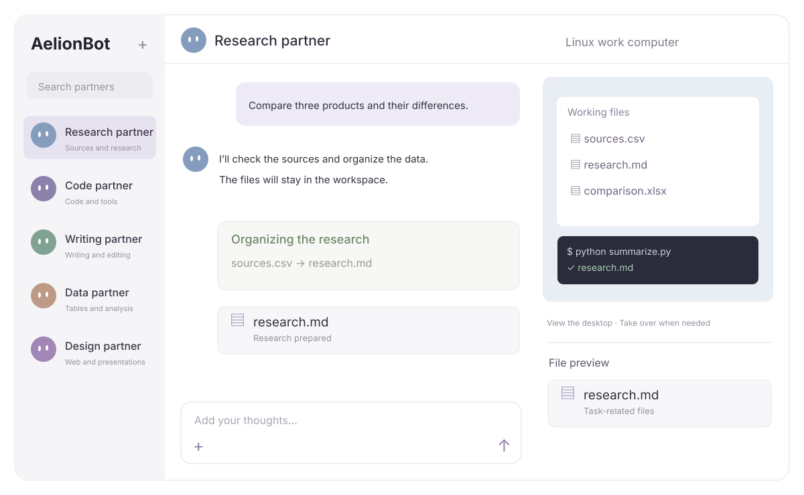
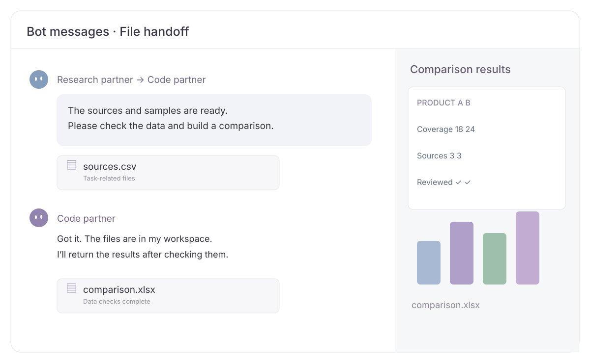
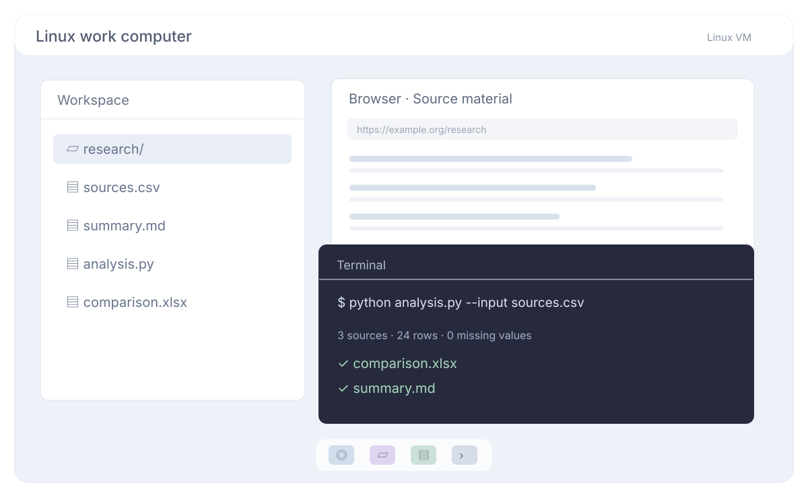

  <picture>
    <source media="(prefers-color-scheme: dark)" srcset="docs/assets/logo-dark.svg">
    
  </picture>

  
<strong>English</strong> · <a href="README.zh-CN.md">简体中文</a>

  <h1>Good ideas. Made together.</h1>
  
Your AI partners for the things you want to get done.

  

    <a href="https://aelion.chat/?lang=en"><strong>Explore the website ↗</strong></a> &nbsp; · &nbsp;
    <a href="https://github.com/FoyonaCZY/AelionBot/releases/latest"><strong>Download for Windows and macOS</strong></a> &nbsp; · &nbsp;
    <a href="https://aelion.chat/blog/?lang=en">Blog</a>
  

  

 

**AelionBot is a general-purpose multi-agent system.** Configure agents with different roles, models and tools. Work with one partner or bring a team into group chat for research, data analysis, coding, writing and office tasks. A VM and local tools handle execution, with files, previews and conversations in one workspace.

| Core capability | What it makes possible |
| --- | --- |
| **Linux work computer (VM)** | Give General Bots a browser, terminal and desktop apps for real file and application work |
| **Group chats and Bot-to-Bot messages** | Assign roles, exchange files and results, and ask a partner to take the next step |
| **Specialist roles when needed** | Add a Designer with 152 bundled design systems for webpages and presentations |

## Multi-agent collaboration: give each partner a role

Give research, coding, writing and data analysis their own agents. Bring them into the same group to share task-related messages, source material and files. Add a requirement at any time, or **@ a partner** to take the next step.

For a product research and comparison task:

1. A **research partner (General Bot)** gathers sources in the VM and shares `research.md` and data files.
2. A **data or coding partner** checks the samples, runs the analysis and produces a comparison table.
3. A **writing partner** turns the results into a report. **You** review the files, add requirements and continue the discussion.

Bots can also exchange private messages and files. Group context stays separate from unrelated private conversations. **You choose the roles**; the app does not automatically turn a General Bot into a Designer.

## A VM for work that needs a computer

General Bots can use a managed **Linux VM**. Each Bot has its own workspace and desktop within that VM, with access to webpages, apps, commands and files. Watch the work, pause it, or take over the desktop.

> “Find three industry examples. Save their sources and key data in a brief that a Designer can use.”

A browser gathers sources, a terminal processes data, and office apps handle documents. Follow the in-app guide to prepare and start the work computer. A frontend running inside the VM can also open in the app's preview through port forwarding.

General Bots can also access host files and commands under your permission settings. The VM and host workspace are distinct execution locations; you choose which operations need approval.

## Configure roles. Add specialists when needed.

| | General Bot | Designer |
| --- | --- | --- |
| Best suited to | Research, writing, office work, code and desktop operations | Web prototypes, presentations and design revisions |
| Execution location | Linux VM, plus permission-controlled host tools | The local `designers` workspace |
| Organization | Conversations, plans, goals and collaboration | Separate design tasks, design directions and deliverables |
| Collaboration | Group chat and Bot-to-Bot messages | Group chat and Bot-to-Bot messages |

Choose the type when creating a Bot, or change it in the profile. **Changing type clears that Bot's context and requires confirmation.** Running or queued work blocks the switch; existing files remain.

## A specialist role: Designers and 152 design systems

Create a Designer Bot, choose a prototype or presentation task, and select its design system. **All 152 references are bundled with the app**, including color, typography, layout guidance and component references. No separate reference download is needed, and you can leave the system unspecified.

- **Choose per task.** Different projects can use different systems. Change the selection while the task is stopped.
- **Keep editable deliverables.** Prototypes retain their HTML/CSS/JS. Presentations use editable PPTX files and can include an HTML preview.
- **Refine in the preview.** Mark a region, add an annotation, or select webpage elements and edit their properties or source before saving.
- **Work locally.** Designers use `designers/<bot>/<task>` under the configured default workspace. They do not require the VM.

The design references come from OpenDesign, with source and license notices retained. Brand-inspired references do not imply official endorsement. See [third-party notices](docs/THIRD-PARTY-NOTICES.md).

## Keep the result beside the conversation

Browse files and preview webpages, images, PDFs and supported documents. Keep chatting in a side panel, or expand the canvas. Edit code and text, select webpage elements, annotate regions, undo changes and save. Message attachments can be saved as new copies.

Designer presentations can be viewed through their HTML companion. External Office files without an HTML preview do not yet have a faithful local Designer converter; download them to view them in an appropriate app.

## Get started

1. **[Download AelionBot](https://github.com/FoyonaCZY/AelionBot/releases/latest)** for Windows or macOS.
2. **Connect your AI service** and configure a model. Usage charges depend on the service you choose.
3. **Choose a partner type:** start with a General Bot task, or create a Designer for a prototype or presentation.
4. **Bring in a team when needed:** create a group, add partners, share materials and assign the work.

Use English, Simplified Chinese or Traditional Chinese, with light/dark themes and adjustable fonts and display scale. Save preferences and schedule recurring tasks; the app must remain open while scheduled work runs. Bundled design references can be read offline, while model services and external assets may still need an internet connection.

Images are vector product illustrations with example content, not application screenshots. This README describes the current source; see release notes for the features in a downloadable build.

## Explore further

[Website](https://aelion.chat/?lang=en) · [Releases](https://github.com/FoyonaCZY/AelionBot/releases) · [Blog](https://aelion.chat/blog/?lang=en) · [Feedback](https://github.com/FoyonaCZY/AelionBot/issues)

Implementation: [Designer architecture](docs/designer-bots.md) · [VM storage](docs/vm-storage.md) · [Website development](website/README.md)
