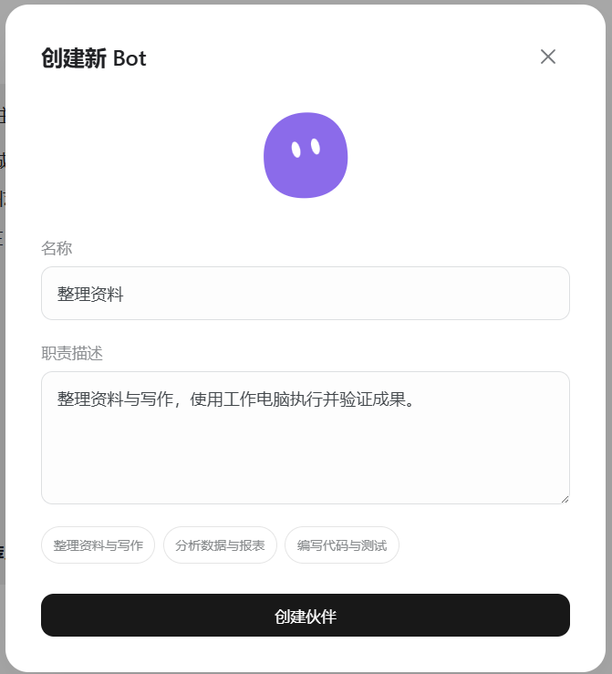
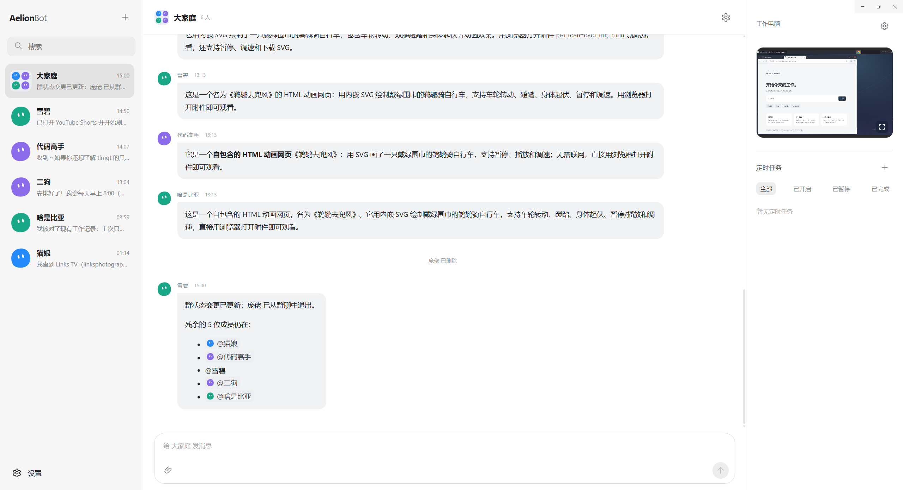
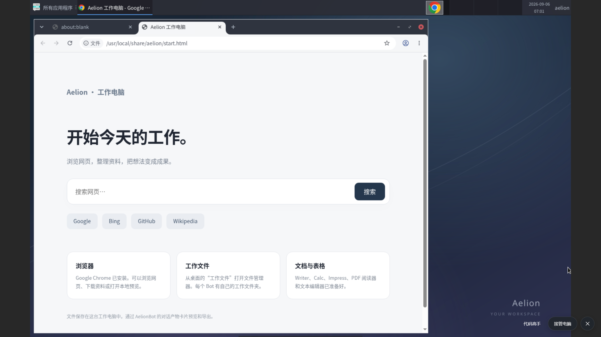
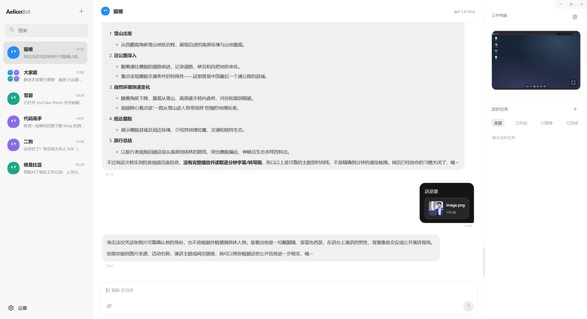
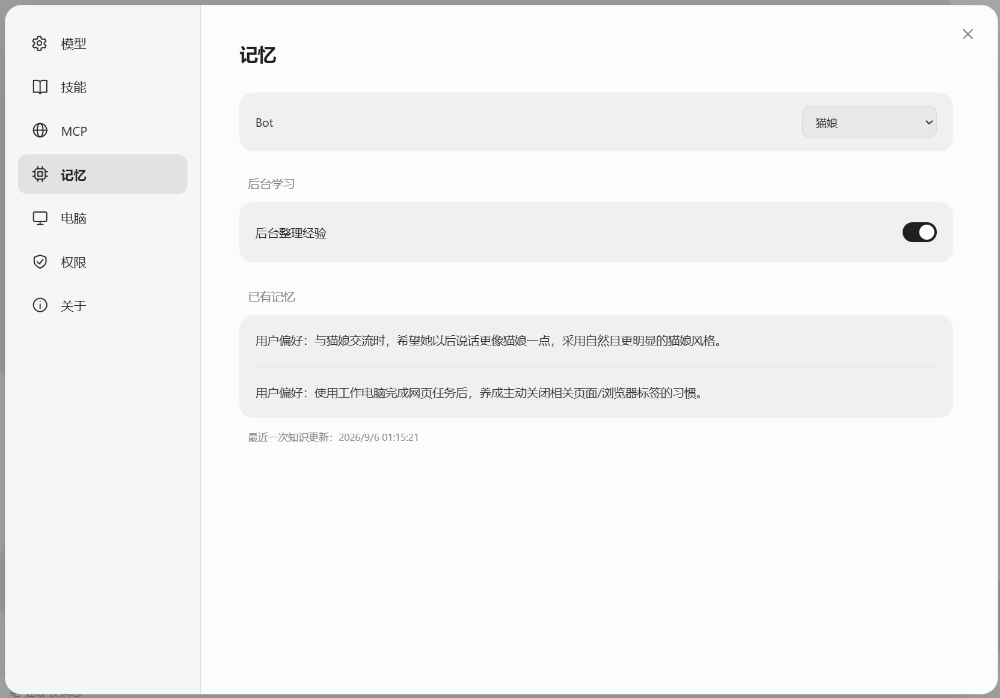

  <picture>
    <source media="(prefers-color-scheme: dark)" srcset="docs/assets/logo-dark.svg">
    <source media="(prefers-color-scheme: light)" srcset="docs/assets/logo-light.svg">
    
  </picture>

<h3 align="center">组建你的 AI 工作团队</h3>

把资料和想法发给伙伴，和它们一起推进手头的工作。

  <a href="https://aelion.chat/">官网</a>
  &nbsp;·&nbsp;
  <a href="https://aelion.chat/blog/">技术博客</a>
  &nbsp;·&nbsp;
  <a href="https://github.com/FoyonaCZY/AelionBot/releases">下载 Windows 版</a>
  &nbsp;·&nbsp;
  <a href="#用在哪些工作里">应用场景</a>
  &nbsp;·&nbsp;
  <a href="https://github.com/FoyonaCZY/AelionBot/issues">反馈建议</a>

AelionBot 是一个桌面 AI 工作空间。你可以创建各有分工的 Bot，让它们处理资料、撰写内容或制作小工具。简单的事情单独聊，需要配合的工作拉个群，在同一个地方沟通、查看进展和接收成果。

## 可以做什么

<table>
  <tr>
    <td width="50%" valign="top">
      <h3>按职责组建团队</h3>
      
给每位 Bot 起个名字，安排它负责的工作。可以让一位整理资料，另一位专心写作，各自保留对话和工作记录。

      

    </td>
    <td width="50%" valign="top">
      <h3>单聊与群聊</h3>
      
和一位伙伴聊需求，或把几位伙伴拉进群里协作。可以 @ 指定成员，Bot 之间也能私聊交换信息。

      

    </td>
  </tr>
  <tr>
    <td width="50%" valign="top">
      <h3>独立工作电脑</h3>
      
每位 Bot 都有独立的工作桌面，可以浏览网页、处理文件和使用应用。你能查看进展，或亲自接管电脑。

      

    </td>
    <td width="50%" valign="top">
      <h3>资料随消息发送</h3>
      
把文档、表格和图片随消息发过去，和伙伴围绕材料开展工作。完成的文件可以在对话中查看、保存。

      

    </td>
  </tr>
  <tr>
    <td width="50%" valign="top">
      <h3>保留协作记忆</h3>
      
伙伴可以记住你的偏好和已确认的信息，积累处理同类工作的经验。长期项目也能沿用之前的记录。

      

    </td>
    <td width="50%" valign="top">
      <h3>安排例行工作</h3>
      
给单个 Bot 或群聊安排任务，约定某个时间执行，也可以每天、每周或按间隔重复。

      
按计划执行时，需要保持应用开启。

      

    </td>
  </tr>
</table>

工作进展会显示在聊天里。需要你确认的本机操作会先提出请求，允许的范围也可以调整。

## 用在哪些工作里

| 你正在做的事 | 可以交给伙伴的工作                       |
| ------ | ------------------------------- |
| 资料调研   | 阅读文件和网页，提取要点，整理成附有来源的主题摘要。      |
| 内容准备   | 搜集素材、整理提纲、起草文章，让不同伙伴分别参与撰写和校对。  |
| 数据报表   | 核对几份表格，汇总数据，整理结果并说明值得关注的变化。     |
| 网页与小工具 | 描述想要的功能，让伙伴协助编写、检查并交付可继续修改的文件。  |
| 例行工作   | 按约定时间整理周报、汇总项目记录，或根据现有材料生成待办清单。 |

例如，你可以在群里提出一个具体任务：

> “这几份材料是下周分享要用的。资料助手先核对内容，写作助手整理成十分钟的讲稿；有遗漏或拿不准的地方，在群里告诉我。”

之后可以继续补充文件、调整要求，或让某位伙伴接着修改其中一部分。
