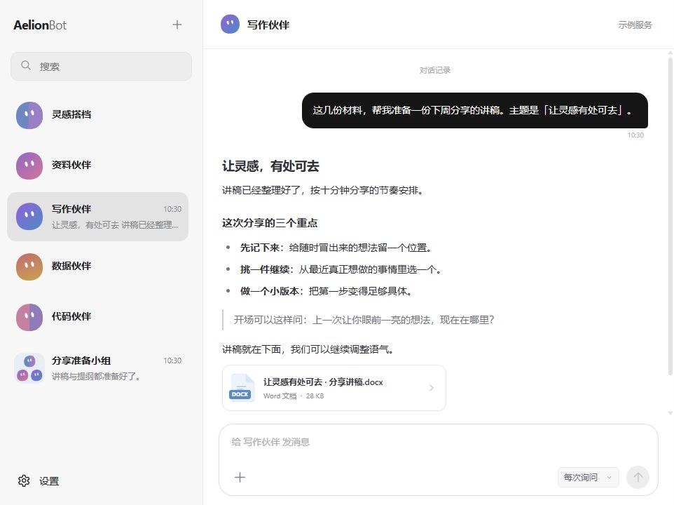

  <picture>
    <source media="(prefers-color-scheme: dark)" srcset="docs/assets/logo-dark.svg">
    <source media="(prefers-color-scheme: light)" srcset="docs/assets/logo-light.svg">
    
  </picture>

<h2 align="center">好想法，一起做出来。</h2>

让擅长不同事情的 AI 伙伴，来到你的桌面。

  <a href="https://aelion.chat/">逛逛官网</a>
  &nbsp;·&nbsp;
  <a href="https://github.com/FoyonaCZY/AelionBot/releases/latest">下载 Windows 版</a>
  &nbsp;·&nbsp;
  <a href="https://aelion.chat/blog/">博客</a>
  &nbsp;·&nbsp;
  <a href="https://github.com/FoyonaCZY/AelionBot/issues">反馈建议</a>

AelionBot 是一个和 AI 伙伴一起工作的地方。给它们起名字、安排分工，把手头的资料和想法交过去，再一起把事情做完。

界面支持简体中文、繁體中文和 English。打开“设置 → 外观 → 界面语言”即可切换；选择会立即生效并保存在本机。

一场分享、一份报表、一个自己想用的小工具，都可以从一句话开始。你可以随时补充要求、看看进展，也可以把几位伙伴拉进群里，让它们互相配合。

## 先交给它一件小事

> “这些材料，帮我准备一份下周分享的讲稿。主题是「让灵感有处可去」，大约十分钟。”

伙伴会围绕你的材料整理思路、起草内容，把做好的文件交回对话里。读完后，继续告诉它：“开场再轻松一点”“这里加一个例子”，把作品慢慢改成你想要的样子。

当前版本的真实界面，使用示例任务展示。

## 每一位，都有自己的本事

你可以有一位整理资料的伙伴、一位擅长写作的搭档，再加一位帮你做小工具的朋友。名字和职责由你决定，头像也能换成喜欢的颜色，试试渐变或拼色。

需要专心处理一件事，就单独聊。需要不同的思路，就把伙伴们拉到一起。

## 一起商量，也一起动手

在群里交代任务，让资料伙伴先核对材料，写作伙伴接着起草，另一位再来检查。可以叫某位伙伴接手一部分，也能在过程中调整方向。

每位伙伴都有自己的工作电脑，能够浏览网页、处理文件和使用应用。工作过程可以查看，需要时你也能亲自接管。

## 收到一些真正用得上的成果

把文档、表格、图片和文件夹随消息发过去，让讨论围绕实际材料展开。完成的讲稿、整理好的资料或做出来的小工具，会回到对话里，方便查看和保存。

做完一版，还可以接着改。你不用换一个地方重新说明需求。

## 合作久了，沟通也更顺了

喜欢怎样的表达、一个项目已经确认过哪些背景，伙伴都可以记下来。下一次接着聊时，就能沿着已有的记录继续工作。

大一些的事情，可以先一起确定计划，再分步推进。你能查看步骤和进展，也能暂停后继续。每周的周报、每天的资料整理，则可以约好时间，让伙伴按计划处理。

定时任务执行时，需要保持应用开启。

## 你正好需要，它正好拿手

| 你手头的事 | 试着这样开口 | 一起完成什么 |
| --- | --- | --- |
| 准备分享 | “这些材料，帮我整理成十分钟能讲清楚的内容。” | 有重点的提纲与讲稿，继续打磨到适合你的表达。 |
| 阅读与研究 | “先帮我读完这些资料，整理重要结论和出处。” | 一份便于回看、可以继续追问的主题笔记。 |
| 核对报表 | “这几份表格有哪些重复、遗漏和值得关注的变化？” | 整理后的汇总表，以及需要再核对的问题。 |
| 制作小工具 | “我想要一个演讲时用的计时器，界面简单一点。” | 一件能试用、能继续调整的小作品。 |
| 推进长期项目 | “先把接下来的事情列个计划，我们分步来。” | 看得见进展的工作过程，随时补充或调整方向。 |

## 按你的节奏来

你决定伙伴接触哪些资料、怎样获得操作许可。工作过程中，随时可以补充想法、暂停任务，或把某一步接回自己手里。

你也可以先从一位伙伴开始。找到合拍的方式，再慢慢组建自己的小团队。

---

<h3 align="center">下一件事，一起做。</h3>

  <a href="https://github.com/FoyonaCZY/AelionBot/releases/latest"><strong>下载 Windows 版</strong></a>
  &nbsp;·&nbsp;
  <a href="docs/releases/v0.6.0.md">Mac 预览版说明</a>
  &nbsp;·&nbsp;
  <a href="docs/USAGE.md">使用帮助</a>

首次使用，按引导连接你选择的 AI 服务；使用费用按所选服务计算。

