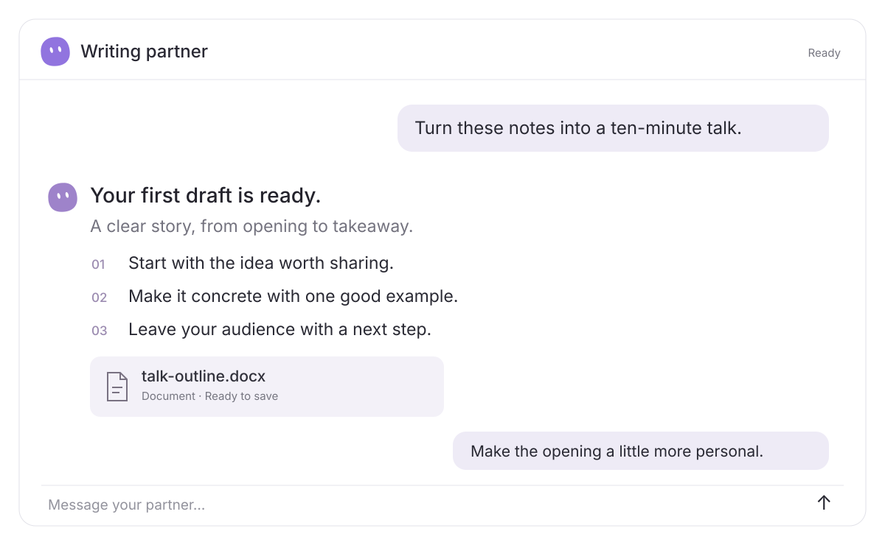
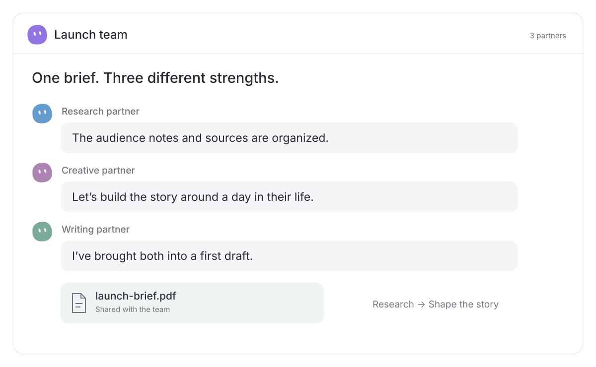
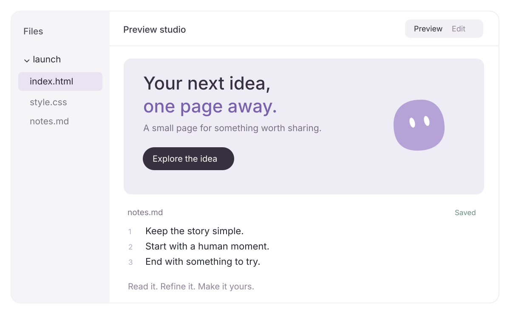
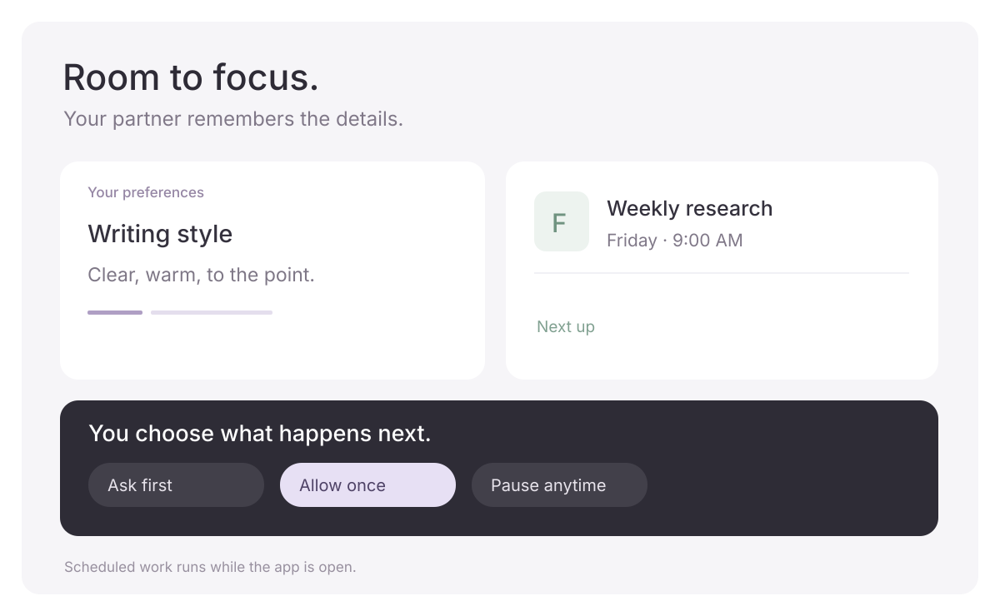

  <picture>
    <source media="(prefers-color-scheme: dark)" srcset="docs/assets/logo-dark.svg">
    
  </picture>

  
<strong>English</strong> · <a href="README.zh-CN.md">简体中文</a>

  <h1>Good ideas. Made together.</h1>
  
Your AI partners for the things you want to get done.

  

    <a href="https://aelion.chat/?lang=en"><strong>Explore the website ↗</strong></a> &nbsp; · &nbsp;
    <a href="https://github.com/FoyonaCZY/AelionBot/releases/latest"><strong>Download for Windows and macOS</strong></a> &nbsp; · &nbsp;
    <a href="https://aelion.chat/blog/?lang=en">Blog</a>
  

  

 

**Research a topic. Shape a story. Build a small tool.** AelionBot brings AI partners to your desktop, each with a name, a role, and a way of working that you choose. Talk through an idea, share your materials, and work toward something you can actually use.

## Start with a sentence

> “Turn these notes into a ten-minute talk. Keep it clear and conversational.”

Give your partner the goal and the material. It can research, organize, write, and work with files and apps. Stay in the conversation as the work takes shape, then open the result and refine it together.

## Different strengths. One team.

Bring a research partner, a creative partner, and a writing partner into the same group. Let them exchange findings and build on one another’s work. Jump in with a new direction or ask one partner to take the next step.

## Open it. Make it yours.

Your work stays close to the conversation. Browse the folder, open a presentation, read a PDF, inspect an image, or try a webpage. Use the side preview to keep chatting, or expand it when you want room to focus.

Code and text can be edited right in the preview, with highlighting, line numbers, and a file tree to move between files. Save workspace changes, or save an edited attachment as a new copy.

## A partner that feels like yours

Choose its name, responsibilities, and colors. Keep useful preferences in memory, so you spend less time repeating the small details. Set up recurring work for the things that come around every week.

You also set the boundaries: which materials to share, which actions to allow, and when to pause. Your partner’s work computer is there to view or take over when you need it.

Images above are vector product illustrations with example content, not application screenshots. Scheduled work requires the app to remain open.

## What will you make first?

| You bring… | Work toward… |
| --- | --- |
| A folder of reading material | A concise brief with useful sources |
| Notes for a talk | An outline, a script, and a presentation to refine |
| A few spreadsheets | A clearer view of the changes that matter |
| An idea for a personal tool | A small webpage you can try and adjust |
| The same weekly chore | A repeatable routine with a partner assigned |

## Make yourself at home

Light or dark. English, Simplified Chinese, or Traditional Chinese. Adjust the type, text size, and display scale until your workspace feels comfortable.

1. **[Download AelionBot](https://github.com/FoyonaCZY/AelionBot/releases/latest).** The current release is available for Windows and macOS.
2. **Connect your AI service.** Follow the in-app setup; usage charges depend on the service you choose.
3. **Meet your first partner.** Give it a role and start with one small task.

   
  <h2>The next thing, together.</h2>
  
<a href="https://aelion.chat/?lang=en">Website</a> · <a href="https://github.com/FoyonaCZY/AelionBot/releases">Releases</a> · <a href="https://aelion.chat/blog/?lang=en">Stories & updates</a> · <a href="https://github.com/FoyonaCZY/AelionBot/issues">Share feedback</a>

