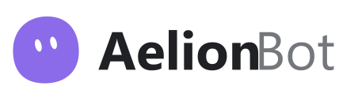
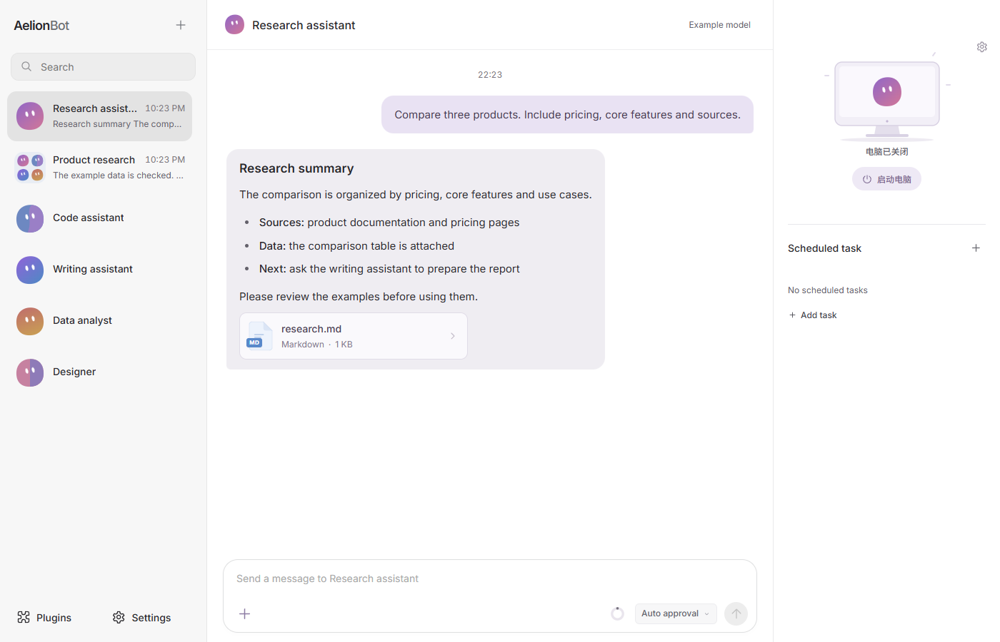
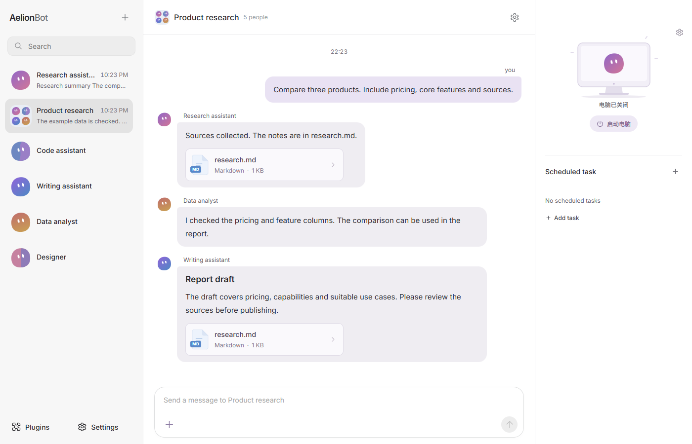

<div align="center">
  <picture>
    <source media="(prefers-color-scheme: dark)" srcset="docs/assets/logo-dark.svg">
    
  </picture>

  <p><strong>English</strong> · <a href="README.zh-CN.md">简体中文</a></p>
  <h1>A team of AI partners, working on your own computer</h1>
  <p>
    <a href="https://github.com/FoyonaCZY/AelionBot/releases/latest"><strong>Download for Windows / macOS</strong></a> &nbsp; · &nbsp;
    <a href="https://aelion.chat/?lang=en">Website</a> &nbsp; · &nbsp;
    <a href="https://aelion.chat/blog/?lang=en">Blog</a>
  </p>
  <p><a href="https://github.com/FoyonaCZY/AelionBot/actions/workflows/ci.yml"></a></p>
  
</div>

<br>

AelionBot is a multi-agent desktop app. Create a few Bots, give each one a role, a model and a set of tools, then hand work to one of them or bring several into a group chat to split it up.

- **Group chat with no moderator**: every message reaches every member. Bots claim tasks, hand off files and fill in for each other. You can step in at any time.
- **Runs on your machine**: General Bots use a Linux VM on your computer (browser, terminal, office apps) and, under the permissions you set, host files and commands.
- **Bring your own model**: your own API key for OpenAI-compatible APIs, Anthropic or Gemini; local models and MCP work too. The app is free.



## What it does

| | |
| --- | --- |
| **General Bots** | Research, writing, data analysis, code and desktop work. Each Bot has its own workspace and VM desktop that you can watch, pause or take over |
| **Designers** | Web prototypes, editable PPTX decks and site clones, with 152 bundled design systems. No VM needed |
| **Files & previews** | Webpages, images, PDFs and documents next to the chat; annotate regions or edit page elements in place |
| **AI games** | Twelve-player Werewolf in group chat, with human seats or an all-AI table ([rules](docs/werewolf-twelve.md), in Chinese) |
| **Also** | Bundled data / spreadsheet / PDF / slide skills, scheduled tasks, English and Chinese UI |

A typical setup: a research partner collects sources into `research.md`, a data partner checks the samples and builds a comparison table, and a writing partner turns it into a report. They relay in one group; you can add requirements or @ a partner along the way.



## Get started

1. [Download](https://github.com/FoyonaCZY/AelionBot/releases/latest) for Windows 10+ (64-bit) or macOS (Intel / Apple silicon).
2. Connect a model service.
3. Create a General Bot or a Designer and give it a task. For teamwork, create a group and assign roles.

The work computer (Linux VM) needs about 4 GB of memory and tens of GB of disk; 16 GB of RAM or more is recommended. Designers work without the VM.

## Development

Requires Node.js 24 and pnpm 12.5.1 (pinned in `package.json`).

```sh
pnpm install --frozen-lockfile
pnpm run typecheck && pnpm test
pnpm run dev
```

Commit dependency changes with `pnpm-lock.yaml`. Run `pnpm run vm:prepare-runtime` before using the work computer; see [release instructions](docs/RELEASING.md) for packaging.

## Learn more

[Releases](https://github.com/FoyonaCZY/AelionBot/releases) · [Feedback](https://github.com/FoyonaCZY/AelionBot/issues) · [Designer architecture](docs/designer-bots.md) · [Group protocol](docs/group-protocol-v2.md) · [VM storage](docs/vm-storage.md) · [Third-party notices](docs/THIRD-PARTY-NOTICES.md)

<sub>Screenshots are taken from the current app frontend; example conversations and files are fictional. Design systems come from OpenDesign; brand-inspired references do not imply endorsement.</sub>
