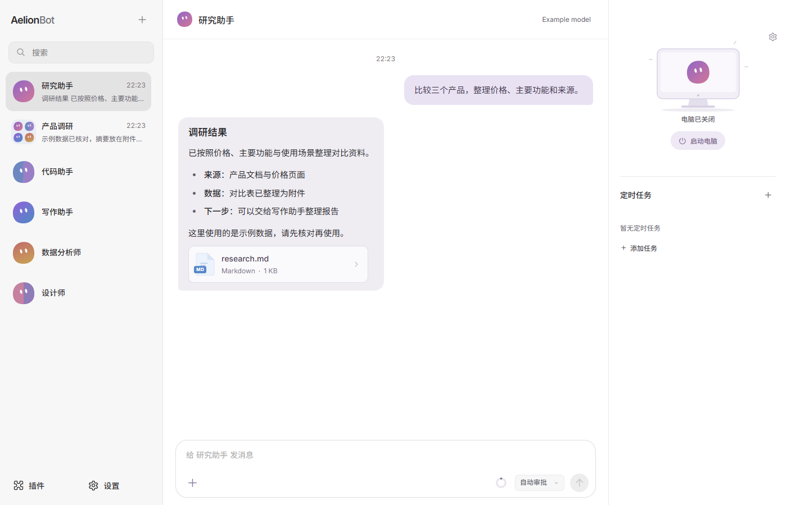
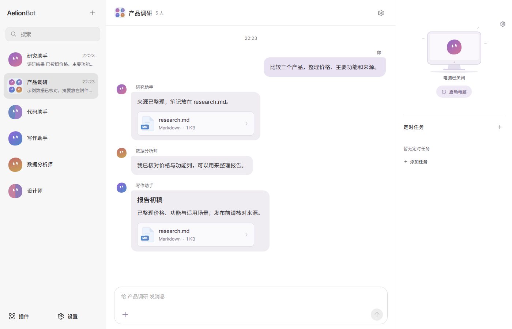
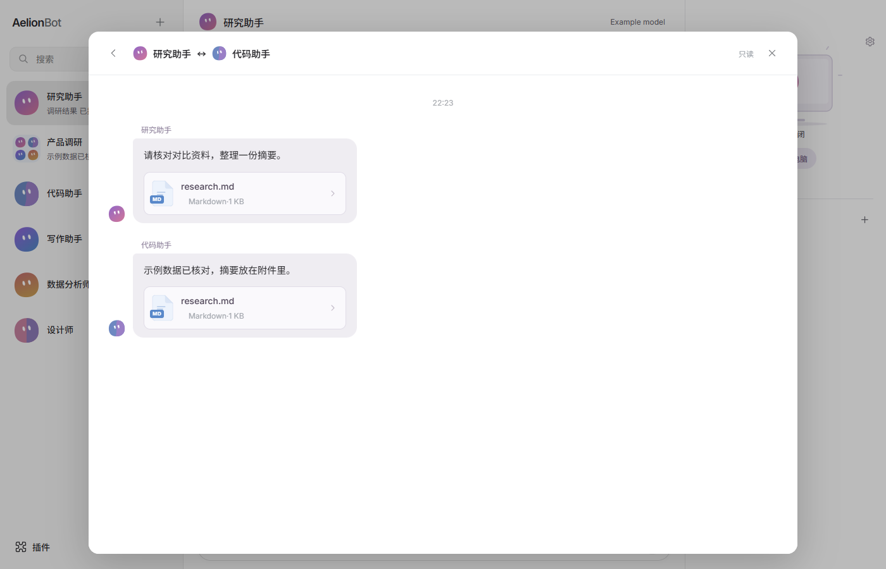
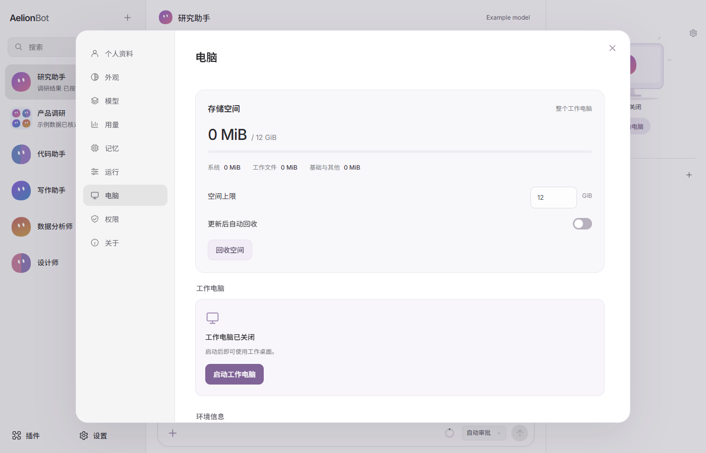
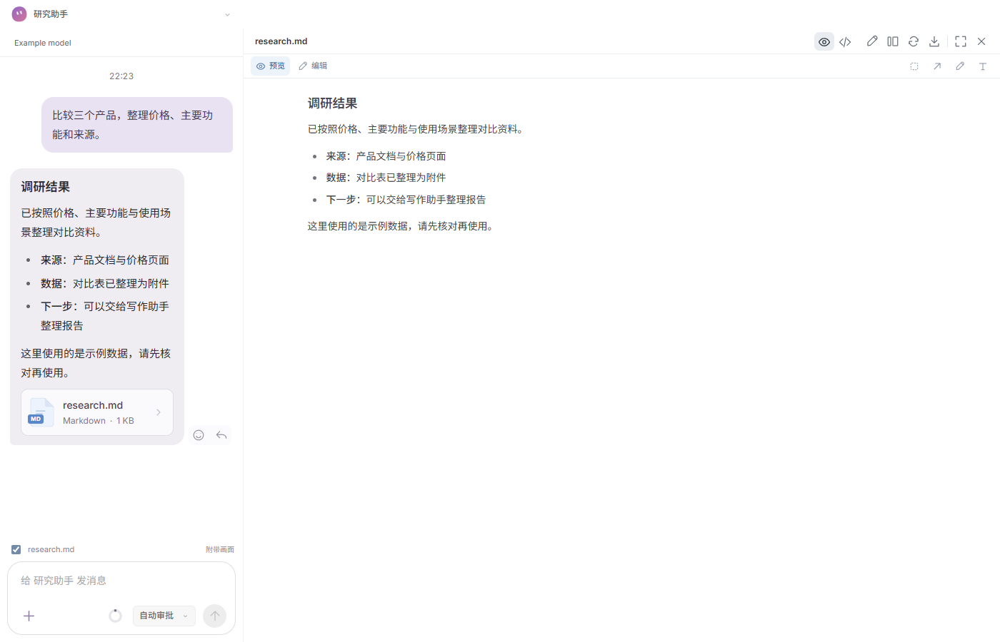

  <picture>
    <source media="(prefers-color-scheme: dark)" srcset="docs/assets/logo-dark.svg">
    
  </picture>

  
<a href="README.md">English</a> · <strong>简体中文</strong>

  <h1>通用多 Agent 桌面工作空间</h1>
  
配置多个 Agent，通过群聊、VM 和本机工具协作完成任务。

  

    <a href="https://aelion.chat/?lang=zh-CN"><strong>逛逛官网 ↗</strong></a> &nbsp; · &nbsp;
    <a href="https://github.com/FoyonaCZY/AelionBot/releases/latest"><strong>下载 Windows 与 macOS 版</strong></a> &nbsp; · &nbsp;
    <a href="https://aelion.chat/blog/?lang=zh-CN">博客</a>
  

  

 

**AelionBot 是一个通用多 Agent 系统。** 为不同 Agent 配置职责、模型和工具，单独交办任务，或把伙伴拉进同一个群，协作完成调研、数据分析、代码、写作和办公工作。VM 和本机工具负责执行，文件、预览与对话留在同一个工作空间。

| 核心能力 | 可以做什么 |
| --- | --- |
| **Linux 工作电脑（VM）** | 让通用 Bot 使用浏览器、终端与桌面应用，完成真实文件操作 |
| **群聊与 Bot 私信** | 按角色分工、交换文件与结果，指定伙伴接手 |
| **按需加入专业角色** | 需要设计时，可使用设计师与 152 套预装设计系统制作网页和 PPT |

## 多 Agent 协作：把任务分给合适的伙伴

为研究、代码、写作和数据分析安排不同的 Agent，加入同一个群，共享与任务有关的消息、资料和文件。你可以随时补充要求，或 **@ 指定伙伴**继续处理。

一个“产品调研与对比报告”的分工示例：

1. **资料伙伴（通用 Bot）** 在 VM 中收集来源，整理为 `research.md` 和数据文件。
2. **数据或代码伙伴** 接收文件，核对样本、运行分析，生成对比表。
3. **写作伙伴** 把结果整理成报告；**你**查看文件、补充要求，继续在群里讨论。

Bot 之间也能互发私信、传递文件。群聊围绕群内上下文工作，不会直接混入无关的私聊记录。**谁负责什么，由你决定**。

## VM：给通用 Bot 一台能动手的工作电脑

通用 Bot 可以使用一台受管理的 **Linux VM**。各 Bot 有自己的工作目录与桌面，可以打开网页、使用应用、运行命令和整理产物；你能查看工作过程，也能暂停或接管桌面。

> “收集三个行业案例，整理出处和关键数据，保存成可以交给设计师的资料。”

浏览器负责查资料，终端处理数据，办公应用处理文档。按应用内引导准备并启动工作电脑后，就可以把这些操作串成一个任务。VM 内启动的网页服务也能通过端口转发接入应用预览。

通用 Bot 也可以按权限使用本机文件与命令。VM 和本机目录是不同的执行位置，哪些操作需要许可，由你设置。

## 角色由你配置，专业能力按需加入

| | 通用 Bot | 设计师 |
| --- | --- | --- |
| 适合的任务 | 调研、写作、办公、代码与桌面操作 | 网页原型、PPT 与设计修改 |
| 执行位置 | Linux VM，也可按权限操作本机 | 默认工作目录下的 `designers` |
| 工作组织 | 对话、计划、目标与协作 | 独立设计任务、设计约定与成果 |
| 协作方式 | 群聊、Bot 私信 | 群聊、Bot 私信 |

创建 Bot 时选择类型；也可以在 Bot 资料中更改。**更改类型会清空该 Bot 的上下文，需要确认**，有运行中或排队工作时不能切换。已有文件会保留。

## 专业扩展：设计师与 152 套设计系统

新建设计师 Bot，选择“原型设计”或“PPT 演示”，再为任务指定一套设计系统。**152 套参考随应用预装**，包含配色、字体、布局约定与组件参考，参考文件无需临时下载；也可以选择“未指定”。

- **按任务选择。** 不同任务可以采用不同设计系统，任务停止后可更改选择。
- **交付可继续修改的文件。** 网页原型保留 HTML/CSS/JS；演示交付可编辑的 PPTX，并可附带 HTML 预览。
- **在预览中提意见。** 框选区域、添加标注，或直接选择网页元素、修改属性与源码，再保存到文件。
- **本机项目目录。** 设计师在默认工作目录的 `designers/<bot>/<task>` 下工作，无需启动 VM。

设计系统来自 OpenDesign 的整理资源，保留原始来源与许可说明。品牌风格参考不代表品牌官方合作；详见[第三方声明](docs/THIRD-PARTY-NOTICES.md)。

## 成果就在对话旁边

浏览文件目录，预览网页、图片、PDF 和支持的文档；用侧栏继续聊天，或展开大画布。代码和文字支持直接编辑，网页支持元素选择、框选标注、撤销与保存。消息附件可以另存副本。

设计师生成的演示可以通过 HTML 版本查看。没有 HTML 预览的外部 Office 文件，目前不提供设计师本机保真转换，可下载后查看。

## 开始使用

1. **[下载 AelionBot](https://github.com/FoyonaCZY/AelionBot/releases/latest)**，选择适合电脑的 Windows 或 macOS 版本。
2. **连接 AI 服务**，按引导配置模型；模型服务的使用费用由所选服务决定。
3. **选择伙伴类型**：先交给通用 Bot 一件任务，或创建一个设计师开始原型/PPT 项目。
4. **需要时再组队**：创建群聊，加入伙伴，分享材料并分配工作。

应用支持英文、简体中文、繁体中文，以及浅色/深色、字体与显示比例设置。你可以保存偏好、安排定时任务；定时任务执行时需要保持应用开启。预装设计参考可离线读取，模型服务与外部素材可能仍需联网。

产品图片直接截取当前 App 前端，使用虚构的示例对话和文件，未连接模型或 VM。顶部 Bot 形象为品牌插画。本文介绍当前源码能力，下载包以对应版本说明为准。

## 了解更多

[官网](https://aelion.chat/?lang=zh-CN) · [版本更新](https://github.com/FoyonaCZY/AelionBot/releases) · [博客](https://aelion.chat/blog/?lang=zh-CN) · [反馈建议](https://github.com/FoyonaCZY/AelionBot/issues)

开发与实现：[设计师架构](docs/designer-bots.md) · [VM 存储管理](docs/vm-storage.md) · [官网开发说明](website/README.md)
