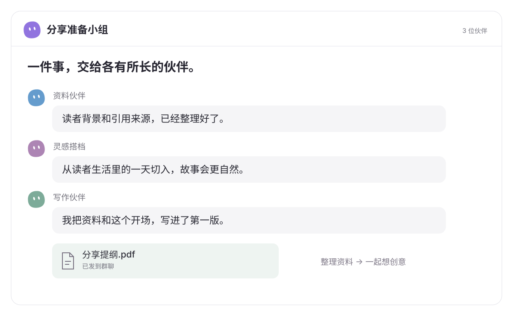
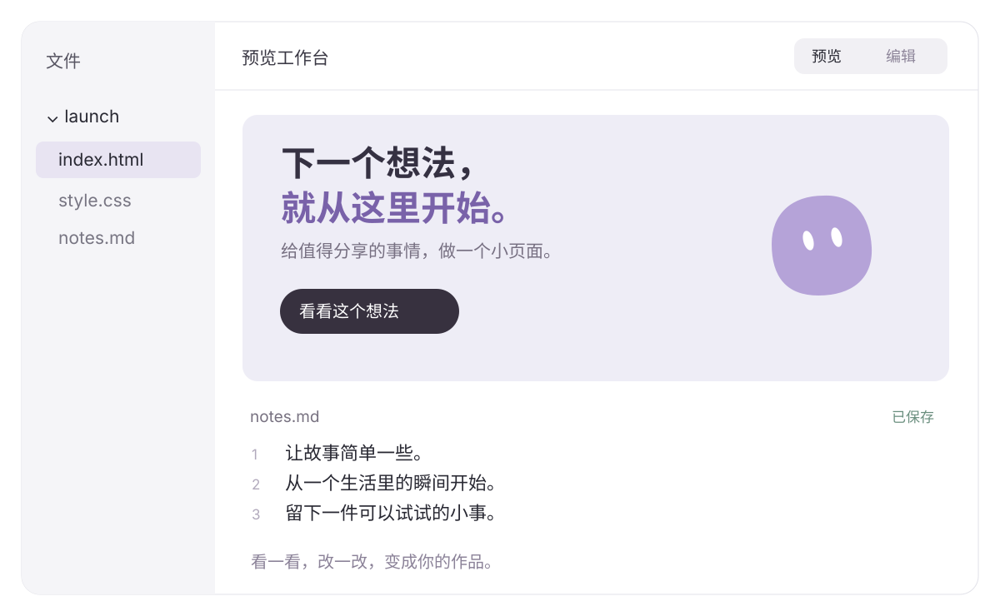
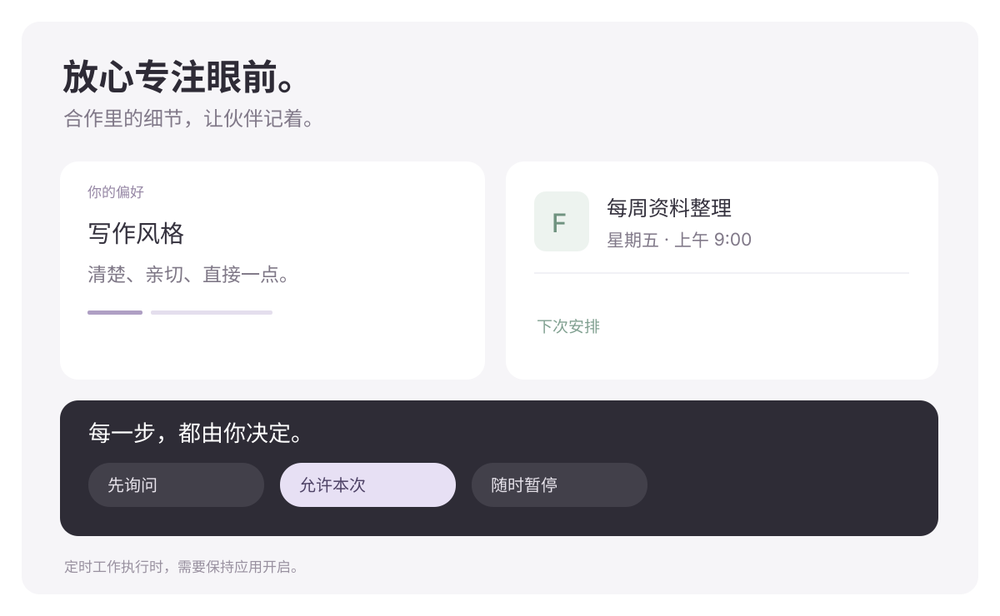

  <picture>
    <source media="(prefers-color-scheme: dark)" srcset="docs/assets/logo-dark.svg">
    
  </picture>

  
<a href="README.md">English</a> · <strong>简体中文</strong>

  <h1>好想法。一起做出来。</h1>
  
你的 AI 工作伙伴，陪你把想做的事往前推一步。

  

    <a href="https://aelion.chat/?lang=zh-CN"><strong>逛逛官网 ↗</strong></a> &nbsp; · &nbsp;
    <a href="https://github.com/FoyonaCZY/AelionBot/releases/latest"><strong>下载 Windows 与 macOS 版</strong></a> &nbsp; · &nbsp;
    <a href="https://aelion.chat/blog/?lang=zh-CN">博客</a>
  

  

 

**查清一个问题，讲好一个故事，做个顺手的小工具。** AelionBot 让 AI 伙伴来到你的桌面。名字、职责、做事的风格，都由你决定。聊聊想法，分享材料，一起做出真正用得上的东西。

## 从一句话开始

> “把这些笔记，变成一场十分钟的分享。讲得清楚一点，像平时聊天。”

把目标和材料交给伙伴。它可以查资料、理思路、写内容，也能处理文件、使用应用。过程中继续聊，有新想法随时补充；成果做好了，打开看看，再一起调整。

## 各有本事。一起做事。

把资料伙伴、灵感搭档、写作伙伴拉进同一个群。有人整理来源，有人想切入点，有人写成作品。你可以随时加入讨论、补充方向，也可以指定一位伙伴接着做。

## 打开看看。顺手改改。

成果就在对话旁边。翻翻目录，打开演示文稿，读 PDF、看图片，或者试试刚做好的网页。一边聊一边预览，需要专注时就展开成大画布。

代码和文字可以在预览里直接编辑，高亮、行号和文件树都在手边。工作目录里的修改可以保存，消息附件则可以另存一份。

## 越来越像你的伙伴

选个喜欢的名字，安排职责，调一套合拍的颜色。把有用的偏好记下来，下次合作，就少解释一点。那些每周都要做的事情，也可以提前约好时间。

能接触哪些材料、哪些操作需要许可、什么时候暂停，都由你决定。想看看它在做什么，或亲自接手，也可以打开伙伴的工作电脑。

以上画面为矢量功能示意，使用示例内容，并非应用截图。定时工作执行时，需要保持应用开启。

## 先交给它哪件事？

| 你手上有…… | 可以一起做成…… |
| --- | --- |
| 一文件夹的阅读材料 | 重点清楚、带有出处的资料简报 |
| 准备分享的零散笔记 | 可以继续打磨的提纲、讲稿和演示文稿 |
| 几份看不完的表格 | 值得关注的变化和发现 |
| 一个想自己用的小工具 | 能打开试用、继续调整的小网页 |
| 每周重复的老任务 | 有伙伴负责的固定安排 |

## 调成自己舒服的样子

浅色或暗色，英文、简体中文或繁体中文。字体、文字大小、显示比例，都可以按习惯调整。

1. **[下载 AelionBot](https://github.com/FoyonaCZY/AelionBot/releases/latest)。** 当前版本提供 Windows 与 macOS 版。
2. **连接你想用的 AI 服务。** 按应用内引导完成设置，使用费用按所选服务计算。
3. **认识第一位伙伴。** 给它安排一个职责，先从一件小事开始。

   
  <h2>下一件事，一起做。</h2>
  
<a href="https://aelion.chat/?lang=zh-CN">官网</a> · <a href="https://github.com/FoyonaCZY/AelionBot/releases">版本更新</a> · <a href="https://aelion.chat/blog/?lang=zh-CN">故事与动态</a> · <a href="https://github.com/FoyonaCZY/AelionBot/issues">反馈建议</a>

