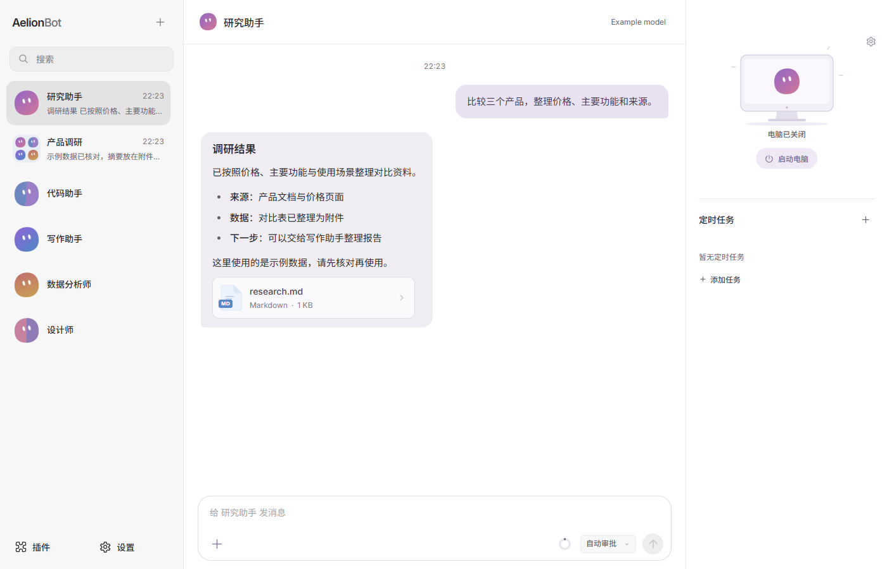
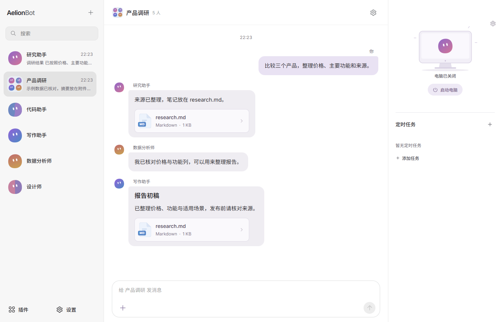
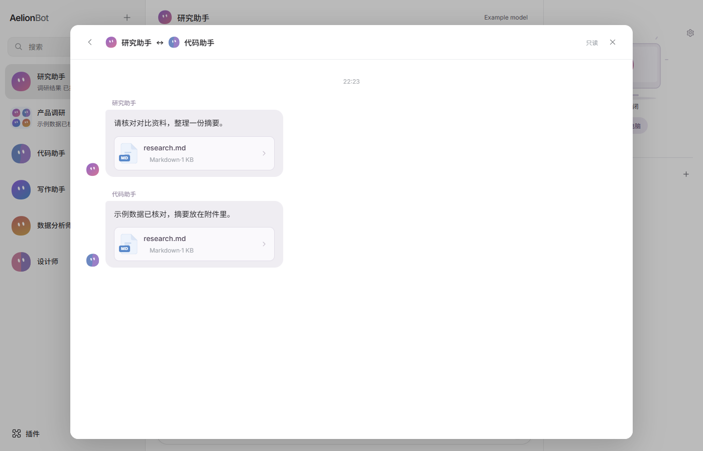
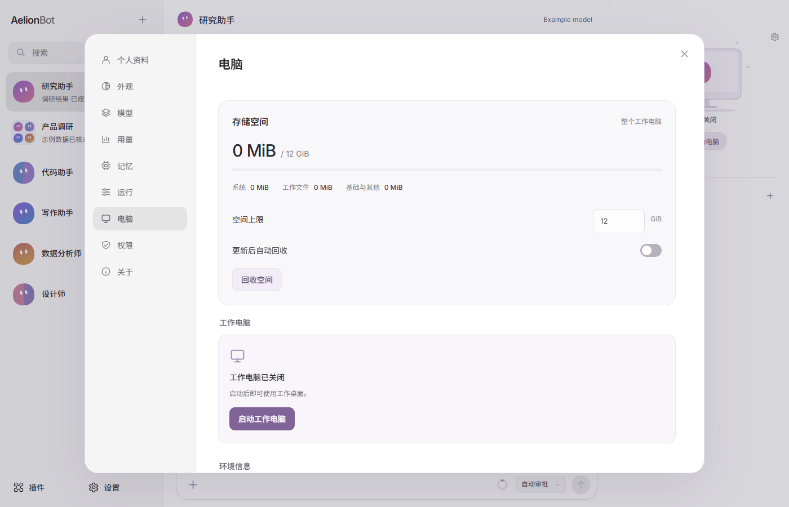
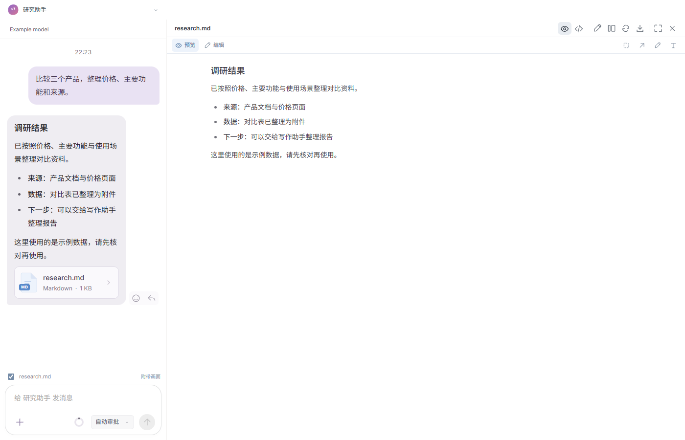

<div align="center">
  <picture>
    <source media="(prefers-color-scheme: dark)" srcset="docs/assets/logo-dark.svg">
    
  </picture>

  <p><a href="README.md">English</a> · <strong>简体中文</strong></p>
  <h1>通用多 Agent 桌面工作空间</h1>
  <p>为不同任务配置不同职责的 Agent，通过群聊、本地 VM 和本机工具协作完成工作。</p>
  <p>
    <a href="https://aelion.chat/?lang=zh-CN"><strong>逛逛官网 ↗</strong></a> &nbsp; · &nbsp;
    <a href="https://github.com/FoyonaCZY/AelionBot/releases/latest"><strong>下载 Windows 与 macOS 版</strong></a> &nbsp; · &nbsp;
    <a href="https://aelion.chat/blog/?lang=zh-CN">博客</a>
  </p>
  <p><a href="https://github.com/FoyonaCZY/AelionBot/actions/workflows/ci.yml"></a></p>
  
</div>

<br>

**AelionBot 是一个通用多 Agent 系统。** 每个 Agent 可以单独配置职责、模型和工具。调研、代码、写作、数据分析可以各安排一位伙伴，单独交办任务，或者把几位拉进同一个群协作。执行由一台本地 Linux 工作电脑和本机工具完成，文件、预览和对话放在同一个工作空间里。

举个例子，做一份产品调研与对比报告：资料伙伴收集来源，整理成 `research.md` 和数据文件；数据伙伴核对样本、跑分析、生成对比表；写作伙伴把结果汇总成报告。中途你可以随时补充要求，或者用 @ 指定某位伙伴继续处理。

| 核心能力 | 可以做什么 |
| --- | --- |
| **Linux 工作电脑（VM）** | 让通用 Bot 使用浏览器、终端与桌面应用，完成文件操作 |
| **群聊与 Bot 私信** | 按角色分工、交换文件与结果，指定伙伴接手 |
| **设计工作** | 任何 Bot 都能用 152 套预装设计系统制作网页原型、PPT 与网站复刻 |
| **AI 游戏** | 在群聊里玩十二人狼人杀，和真人或 AI 同桌，也可以旁观全 AI 对局 |



## 本地执行

市面上的通用 agent 产品多数在云端沙箱里执行。AelionBot 的执行环境在你自己的电脑上，有几点不同：

- 文件、命令和桌面操作都在本机的工作电脑里执行，不经过第三方的云端沙箱。模型调用会连接你选择的服务。
- 伙伴的分工、进度和产出都显示在群聊里，你可以随时插话、改要求、指定接手。
- 模型服务用自己的 API Key，可以随时更换，也支持本地模型和 MCP 工具。

## 多 Agent 协作

为研究、代码、写作和数据分析安排不同的 Agent，加入同一个群，共享与任务有关的消息、资料和文件。群聊围绕群内上下文工作，不会混入无关的私聊记录。伙伴之间也能互发私信、传递文件。谁负责什么由你决定，应用不会擅自改变伙伴的分工。





## 工作电脑（Linux VM）

通用 Bot 可以使用一台受管理的 Linux VM，里面有浏览器、终端和办公应用：

> “收集三个行业案例，整理出处和关键数据，再据此设计一页摘要。”

浏览器查资料，终端处理数据，办公应用处理文档。按应用内引导准备并启动工作电脑后，这些操作可以串成一个任务。VM 里启动的网页服务可以通过端口转发在应用内预览。

各 Bot 有自己的工作目录和桌面。你可以查看工作过程，也可以暂停或接管桌面。通用 Bot 也可以按权限使用本机文件与命令，哪些操作需要许可由你设置。



## 设计工作

向任何 Bot 要原型、PPT、网站复刻、移动端页面或多页文档，它会在当前对话里建立设计任务，不用换 Bot，也不会丢上下文。设计稿以缩略图显示在右上角电脑卡片下方的画布卡片里，点开后以半屏展示。关闭任务后，对话照常继续。

每件任务可以指定一套设计系统：

- 152 套设计参考随应用预装，包含配色、字体、布局约定和组件参考，不用临时下载。
- 用哪套设计系统、哪些字体都由 Bot 按需求决定，也可以不用设计系统；拿不准时会先问你。设置 → 设计里可以浏览和导入设计系统，也能管理字体库：下载 Fontsource 字体或导入自己的字体，Bot 可以离线取用。
- 网页原型与网站复刻保留 HTML/CSS/JS；演示交付可编辑的 PPTX，可以附带 HTML 预览。复刻任务会写 NOTES.md，说明来源和未克隆的部分。
- 预览里可以框选标注，也可以直接选中网页元素修改属性和源码后保存。
- 设计任务在默认工作目录的 `designers/<bot>/<task>` 下进行，不需要启动 VM。第一版直接交付，不做繁琐检查；设计检查的结果作为建议返回。

设计系统来自 OpenDesign 的整理资源，保留了原始来源和许可说明。品牌风格参考不代表品牌官方合作，详见[第三方声明](docs/THIRD-PARTY-NOTICES.md)。



## 文件与预览

文件目录、网页、图片、PDF 和支持的文档都可以在对话旁边预览，也可以展开成大画布。代码和文字能直接编辑，网页支持元素选择、框选标注、撤销和保存。消息附件可以另存副本。

## AI 游戏

群聊里有「AI 游戏」入口，目前是十二人狼人杀：12 座、有警长，包含警长竞选、警徽流转、夜间行动、发言、投票和胜负结算。板子有两个：预女猎白（4 狼 4 民，预言家、女巫、猎人、白痴）和预女猎守（4 狼 4 民，预言家、女巫、猎人、守卫）。

- 可以真人上桌，也可以只旁观全 AI 对局；座位不够时一键用临时 Bot 补齐。
- 每个 AI 玩家可以单独或批量指定模型；性格（MBTI）可以预设，也可以每局随机。
- 狼队夜间分提议、回应、确认三轮讨论；真人狼人可以连续发言，点击结束讨论推进。
- 对局可以暂停、恢复、结束，应用重启后也能接着来。模型调用失败时会暂停，已完成的选择保留。
- 每个玩家只看到自己角色该看的信息，夜间行动不会向普通玩家暴露狼人的座位。附带角色攻略和玩家决策记录。

本版暂不开放狼人自爆。

## 其他能力

- 模型：兼容 OpenAI 接口、Anthropic、Gemini 等服务，支持本地模型和 MCP 工具。
- 技能：附带数据分析、电子表格、PDF、演示文稿等办公技能。
- 定时任务：按计划自动执行提醒和例行工作，执行期间需要保持应用开启。
- 权限：本机文件、命令和 VM 操作，哪些需要确认由你设置。
- 界面：英语、简体中文、繁体中文，浅色/深色主题，字体和显示比例可调。

## 开始使用

1. [下载 AelionBot](https://github.com/FoyonaCZY/AelionBot/releases/latest)，选择适合电脑的 Windows 或 macOS 版本。
2. 连接模型服务，按引导配置。应用本身不收费，模型调用费用由所选服务收取；也可以用本地模型。
3. 交给 Bot 一件任务：调研、写作、代码，或者原型、PPT、网站复刻。
4. 需要多人协作时创建群聊，加入伙伴，分享材料并分配工作。

系统要求：Windows 10 及以上（64 位）或 macOS，Intel 与 Apple 芯片都支持。工作电脑（Linux VM）大约需要 4 GB 内存和几十 GB 可用磁盘，电脑内存建议 16 GB 或更多。

## 常见问题

- 外部 Office 文件能直接预览吗？设计任务生成的演示可以通过 HTML 版本查看。其他 Office 文件在工作电脑启动后可以预览，也可以下载后查看。
- 离线能用吗？预装设计参考可以离线读取，模型服务和外部素材可能仍需联网。
- 下载包和这里写的不一样？本文描述的是当前源码的能力，下载包以对应版本的发布说明为准。

## 本地开发

使用 Node.js 24 和 pnpm 12.5.1（版本固定在 `package.json`）。按 [pnpm 官方说明](https://pnpm.io/installation) 安装后，在仓库根目录运行：

```sh
pnpm install --frozen-lockfile
pnpm run typecheck
pnpm test
pnpm run build
pnpm run dev
```

修改依赖时一起提交 `pnpm-lock.yaml`，不要生成 npm 锁文件。依赖构建脚本的批准配置在 `pnpm-workspace.yaml`。使用 Linux 工作电脑前还需运行 `pnpm run vm:prepare-runtime`；完整安装包的生成方式见[发布说明](docs/RELEASING.md)。

## 了解更多

[官网](https://aelion.chat/?lang=zh-CN) · [版本更新](https://github.com/FoyonaCZY/AelionBot/releases) · [博客](https://aelion.chat/blog/?lang=zh-CN) · [反馈建议](https://github.com/FoyonaCZY/AelionBot/issues)

开发与实现：[设计工作](docs/design-work.md) · [VM 存储管理](docs/vm-storage.md) · [官网开发说明](website/README.md)

<sub>截图取自当前 App 前端，示例对话与文件是虚构的；顶部 Bot 形象为品牌插画。</sub>
