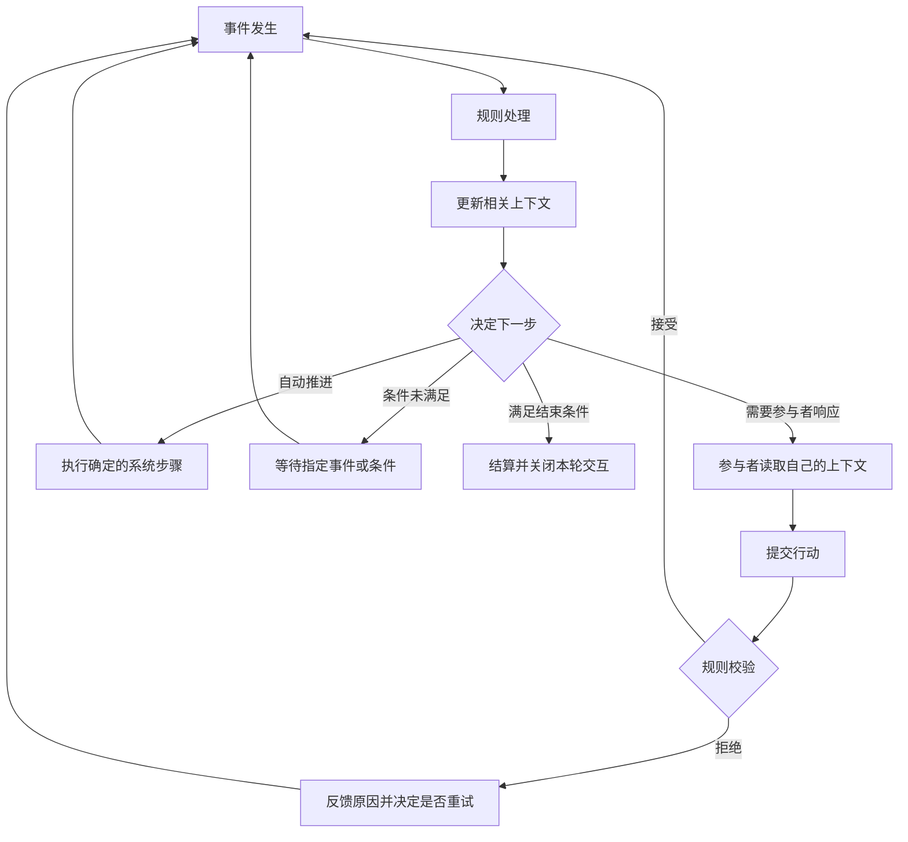

# AI 游戏协作底座：上下文与事件驱动

状态：架构讨论稿。狼人杀已有首版规则、运行器与模型接入，多游戏底座尚未完成验证。面向产品、前端与运行时开发者。

当前已完成群聊「AI 游戏」的前端，并接入六人狼人杀真实回合、Grok 决策与对局保存，包括参与者勾选、临时 Bot 补齐和本局模型配置。我们需要先确定一套能承载狼人杀、德州、斗地主的协作底座，再接入真实玩家决策。本文沿用已对齐的五个概念，检查完整循环如何覆盖正常流程与异常流程，不展开代码接口、存储表或部署选型。

目标是让同一场游戏可以由 AI 自主运行，也可以让真人参与，并在中断或失败时保持事实和进度一致。完成生命周期包括正常结算和明确的异常终止；不能为了跑到结尾而虚构行动或胜负。

## 1. 已对齐的抽象与适用范围

底座以共享上下文、参与者上下文、事件、参与者、规则为核心。游戏提供具体规则，底座负责上下文管理、事件处理和参与者调度。A2A 与 H2A 表示参与者的响应来源不同，不采用两套流程。

| 概念 | 职责 | 必须保持的边界 |
| --- | --- | --- |
| 共享上下文 | 保存参与者共同依赖的事实、状态和历史 | 可以全局共享或局部共享；不等于所有人都能读的聊天记录 |
| 参与者上下文 | 组织授权可见的信息、私有信息、记忆与判断 | 个人判断与系统确认的事实分开；模型只能读取自己的授权上下文 |
| 事件 | 表达发生了什么，触发规则处理、信息更新与后续响应 | 事件的接收范围与唤醒范围分别确定；并非每条消息都触发所有 AI |
| 参与者 | 读取自己的上下文，提出行动，或进入等待、退出 | 真人与 AI 受到相同规则约束；更换响应来源不改变游戏中的身份与资源 |
| 规则 | 决定行动是否合法、信息如何流动、何时推进和结束 | 规则负责确认结果；玩家发言不能直接改写共同事实 |

上下文既包括结构化局面，也包括事件历史和文字信息。例如筹码数量是结构化事实，公开发言是历史，玩家对他人的怀疑是个人判断。三者不能混为一段可随意改写的摘要。

系统保存全量信息，不表示这些信息属于全员共享上下文。隐藏身份、手牌、未公开投票必须有明确的访问范围；全知观战也属于单独授权的上下文。

本文首先覆盖离散行动、可定义规则与结束条件的多人交互。实时操作、任意外部工具执行、自动修改规则或策略不在首版范围内。本文的流程矩阵用于检验表达能力，不构成“已经支持所有游戏”的结论。

### 共识与建议的区别

已对齐的方向是五个概念、事件循环、真人与 AI 平等参与，以及多游戏共用底座。下文的流程约束和异常处理是建议采用的设计原则，仍需在具体玩法与验证中确认。各玩法的超时时长、托管动作、平票处理、整场结束条件尚未定案。

## 2. 一个能够等待、循环和结束的流程

一次对局从开始事件进入循环。规则处理事件，更新有权接收变化的上下文，然后决定唤醒参与者、执行系统步骤、等待条件或结束。

图中的“关闭本轮交互”由游戏的范围决定：一手结束后可以产生下一手开始事件；整场结束才停止继续生成行动请求。不能把局部结算误当成整个房间结束。

### 行动、事实与公开的区别

参与者提交的是行动意图，只有经过规则校验才能产生被接受的结果。拒绝也会形成反馈事件，但不会改变已经确认的游戏事实。

接受行动与公开结果可以分开。例如秘密投票先被接受，其他参与者不能立刻读取；收齐后才生成公开结果。提交者可以知道自己的行动已被接受，而无需等待全部玩家。

### 顺序、并行与等待从条件中产生

| 情况 | 循环如何表达 |
| --- | --- |
| 轮流行动 | 上一行动被接受后，触发下一位参与者 |
| 独立并行 | 同一事件触发多个互不依赖的决策 |
| 同时提交 | 多人基于同一时点的授权上下文决策，结果收齐前隔离 |
| 有依赖的行动 | 前一个结果生成后，才开放后一个参与者所需的信息与行动机会 |
| 集中结算 | 所有必需结果已接受后，触发一次系统结算 |
| 多轮交流 | 每次发言产生事件，但交流受轮数、时间或完成条件限制 |

等待必须能回答：等待谁、等待什么、什么事件能解除等待。允许真人无限等待是一种显式策略；它不等于系统无故停住。AI 重试、团队讨论和自动系统步骤都需要边界，避免无限循环。

调度只是执行这些条件，不自行决定游戏规则。模型完成得快，也不能提前获得本应在收齐后公开的信息。

## 3. 正常流程覆盖

### 从创建到结束

| 环节 | 输入与判断 | 结果与后续 |
| --- | --- | --- |
| 准备 | 选择玩法、勾选参与者、补齐临时 Bot、配置本局模型 | 形成可检查的参与者配置；未满足人数等条件时不开局 |
| 开始 | 规则检查准备条件并初始化局面 | 建立共享与私有上下文，产生首批事件 |
| 行动 | 参与者收到事件，读取授权上下文并提交行动 | 规则接受或拒绝；合法行动进入后续流程 |
| 阶段推进 | 前置条件成立，必需行动已完成 | 更新局面与可见信息，触发下一阶段 |
| 局部结算 | 一轮、一手等局部结束条件成立 | 结算该部分；是否继续由整场规则决定 |
| 整场结束 | 游戏胜负条件、约定场次等结束条件成立 | 固定最终结果，撤销未完成请求，保留可复盘记录 |

页面关闭、观战暂停和游戏暂停需要区分。前端不再展示动画，不应隐式停止底座；显式暂停对局才停止发起新的决策。应用进程停止后的恢复属于异常流程。

### 三种游戏对同一抽象的检验

以下是场景示例，不替代完整玩法规则。

| 场景 | 上下文如何组织 | 事件与推进条件 | 检验点 |
| --- | --- | --- | --- |
| 狼人杀分配身份 | 身份仅进入对应参与者上下文；允许互认的队友信息局部共享 | 分配完成后进入首阶段 | 全量信息不能默认广播 |
| 狼人队内讨论 | 队内共享讨论，其他玩家不可见 | 到达讨论边界后提交团队选择 | 交流能够结束；分歧有处理规则 |
| 预言家与狼人行动 | 各自读取授权局面，彼此结果隔离 | 无依赖时并行；结果满足条件后继续 | 并行不等于共享中间结果 |
| 女巫救人 | 在规则允许时接收狼人行动的相关结果 | 前置结果完成后才唤醒 | 能表达局部依赖 |
| 白天顺序发言 | 每次公开发言进入后续玩家的上下文 | 当前发言完成后唤醒下一位 | 后行动者继承已公开信息 |
| 秘密投票 | 每人读取同一阶段快照，自己的投票私下保存 | 收齐有效投票后统一公开并结算 | 速度不改变信息公平性 |
| 德州下注与加注 | 私有手牌、公开牌面及下注状态分开 | 每次合法行动后重新确定待回应者 | 下一步可以动态变化 |
| 德州下注轮结束 | 全员获得新公开信息，各自保留私有手牌 | 满足下注闭合条件后发牌或结算 | 规则判断由系统完成 |
| 德州全下与边池 | 共享筹码及投入事实；手牌仍受可见规则约束 | 特殊下注状态影响行动资格与结算 | 通用底座不代替具体结算算法 |
| 斗地主叫牌 | 各自持有手牌，叫牌结果按规则公开 | 顺序叫牌，确定地主后进入出牌 | 同一局支持不同阶段规则 |
| 斗地主出牌与不出 | 手牌私有，已出牌和剩余张数按规则共享 | 接受动作后判断下一行动者；连续不出可重置出牌权 | 规则处理跳过、循环与行动约束 |
| 连续多手 | 保留整场得分，按规则重建每手私有信息 | 一手结束后检查继续或整场结束 | 局部上下文能重置，长期结果能保留 |

斗地主存在阵营关系，不意味着农民可以共享手牌或任意私聊。局部共享能力是否启用，始终由具体规则决定。

### A2A、H2A 与观战

| 场景 | 相同的部分 | 差异 |
| --- | --- | --- |
| 全 AI | 上下文权限、合法行动、结算与结束规则 | 响应来自模型，可以自动推进 |
| 真人参与 | 与 AI 相同的行动资格和规则校验 | 通过界面响应；轮到真人时按等待策略处理 |
| 真人托管 | 身份、资源、已接受行动继续保留 | 在明确边界更换响应来源，旧请求作废或重新授权 |
| 观战 | 读取同一局的事件与状态 | 默认不具备行动权；公共和全知视角分别授权 |
| 批量实验 | 使用相同规则和玩家控制逻辑 | 不等待界面展示；记录有效局数、失败与成本 |

选择模型只决定 AI 如何响应，不改变它在游戏中的权限。本局模型调整不应修改原 Bot 的长期配置。Bot 的工作历史也不自动进入游戏上下文。

## 4. 异常流程与恢复边界

异常应回到相同的事件循环处理。不能另建一套可以绕过规则修改状态的“修复通道”。恢复目标是最后一次已经确认的事实；后续处理必须保留依据。

| 类别与场景 | 底座必须保证 | 后续路径；仍需玩法决定的部分 |
| --- | --- | --- |
| 模型返回格式错误、非法目标或非法动作 | 未接受动作不更新共同事实；反馈具体原因 | 有限重试；耗尽后暂停或使用预先允许的替代动作 |
| 模型超时、服务不可用 | 区分未返回、已返回未接受、已接受；不凭超时推断游戏动作 | 重试、换控制器或暂停；次数与预算待定 |
| 真人未操作、暂时离开 | 不把未响应解释为投票、弃牌或退出 | 无限等待、计时或托管由开局策略明确 |
| 同步阶段部分参与者未完成 | 已接受的秘密结果不提前泄露，不重复征求其他人的结果 | 等待缺失者；超时如何补齐由规则决定 |
| 重复提交、回执丢失后重试 | 同一有效行动只结算一次，能确认已有结果 | 返回既有结果，不重复推进 |
| 旧阶段回复或托管前的 AI 迟到回复 | 不进入新阶段，不覆盖新控制者的行动 | 丢弃并告知已失效；必要时重新请求 |
| 暂停时仍有模型调用在进行 | 暂停有明确生效边界；不能出现部分阶段继续推进 | 暂停后返回结果暂存还是作废需统一决定；恢复前重新检查有效性 |
| 应用退出或进程崩溃 | 已确认状态不丢失，未确认结果不假装成功 | 恢复上下文与等待条件；只重做未完成工作 |
| 状态保存失败 | 不向参与者宣告一个无法恢复的成功结果 | 停止继续推进，恢复保存能力后再处理 |
| 参与者退出或被替换 | 区分控制者离开与游戏身份出局 | 托管、保留空位、规则判定或终止；不能直接删除手牌或筹码 |
| 模型配置失效或凭证不可用 | 不静默切换到另一模型、另一服务或更高费用配置 | 请求重新配置，或采用已授权的备用配置 |
| 队内无法达成一致、平票、无人叫牌 | 视为可预期的规则分支，不等同系统故障 | 由玩法定义重选、优先级、重新发牌等处理 |
| 自动事件循环不收敛、费用或轮数达到上限 | 停止继续消耗，不虚构胜负 | 暂停或异常终止；保留触发原因 |
| 私有信息被错误公开 | 后续事件不能让参与者“忘掉”已经看到的内容 | 停止受影响对局并标记无效，修复后重新开始 |
| 对局已结束仍收到行动 | 最终结果保持不变，不自动开启下一局 | 拒绝行动；新开局需有独立的开始条件 |

恢复不能简单地“全部重跑”：重复模型调用可能返回不同动作，已经公开的消息也无法撤回。应复用已经接受的事实，只对未完成部分继续处理。

上下文摘要也可能出错。建议保留原始授权事实作为依据，摘要仅用于压缩表达；无法确认的判断不升级为事实。跨局经验、自进化和总结策略不作为首版推进的必要环节。

## 5. 如何判断底座足够完整

覆盖矩阵只能说明设计能够描述场景，实际保证还需要规则审查与运行验证。验收同时检查安全性——不发生非法变化，以及推进性——符合前提时能够继续，不因内部遗漏永久等待。

### 必须成立的约束

1. **事实一致**：所有共同事实的修改经过规则；多个参与者可以有不同判断，但不能各自改写筹码、出局等确认结果。
2. **信息有界**：当前规则不允许看到的信息，不进入模型请求、玩家界面或该玩家可读取的历史。
3. **决策时点一致**：同时提交的参与者依据同一阶段的信息边界，不获得其他人提前提交的内容。
4. **因果可追踪**：能解释哪个事件触发了哪次处理、改变了哪些上下文、为何唤醒下一位参与者。
5. **影响不重复**：重复、迟到和恢复重放不能导致二次投票、扣款、出牌或结算。
6. **等待可解释**：运行中的每个等待都有对象、解除条件和处理策略；无后续路径时必须显式结束或暂停。
7. **结束有边界**：正常结束与异常终止分别记录，终止后不再接受影响最终结果的行动。

### 建议的验证顺序

| 验证 | 需要看到的证据 |
| --- | --- |
| 无模型的完整流程 | 确定脚本或随机合法玩家能按规则运行；正常结束与规则分支均可观察 |
| 信息隔离 | 不同参与者读取到的上下文符合授权；秘密提交不会改变他人的决策输入 |
| 异常注入 | 在提交前后、保存前后、公开前后插入中断、重复和超时，不破坏上述约束 |
| 真人与 AI 混合 | 更换响应来源不需要更改玩法规则；托管后旧回复无效 |
| 多游戏交叉验证 | 狼人杀的秘密投票、德州的加注回应、斗地主的连续不出均通过同一循环表达 |
| 真实模型运行 | 记录完整结束率、非法动作率、超时与替代动作比例、耗时和成本，再评价策略胜率 |

规则导致的无限对局与底座失去推进路径应区分。只有在参与者响应、依赖满足且规则保证终止的前提下，才能要求必然正常结束；其他情况必须走明确的等待、暂停或终止路径。

### 下一轮需要确认的决策

| 决策 | 建议讨论方向 |
| --- | --- |
| 首版各游戏的规则版本 | 先固定少量玩法；明确平票、队内分歧、下注闭合和整场结束条件 |
| 参与者上下文的组成 | 从授权事实与本局记录开始；带入哪些 Bot 性格信息另行约定 |
| 时间与超时 | 区分真人等待、AI 调用超时、游戏行动期限；明确暂停后如何计时 |
| 暂停和替换控制器 | 定义生效边界，以及在途结果如何处理 |
| 中断后恢复 | 建议重开应用先展示恢复入口；是否自动恢复模型调用与费用消耗待定 |
| 观战与复盘权限 | 真人参与时是否允许全知，以及全知信息如何与本局玩家隔离 |
| 共享群聊与对局之间的信息 | 群聊承接入口和战报；局外消息是否影响对局需明确规则 |

这份文档定的是协作能力与责任边界。下一步可先选择上述代表性场景逐一走通逻辑，再形成协议与实现方案；发现必须绕开规则或越过上下文权限才能完成的流程，应先修正抽象。

## 参考依据

[AI 狼人杀实践文章](https://bytetech.info/articles/7663486474477649946)提供了任务依赖、上下文隔离、先用随机动作验证规则以及受控复盘的经验。本文据此扩展为多游戏场景的候选架构；没有把文章中的小样本胜率结果当作架构有效性的证明。
