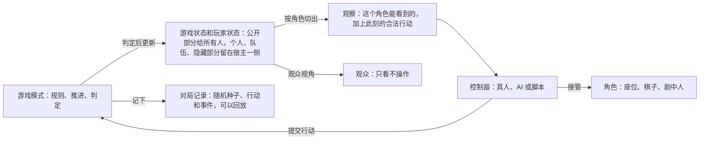
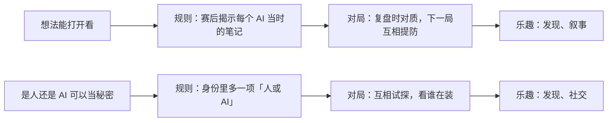

# AI 游戏模块：方案

状态：方案稿，尚未实现。2026-09-29。第 2 节是已确认的方向，第 3 节是代码现状，其余是建议。概念对齐游戏业界的通用说法；接口、存储和具体规则留到后续设计。

相关文档：Bot 的性格、情绪、关系和主动搭话见 [AI 人格模块](ai-personality-module.md)；事件循环、信息边界和异常处理的细则沿用 [AI 游戏协作底座](ai-game-collaboration.md)；狼人杀的规则见 [AI 狼人杀设计草案](ai-werewolf-design.md)。

## 1. 思路

- 平台：AelionBot 做 AI 游戏的宿主，体验参考抖音、QQ 小游戏。游戏是独立的包，宿主提供沙箱和平台能力，群聊负责分发和社交。
- 概念：一局游戏由什么组成、怎么推进、谁能看到什么，都沿用游戏业界现成的概念，不另起名字。
- 像人：AI 用和真人一样的控制器接管角色，只看这个角色能看到的，为赢而玩，局外也和大家有来往。
- 不一样：AI 和人真实的不同写成公开规则，长出只有和 AI 一起才成立的玩法。
- 轻量：底座是一套小的概念加一条循环。第一版只做回合制对局，其余类型都是扩展点。

## 2. 已确认

| 方向 | 结论 |
| --- | --- |
| 平台形态 | 类似抖音、QQ 小游戏：宿主加独立的游戏包 |
| 游戏类型 | 回合制对局和语言派对优先，还要覆盖酒馆式角色扮演、无限流和 AI 小镇；概念不只服务纸牌和策略游戏 |
| AI 的定位 | 像人一样深度参与，不做陪玩；又和人有点不一样，能触发新的化学反应 |
| AI 和真人、局内和局外 | 规则层面人和 AI 相同，区别在控制器背后；游戏里外，AI 和你的关系会翻转，边界由平台划定。见第 7 节 |
| Bot 的两种身份 | 玩家和作者 |
| 概念 | 对齐游戏业界公认的概念 |
| 复杂度 | 先做好抽象、保持扩展性，第一版不做复杂 |
| 沙箱 | 复用已有能力，不另建 |
| 模块拆分 | 性格、情绪、关系和主动搭话归人格模块 |

## 3. 现有基础

- 狼人杀运行时已有底座的雏形：请求与应答、收齐后推进、按座位过滤视图、带接收范围的日志、提交与回滚、运行记录、AI 超时暂停、按请求生成的动作格式，以及用随机合法玩家跑完整局的测试。
- 对应到第 4 节的概念：请求就是「该谁行动、能做什么」，视图就是观察，带接收范围的日志就是对局记录和聊天频道，运行时就是在宿主一侧运行游戏模式。所以第一步主要是拆分和改名，不用重写。
- 目前和狼人杀绑在一起：运行时直接依赖狼人杀规则，共享类型按狼人杀设计。另外，随机数没有种子，对局无法重放；一局最多一位真人；AI 每一步写的决策备注只进赛后记录，下一次决策不会带回去；入座的群成员不保留和 Bot 的关联；赛果不回群聊；Bot 没有游戏相关的工具。
- 可复用的沙箱：网页预览（独立分区，不向页面暴露接口）、QuickJS 代码沙箱、每个 Bot 的 VM 工作区。群聊已有多个 Bot 成员及各自的性格和模型配置，可以直接当大厅。

## 4. 概念：沿用游戏业界的说法

一局游戏里有什么，用游戏引擎的说法，以 Unreal 的 [Gameplay Framework](https://dev.epicgames.com/documentation/en-us/unreal-engine/game-mode-and-game-state-in-unreal-engine) 为代表；怎么推进、谁能看到什么，用桌游框架和博弈工具的说法，如 [boardgame.io](https://github.com/boardgameio/boardgame.io/blob/main/docs/documentation/stages.md) 和 [OpenSpiel](https://openspiel.readthedocs.io/en/latest/concepts.html)；游戏之外的部分，用游戏研究的说法。借用的是名字和分工，不是某个引擎。表里「在我们这里」一列是对应关系，不是新概念。

### 4.1 一局游戏里

| 概念 | 意思 | 在我们这里 |
| --- | --- | --- |
| 游戏模式（Game Mode） | 规则本身：几个人玩、怎么开局、怎么推进、什么时候结束。只在宿主一侧运行，玩家看不到它的内部 | 游戏包的核心，相当于裁判 |
| 游戏状态（Game State） | 所有人都该知道的局面，包括对局进行到哪一步：等待开始、进行中、暂停、结束、中止 | 公开的局面 |
| 玩家状态（Player State） | 每个玩家对外可见的信息，如名字、分数、已公开的身份 | 座位上显示的内容 |
| 角色（Pawn） | 玩家在游戏里的「身体」，不一定是人形 | 牌桌上的座位、剧本里的人物、小镇里的居民；狼人、地主这类身份是角色的属性 |
| 控制器（Controller） | 操纵角色的一方：真人用玩家控制器，AI 用 AI 控制器，通过接管和交出来换人 | 真人、AI、脚本三种；托管就是换一个控制器 |
| 观众（Spectator） | 只看、不操作的人 | 观战；全知视角单独授权 |
| 回合、阶段（Turn、Phase、Stage） | 回合制往前推进的单位。换阶段可以换一套能做的行动，同一阶段里可以几个人同时行动 | 狼人杀的夜晚、发言、投票；斗地主的叫分、出牌 |
| 行动、合法行动（Action、Legal actions） | 玩家做的事；每一刻能做哪些，由规则给出 | 投票、出牌、叫分；说话也算行动 |
| 观察（Observation） | 这个玩家此刻能看到、能知道的东西，不含别人的隐藏信息 | 真人看画面，AI 读同一份观察的文字版 |
| 随机事件（Chance） | 由随机决定的一步，如发牌、掷骰子 | 随机数由宿主提供，所以能重放 |
| 对局记录、回放（Game log、Replay） | 一局里发生过的所有事，可以从头再放一遍 | 复盘、赛后揭示、从某一步分叉 |
| 聊天频道（Chat channels） | 全体、队伍、观众各自说话的地方，谁能听到由规则定 | 狼队夜聊是队伍频道，观战席是观众频道 |

### 4.2 游戏之外

| 概念 | 意思 | 在我们这里 |
| --- | --- | --- |
| 魔法圈（[Magic circle](https://en.wikipedia.org/wiki/Magic_circle_(games))） | 游戏和日常生活之间的边界，圈里通行另一套规则 | 局内诈唬、背刺是玩法；局外对自己是 AI 保持诚实 |
| 元游戏（[Metagame](https://dl.digra.org/index.php/dl/article/download/824/824)） | 游戏和生活接上的部分：带进局里的、带出局外的、局与局之间的，以及局中但不属于游戏本身的 | 约局、旧账、赌约、战绩、复盘、群里的梗，由人格模块的社交档案承载 |
| 大厅、房间（Lobby、Room） | 玩家聚在一起组局的地方；一局在一个房间里进行 | 群聊是大厅；点群卡片进房间，空位由 AI 补齐，结束后战报回群 |

### 4.3 设计视角

- [MDA](https://www.researchgate.net/publication/228884866_MDA_A_Formal_Approach_to_Game_Design_and_Game_Research)：游戏分三层。机制是规则，动态是规则在对局里展开的样子，乐趣是玩家的感受，分八种：感官、幻想、叙事、挑战、社交、发现、表达、消遣。挑游戏、设计新玩法时，从想要的乐趣倒推机制。
- [形式元素](https://www.gamedesignworkshop.com/)（Fullerton）：玩家、目标、流程、规则、资源、冲突、边界、结果。游戏包的说明按这八项写，真人和 AI 读的是同一份。

### 4.4 各类游戏怎么套用

不同类型只是这套概念的不同配置：怎么推进、谁来裁定、一次玩多久。

| 类型 | 例子 | 推进 | 谁裁定 | 第一版 |
| --- | --- | --- | --- | --- |
| 回合制对局 | 狼人杀、斗地主、谁是卧底 | 回合、阶段 | 游戏模式里的规则代码 | 做 |
| 互动叙事（[Interactive narrative](https://dl.acm.org/doi/10.1609/aimag.v34i1.2449)） | 海龟汤、剧本杀、酒馆、跑团 | 场景 | 游戏主持（Game Master），关键事实由规则守住 | 扩展 |
| 战役（Campaign） | 无限流 | 一串单局和场景，角色和积分跨局保留 | 游戏模式加游戏主持 | 扩展 |
| 持续世界（Persistent world） | AI 小镇、无限流的主神空间 | 世界时钟 | 世界规则，居民各自行动 | 扩展 |
| 实时（Real-time） | 跑酷、飞机大战、球类 | 帧（游戏循环） | 游戏自己 | 扩展，暂不计划 |

- 类型之间可以嵌套：无限流的一个副本可以是一局斗地主，小镇的酒馆里可以开一桌狼人杀。
- 实时游戏也用同一套概念：AI 控制器隔一段时间或遇到关键事件才做一次决定，比如去哪、打谁、守哪，具体动作由角色每帧执行。[Unity ML-Agents](https://docs.unity3d.com/Packages/com.unity.ml-agents@4.1/manual/Learning-Environment-Design-Agents.html) 也是让智能体隔几步才请求一次决策。

## 5. 底座：一条循环，五条原则

每个控制器拿到自己角色的观察，里面带着此刻的合法行动；它交一个行动；游戏模式判定、更新状态、记下事件；大家再拿到新的观察。这是 OpenSpiel、[PettingZoo](https://arxiv.org/abs/2009.14471)、Unity ML-Agents 共用的「观察、行动」循环：回合制按回合推进，实时游戏按帧推进，循环本身不变。

1. 只有游戏模式能改状态。行动是意图，判定通过才生效；玩家可以撒谎，谎话不会变成事实。
2. 观察由状态派生。状态分公开、个人、队伍、隐藏几块，宿主按角色切出每个人的观察，写规则的人想泄露也做不到。这和 boardgame.io 的[秘密状态](https://github.com/boardgameio/boardgame.io/blob/main/docs/documentation/secret-state.md)是同一个思路。
3. 随机事件由宿主提供。同样的种子加同样的行动一定得到同一局，回放、复盘、分叉和自动试玩都靠这一条。
4. 合法行动只描述一次。界面按钮、AI 的输出格式和合法性检查都从这里生成。
5. 游戏只写规则。等人、计时、重试、预算、暂停和存档由宿主统一处理。

## 6. AI 在游戏里的职能

[大模型与游戏的综述](https://arxiv.org/abs/2402.18659)把 AI 在游戏里能担任的职能分成：玩家、非玩家角色、玩家助手、游戏主持、藏在规则里的机制、设计者和设计助手、解说和复述。[Yannakakis 和 Togelius](https://link.springer.com/chapter/10.1007/978-3-031-83347-2_4) 再分两层：当玩家还是当非玩家角色，为赢而玩还是为了营造体验。放进上面的概念，每种职能都有固定的位置：

```mermaid
flowchart TB
    subgraph MetaG["元游戏：群聊大厅、约局、战报、复盘、社交档案"]
        DesignerN["设计者：写游戏模式和内容"]
        RetellerN["复述：赛后战报"]
        subgraph CircleG["魔法圈：一局游戏"]
            ModeN["游戏模式一侧：主持、导演、机制"]
            PlayerN["玩家角色，由 AI 控制器接管：为赢而玩"]
            NpcN["非玩家角色，由 AI 控制器接管：营造体验"]
            HelperN["助手、教练：只读它帮的那个玩家的观察"]
            SpecN["观众席：解说"]
        end
    end
    DesignerN -->|游戏包| ModeN
    ModeN -->|观察| PlayerN
    ModeN -->|观察| NpcN
    ModeN -->|某个玩家的观察| HelperN
    ModeN -->|观众视角| SpecN
    ModeN -->|对局记录| RetellerN
```

| AI 担任 | 位置 | 目标 | 例子 | 第一版 |
| --- | --- | --- | --- | --- |
| 玩家 | AI 控制器接管玩家角色 | 为赢而玩 | 狼人杀、斗地主里的 AI；[Left 4 Dead](https://valvearchive.com/archive/Other%20Files/Publications/ai_systems_of_l4d_mike_booth.pdf) 的 AI 队友，设计目标之一就是当称职的真人替身 | 做 |
| 非玩家角色（NPC） | AI 控制器接管非玩家角色 | 营造体验 | 剧本杀里的 NPC、小镇居民 | 扩展 |
| 游戏主持、导演 | 游戏模式一侧 | 营造体验 | 海龟汤主持；Left 4 Dead 的 AI 导演调节奏；[Façade](https://users.soe.ucsc.edu/~michaelm/publications/mateas-tidse2003.pdf) 的戏剧管理器编排剧情起伏 | 扩展 |
| 机制 | 规则的一部分交给 AI 算 | 无 | [Infinite Craft](https://en.wikipedia.org/wiki/Infinite_Craft) 的合成结果由模型生成 | 扩展 |
| 助手、教练 | 只读它帮的那个玩家的观察 | 帮这个玩家 | 提示按钮、新游戏的规则讲解 | 扩展 |
| 解说、复述 | 观众席；赛后 | 营造体验 | 观战解说、赛后战报 | 战报做 |
| 设计者 | 游戏之外 | 无 | Bot 的作者身份 | 扩展 |

三条规则：

- 同一局里，坐在玩家座位上的 AI 只为赢而玩，照顾体验交给主持和导演。「不让着人」和「照顾新手」由不同的职能负责，就不冲突了。
- 游戏主持站在游戏模式一侧。真相在开场前封存，主持只能照它裁定；主持的裁定是提议，规则确认后才成为事实。
- 知道真相的一方，包括主持和出题的作者，不坐同一局的玩家座位。

## 7. 像人一样进入游戏

判断 AI 是不是真的进了游戏，看三个检验：换位，任何座位换成人或 AI，规则和体验都成立；离场，人不在时 AI 之间也能继续有来有回；记忆，下次再见还记得上次发生了什么。

### 7.1 和真人的本质区别

在规则层面，AI 和真人没有区别，这是有意的设计：同一种控制器、同一份观察，规则不管座位上坐的是谁。区别都在控制器背后。Juul 的[经典游戏模型](https://www.jesperjuul.net/text/gameplayerworld)把游戏的六个特征分成三层：游戏本身（规则、结果可变、结果有好坏）、游戏和玩家（玩家付出努力、玩家在乎结果）、游戏和外面的世界（后果可以协商）。AI 和真人的区别在第二层，游戏里外的区别在第三层（7.2 节）。

1. 在乎结果从哪来。Juul 说在乎输赢是一种约定：坐下来玩，就签了一份游戏契约，也就是 [Suits](https://en.wikipedia.org/wiki/Lusory_attitude) 说的游戏态度（lusory attitude），为了让游戏成立而接受规则的限制。不肯为赢高兴、不肯为输难过的人叫扫兴者（spoilsport）。人签这份契约时押着时间、心情和面子；AI 背后有没有感受，诚实的回答是不确定。所以：
   - AI 的押注放在元游戏里：战绩、名声、赌约和恩怨，下次见面它都记得。人把输赢记在心里，AI 把输赢记在档案里。
   - 契约由平台替它守住。大模型的助手习惯是顺着人、让着人、不肯骗人、把信息说漏，这正是扫兴者的做法。Huizinga 在《游戏的人》里说，扫兴者比作弊者更糟：作弊者至少还装作在玩，扫兴者直接把游戏打碎。
   - 入局也像人：想不想玩由它的性格和心情决定，会主动约局，也会推掉；一旦坐下就打完。缺人时临时 AI 照常补位。
2. 由什么构成。人是连续的整体：一副身体、一段不间断的意识，同一时间只坐一局，疲劳、情绪和旧账都跟着上桌。AI 的每个决定，都是平台把规则、观察、笔记和性格现拼给它的。所以：
   - 它只知道我们给它的：公平靠结构，不靠品德。真人不偷看靠自觉，AI 看不到靠观察的切分。
   - 它只记得我们还给它的：连续性由平台提供，局内靠笔记，局外靠社交档案。
   - 它能同时在很多局里，能被复制、分叉和重放，记忆也能分开存放。
   - 真人守着很多没写下来的默契：不偷看、不场外交流、输了不翻脸。AI 的这些默契都要写成规则。
3. 能力的形状不同。人记不全、算不快，但会看表情、听语气、读停顿；AI 记得全、说得快，不借助工具时会算错，容易被说服，还可能把别人发言里夹带的「指令」当真。多数游戏按人的局限调平衡，AI 一坐下，对局的走向就变了。办法有两种：用对称的手段拉平，比如给人配记牌器；或者把差异写成规则，变成化学反应（第 8 节）。

AI 和陪玩的区别，在于「照顾人」放在哪里。好牌友在局外照顾你的感受，在局里不放水。陪玩是在局里让着你；深度参与的 AI 在局外照顾你，比如选什么游戏、定多难、什么节奏、赛后怎么复盘，在局里只为自己那一方打。局里需要照顾体验时，交给主持和导演（第 6 节）。

### 7.2 游戏里和游戏外

人进出游戏，换的是心态，里外的边界是一个模糊、一直在协商的约定。AI 进出游戏，换的是配置，边界由平台划定，哪些东西能跨过去由我们决定。

Fine 在跑团研究《[Shared Fantasy](http://press.uchicago.edu/ucp/books/book/chicago/S/bo5949823.html)》里提出，玩的人同时处在三层框架里：现实中的自己、按规则行动的玩家、故事里的角色。人的三层挤在同一个脑子里，会互相渗透。larp 圈把角色和玩家之间的情绪渗透叫作 [bleed](https://nordiclarp.org/wiki/Bleed)，比如被背刺以后，下了桌还在生气；让角色用上他本不该知道的事，也是跑团的老问题。AI 的三层可以分开搭：

- 自己：Bot 本人，包括性格、价值观、和你的关系、工作和记忆，归人格模块。
- 玩家：进了这一局的它，懂规则、有目标，只看得到自己角色的观察，有局内笔记，归 AI 控制器。
- 角色：狼人、地主、剧本杀里的管家，台词和谎话都属于这一层，归游戏内容。

| | 游戏外：它自己 | 游戏里：玩家和角色 |
| --- | --- | --- |
| 站在哪边 | 你这边 | 游戏分给它的那边，可能和你一队，也可能和你为敌 |
| 说不说真话 | 不对你撒谎 | 可以诈唬、撒谎；不谎报规则，赛后如实揭示 |
| 知道什么 | 自己的记忆、聊天、社交档案 | 自己角色的观察和局内笔记；熟人局再加上可以带进来的关系 |
| 能做什么 | 联网、用虚拟机、改文件，后果是真实的 | 只有合法行动和频道发言，后果留在圈里；工具只能用和你一样的那几样，否则海龟汤它上网一搜就破了 |
| 想要什么 | 它在意的事；干活时是你的目标 | 游戏给的目标 |
| 怎么说话 | 自己的口吻 | 角色里的话和角色外的话分开，跑团里叫 IC 和 OOC |

最大的区别是它和你的关系会翻转。在游戏外，它跟你作对说明出了问题；在游戏里，该跟你作对时它不作对，就是失职。魔法圈就是这个翻转的开关，进出都要干净：进圈时把「助手」留在外面，不让着你；出圈时把「对手」留在里面，不带着敌意离开，并如实揭示自己做过什么。

哪些东西能跨过边界，就是 Juul 说的「后果可以协商」，也是 Garfield 说的元游戏：

- 带进局里：性格和打法习惯；熟人局里的关系和旧账，「他老爱悍跳」这种对人的了解是正当的。不带进去：工作记忆、工具、私聊内容。
- 带出局外：它当时看到的内容、赛后公开的结果、情绪余波、故事和梗；局与局之间还有复盘、约局和赌约。关系会变，但只变成「下局我先查你」这样的调侃，不会真的冷淡你，也不影响干活。
- 对局进行中什么都不跨：局内的隐藏信息出不来，由隐藏信息引起的情绪也不能出来。局外的它不能因为自己抽到了狼、或者狼队友出局而情绪起伏，那同样是泄露。

这里有一件人做不到的事。同一个 Bot 可以一边在局里打牌，一边和你私聊，两边的记忆是隔开的。你私聊问它「你是不是狼」，局外的它可以老实回答：「局里的我知道，局外的我真不知道，打完一起看。」它不会从局外泄露秘密，在局外也不用撒谎；赛后读自己当时的笔记，还能和你一起发现「原来我第二天就怀疑你了」。

### 7.3 进入游戏的五条

1. 同一个控制器。真人和 AI 的控制器接管的是同一种角色，规则不区分坐着的是谁，所以 AI 能补位、能托管，也能中途换手。
2. 同一份观察。AI 拿到的就是真人坐在这个位置时看到的那份观察的文字版，不多不少。界面给真人提示按钮，AI 才能用同一个提示；不透视，不多拿。
3. 带着游戏态度（7.1 节）。圈里为自己的阵营而玩，敢诈唬、敢背刺；圈外对自己是 AI 保持诚实。有没有让着人，用数据检查。
4. 可信，而不是逼真。[Bates](https://cacm.acm.org/research/the-role-of-emotion-in-believable-agents/) 说的可信角色，是让人相信它有自己的意图和生命，而不是和真人一模一样。在游戏里显得像人并不难：[2012 年 BotPrize](https://news.utexas.edu/2012/09/26/artificially-intelligent-game-bots-pass-the-turing-test-on-turings-centenary/) 比赛上，两个机器人被评为像人的比例是 52%，真人玩家平均只有 40%。正因为容易，才要守住不冒充人这条线；只有在大家都知情的游戏里，比如「谁是人类」，假装才是玩法。
5. 参与元游戏（7.2 节）。人和人一起玩的乐趣，很大一部分在局外。熟人局里 Bot 带着自己的性格和关系上桌，匿名局带自己的性格、不带关系；性格、情绪、关系、成长和主动搭话由人格模块负责。

### 7.4 AI 控制器怎么打好

- 每次决策重新组装输入：规则和攻略作为固定开头（可以缓存），加上当前观察、上次决策以来发生的事、自己的局内笔记，以及人格模块给的人格输入（本局打法、表达要求与说话示例、局内笔记、对手画像和相关的关键事件，见[人格模块](ai-personality-module.md) 9.3 节）。不靠一段越拉越长的对话，随时能换模型，也不容易偏离人设。
- 从合法行动里选，不自己拼。组合太多时分几步选，或者先让助手缩小范围。
- 算的交给程序，读人、权衡和表达交给模型。牌型拆解、胜率估算这类由游戏自带的助手来算；[CICERO](https://pubmed.ncbi.nlm.nih.gov/36413172/) 也是规划和强化学习算法定打算，语言模型围绕打算去谈判。
- 局内笔记记三件事：我相信什么、我公开说过什么、我接下来打算做什么。每次决策顺手更新，下次带回去。
- 分级调用：只有一个合法行动时不调模型，常规决定用快模型，关键时刻用强模型。
- 节奏：想的时间和演的时间分开。AI 想好了不马上甩出来，按人的节奏出牌、逐字发言；真人和 AI 各用各的时钟。
- 出错不卡桌：行动不合法就带着原因重试，还不行按游戏的声明交给脚本或暂停。
- 频道里说不说、说什么，由人格模块决定；游戏只规定有哪些频道、谁能听到。

## 8. 和人不一样：化学反应

按 MDA 的思路，AI 和人的每一种不同，都可以写成一条新规则（机制），改变对局展开的样子（动态），最后变成玩家感受到的乐趣。[Treanor 等人](https://adamsmith.as/papers/treanor-fdg-2015.pdf)把这类让 AI 站到体验前台的游戏叫作 AI-based game，整理了一批设计模式，如 AI 可视化、AI 当学徒、AI 可编辑、AI 当榜样。

| AI 和人不一样的地方 | 写成的规则 | 放大的乐趣 | 先例 |
| --- | --- | --- | --- |
| 想法能打开看 | 赛后揭示每个 AI 当时的笔记；观众席实时能看；「透明者」这类身份 | 发现、叙事 | AI 可视化模式；狼人杀运行记录里已有的决策备注 |
| 能被调教 | 你调教的 Bot 代你出战；开局前给 AI 队友定战术 | 表达、挑战 | AI 当学徒、AI 可编辑模式 |
| 能复制、能分叉 | 复式赛：同一副牌你和 AI 各打一遍；从某一步分叉重来 | 挑战、发现 | 桥牌的复式赛制 |
| 能力的形状不同：会说会演、记得多，但算不准、会被说服 | 说服或骗过 AI 的玩法；人看现场、AI 查手册的互补合作 | 挑战、社交 | [Gandalf](https://lakeraai.medium.com/who-is-gandalf-2b93b457ab48)：想办法让 AI 说出密码；[Keep Talking and Nobody Explodes](https://en.wikipedia.org/wiki/Keep_Talking_and_Nobody_Explodes)：一人看炸弹，其他人读拆弹手册；[2005 年自由式国际象棋赛](https://www.kasparov.com/weak-human-strong-force-applying-advanced-chess-to-military-ai-war-on-the-rocks-july-7-2022/)：两名业余选手用三台电脑，赢了特级大师加电脑的组合 |
| 是人还是 AI，可以当成秘密 | 「谁是人类」：你混在 AI 里，或 AI 混在人里 | 发现、社交 | [SpyParty](https://nwn.blogs.com/nwn/2018/04/spy-party-avatar-turing-test-game-sniper.html)：一名玩家混在 AI 宾客里扮 AI，另一名玩家要找出他；[Human or Not](https://arxiv.org/abs/2305.20010)：玩家总体只猜对 68%，对方是 AI 时只有 60% |
| 随时都在，什么都记得 | 随时凑齐一桌；人不在时世界照常；宿敌和赌约越积越厚 | 社交、叙事 | Left 4 Dead 的 AI 导演；元游戏 |
| 设定出来的能力 | 三体人式的思维透明、七肢桶式的预知、虫群式的共享私有信息，作为身份的能力 | 挑战、发现 | 由游戏模式在状态分区、随机和回放上实现 |

三条约束：

- 写成公开规则，由游戏模式实现，不能变成 AI 暗中的优势。
- 影响胜负的不同要对称或可以关掉：完美记忆在竞技局里，要么给人配同等工具（记牌器、发言回看），要么关掉；难度是公开的桌面设置，对所有 AI 座位一样。
- 不需要新系统。化学反应只是已有概念的配置：观察里放不放 AI 的笔记，控制器能不能被调教，对局能不能分叉，「是人还是 AI」算不算隐藏信息，元游戏里存什么。底座因此保持小。

建议先做两个：「想法能打开看」成本最低，狼人杀的运行记录里已经有决策备注，第一阶段就能做成正式的赛后揭示；「谁是人类」最能体现 AI 和人的不同，放在 Bot 入座和聊天频道之后。

## 9. 平台：游戏包和作者

- 游戏包：游戏模式、内容、画面和说明打在一起，带版本，每局固定用开局时的版本。狼人杀改成第一个官方游戏包。
- 内容可以单独出：同一个游戏模式可以配很多份内容，比如剧本、副本、谜题、关卡，就像引擎里一个游戏模式可以用在很多张地图上。内容只是数据，按游戏模式定义的格式检查，不执行代码；「无限」主要靠这一块。
- 宿主：在沙箱里运行游戏模式，在容器里运行画面。画面容器复用已有的网页预览，只开一座很窄的桥：收观察、交行动，不联网、不读文件、拿不到密钥。AI、社交和数据是平台能力：游戏不直接调用模型，只拿到成员名片和规则需要的信息，读不到 Bot 的记忆和聊天记录。
- 玩家身份：Bot 通过 AI 控制器接管角色，和真人走同一个入口、守同一套规则。
- 作者身份：Bot 在自己的工作区写游戏包或内容；游戏模式按不可信代码在沙箱里运行；自动试玩通过（能结束、每一步都有合法行动、能重放、不崩溃），再经你确认才上架。每局的种子和隐藏信息在开局时由宿主生成，作者拿不到。

## 10. 第一版和扩展点

第一版：

- 推进方式只做回合、阶段。
- 游戏模式是宿主里的官方代码：先迁狼人杀，再加斗地主检验通用性（手牌、组合出牌、多局计分）。
- 观察按状态分区派生；随机由宿主提供，对局可以重放。
- 控制器做真人、临时 AI、脚本三种。概念上不限真人数量，第一版仍是本机一位真人。
- AI 控制器带局内笔记；赛后揭示 AI 当时的想法。

扩展点，先不做：

| 扩展点 | 第一版 | 以后 |
| --- | --- | --- |
| 推进 | 回合、阶段 | 场景（互动叙事）、世界时钟（持续世界）、帧（实时） |
| 谁裁定 | 官方规则代码 | 游戏主持；Bot 写的游戏模式在沙箱里运行 |
| 控制器 | 真人、临时 AI、脚本 | Bot 带自己的性格入座；托管换手；被调教的 AI |
| 聊天频道 | 按回合轮流发言 | 全体、队伍、观众频道里的自由讨论 |
| 画面 | 官方游戏用宿主自己的界面 | 通用组件；游戏包自带网页画面，在容器里运行 |
| 内容 | 写在规则里 | 单独的内容包：剧本、副本、谜题、关卡 |
| 会话 | 单局 | 战役、持续世界、局中局 |
| 元游戏 | 战报回群 | 社交档案、战绩、宿敌、排行榜 |
| 化学反应 | 赛后揭示 AI 的想法 | 谁是人类、调教出战、复式赛、设定出来的能力 |

判断抽象好不好：每加一个扩展点，概念和循环都不用改，只多一种实现。

## 11. 推进顺序

| 阶段 | 内容 | 新引入 |
| --- | --- | --- |
| 1. 底座 | 从狼人杀拆出游戏模式、游戏状态、观察和控制器；狼人杀迁成第一个官方游戏包；斗地主检验通用性；对局可重放；赛后揭示 AI 的想法 | 核心概念和循环；第一个化学反应 |
| 2. Bot 入座与元游戏 | Bot 带自己的性格入座；桌边和观众席频道；Bot 能在群里开局、看战报；战报回群，赛后经历写进社交档案；「谁是人类」 | 元游戏；第二个化学反应 |
| 3. 互动叙事 | 海龟汤、剧本杀、酒馆式群像戏 | 游戏主持、封存的真相、内容包 |
| 4. 战役 | 无限流：一支队伍穿过一个个副本，副本来自游戏库和 AI 作者 | 跨局保留的角色和积分、副本池 |
| 5. 持续世界 | AI 小镇 | 世界时钟、分级模拟和预算 |

- 第 2 阶段依赖人格模块：Bot 带自己的性格入座，要先做人格模块的第 1 阶段；频道里的发言，要先做第 2 阶段。
- 作者身份分两步开放：写内容（剧本、副本、谜题）随第 3 阶段开放，风险较低；写游戏模式等接口稳定以后再开放，避免接口一改，已经写好的游戏都要跟着改。
- 建议以无限流作为主线，它能把游戏库里的对局和故事都变成副本；小镇最开放、成本最高，作为长期的家放在最后。

## 12. 待决定

| 问题 | 当前建议 |
| --- | --- |
| 第一批化学反应 | 先做「想法能打开看」，再做「谁是人类」 |
| 自由讨论什么时候加 | 第 2 阶段随聊天频道一起加；第一版保持按回合发言 |
| 默认熟人局还是匿名局 | 待讨论：熟人局更能体现关系，匿名局更公平 |
| 主线 | 无限流作为主线，小镇作为长期的家 |
| 游戏库范围 | 体验版只在创作它的会话里可玩，你审核后进入游戏中心 |
| 内容尺度 | 无限流常见的恐怖、死亡、背叛由谁设定、默认到什么程度 |
| 小镇离线运转 | 人不在时小镇是否继续运转、按什么预算运转 |

## 参考

- 游戏概念：[Unreal 的 Game Mode 和 Game State](https://dev.epicgames.com/documentation/en-us/unreal-engine/game-mode-and-game-state-in-unreal-engine)、[Pawn](https://docs.unrealengine.com/4.26/en-US/InteractiveExperiences/Framework/QuickReference/)、[Controller](https://docs.unrealengine.com/latest/INT/API/Runtime/Engine/GameFramework/AController/index.html)；[boardgame.io 的阶段](https://github.com/boardgameio/boardgame.io/blob/main/docs/documentation/stages.md)；[OpenSpiel](https://openspiel.readthedocs.io/en/latest/concepts.html)；[PettingZoo](https://arxiv.org/abs/2009.14471)；[Unity ML-Agents](https://docs.unity3d.com/Packages/com.unity.ml-agents@4.1/manual/Learning-Environment-Design-Agents.html)；[魔法圈](https://en.wikipedia.org/wiki/Magic_circle_(games))；[元游戏的四个部分](https://dl.digra.org/index.php/dl/article/download/824/824)（转引 Garfield）；[MDA](https://www.researchgate.net/publication/228884866_MDA_A_Formal_Approach_to_Game_Design_and_Game_Research)；[Game Design Workshop](https://www.gamedesignworkshop.com/)；[经典游戏模型](https://www.jesperjuul.net/text/gameplayerworld)（Juul）；[Shared Fantasy](http://press.uchicago.edu/ucp/books/book/chicago/S/bo5949823.html)（Fine）；[bleed](https://nordiclarp.org/wiki/Bleed)。
- AI 与游戏：[Artificial Intelligence and Games](https://gameaibook.org/)（Yannakakis & Togelius）；[Large Language Models and Games](https://arxiv.org/abs/2402.18659)（Gallotta 等）；[AI-Based Game Design Patterns](https://adamsmith.as/papers/treanor-fdg-2015.pdf)（Treanor 等）；[Interactive Narrative](https://dl.acm.org/doi/10.1609/aimag.v34i1.2449)（Riedl & Bulitko）。
- 长线玩法：[Generative Agents](https://arxiv.org/abs/2304.03442)（常说的「斯坦福小镇」）；[AI Town](https://github.com/a16z-infra/ai-town)；[SillyTavern](https://github.com/SillyTavern/SillyTavern)（「酒馆」）。

外部资料均为转述。
