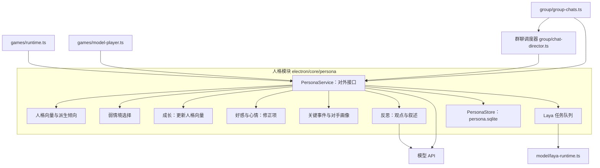
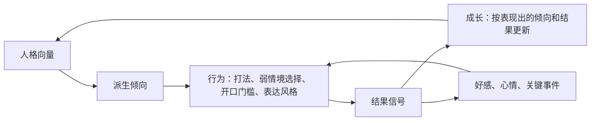
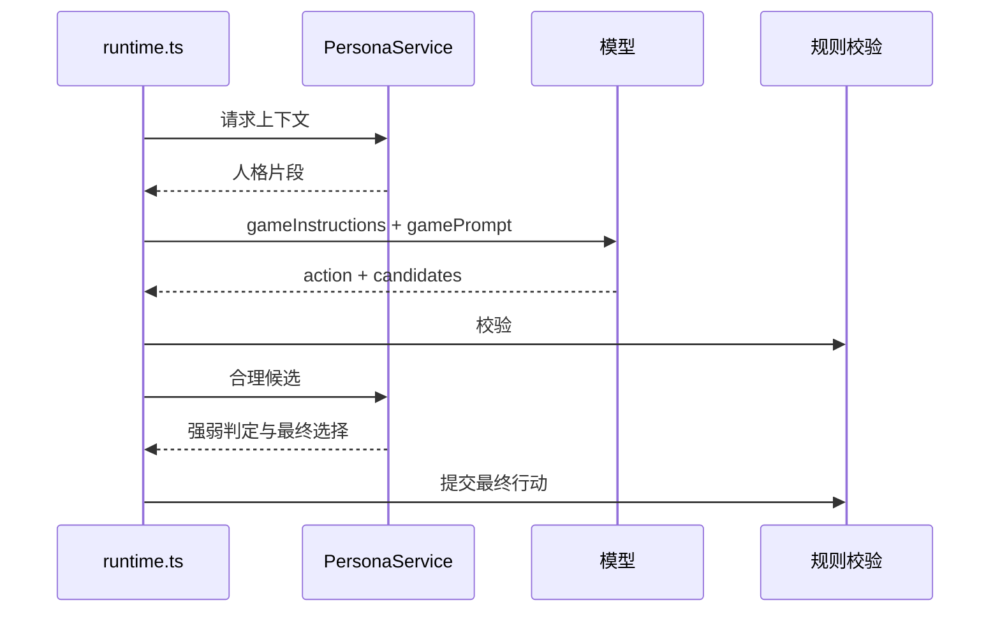
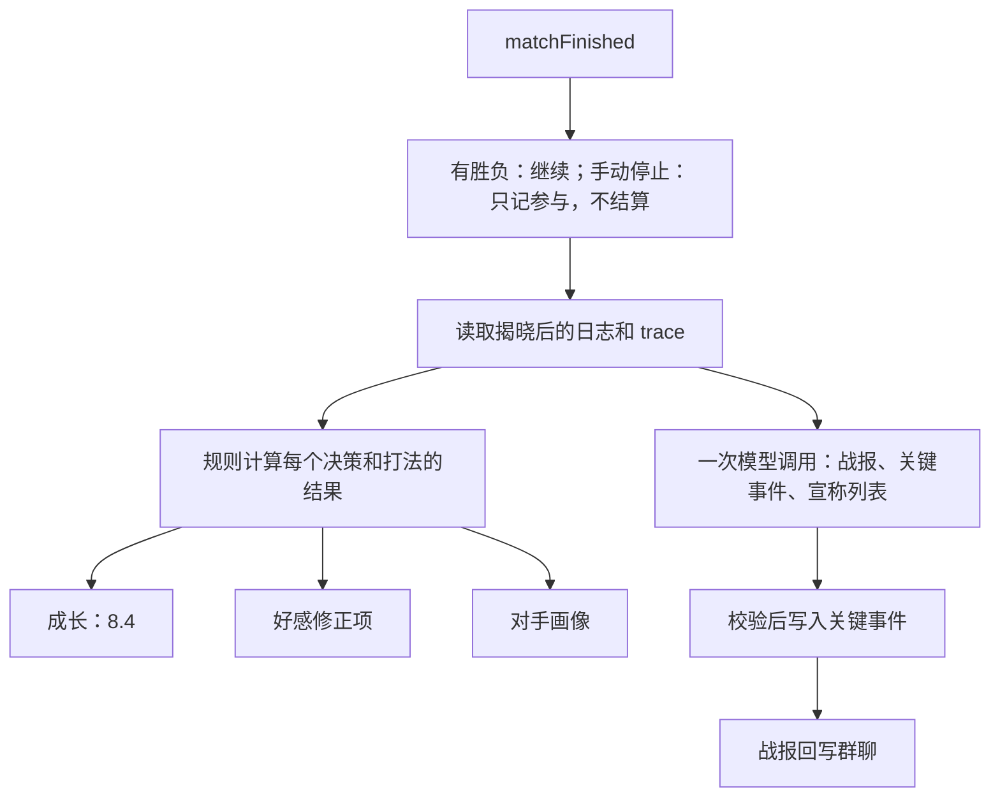
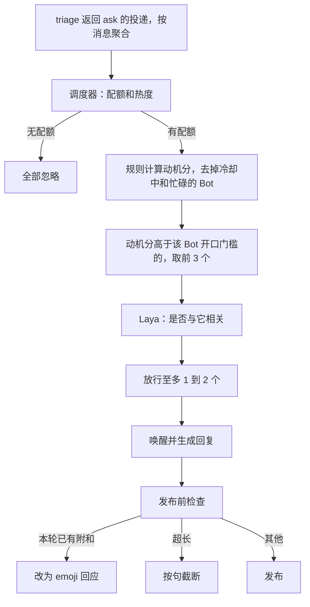

# AI 人格模块技术方案

| 项 | 内容 |
| --- | --- |
| 版本 | 当前实现 v6.1-cross-experience-20261006；本方案的 v5.1 推导保留为历史设计，最新人格策略见 D.11–D.12，评测功能移除见 D.18 |
| 状态 | 开发版，尚未完成发布验收；关键决策改用模型语义与引用核验，新游戏经历只记录事实，不直接进入旧成长公式。开局打法及部分关系规则仍待校准 |
| 范围 | 狼人杀对局（7 人、12 人）和群聊。私聊与工作任务保持原有 SOUL，不接入本模块的人格、成长和关系 |
| 依赖 | 模型 API；Laya 本地选择题模型（可选）。不训练模型，不引入向量模型 |
| 相关文档 | [AI 游戏模块](ai-game-module.md)、[群聊协作方案](design/Group-Collaboration-Framework-20260929.md)、[本地 Laya](laya-local.md)。本方案生效后，[MBTI for Agent](mbti-for-agent.md) 只适用于补位 AI |

## 0. 写在前面

**当前实现说明：** 下文第 8–9 节等 v5.1 计算推导保留用于理解历史设计，不全部代表当前运行行为。v6 已用模型语义替换关键选择的硬特征映射，单条游戏经历只记事实；v6.1 已接通跨经历模型评估和有界自动成长。以 D.11–D.12 的现状说明为准；本地评测功能已按用户要求移除，见 D.18。

**私聊隔离：** 按用户要求，普通私聊、Bot 间私有对话、开场白和私聊工作任务继续使用原有 SOUL；不自动注入五维、MBTI、游戏成长、关系或共同经历。按角色设定估计人格仅单向读取 SOUL，人格调整和游戏结算不回写 SOUL 或私聊长期记忆。群聊仍可读取关系和共同经历；运行时只允许带群聊来源的请求注入群上下文。

### 0.1 我们想做成什么

我们希望群里的 Bot 不只是工具，而是让人愿意一起玩、一起聊的伙伴。衡量标准很朴素：和它相处一段时间后，你会觉得它有自己的脾气，记得你们之间的事，会被事情影响，也知道什么时候该安静。

现在的 Bot 离这个目标很远。几个 Bot 说话一个样；上一局发生的事，下一局全忘了；群里谁说什么它都附和；有时候又一个接一个地抢着说话。它们不是不聪明，而是没有「自己」。

### 0.2 一个具体的样子

以一个叫阿岩的 Bot 为例，这是方案做成之后我们希望看到的：

- 阿岩胆子大。拿到狼人时，它倾向于冒充预言家；局势不明朗、上不上警都说得过去时，它多半会上。但如果场上已经有了确凿的证据，它和别的 Bot 一样照证据行事，不会因为性格去做一个明显错误的决定。
- 有一局它冒充预言家被当场识破。第二天在群里有人提起，它能准确说出是哪一局、谁拆穿的，还会拿这件事和那个人开玩笑。它说的每件事都真实发生过。
- 连着几次被识破之后，它上警和冒充身份的次数少了一点，但还是那个胆子偏大的阿岩，不会变成另一个人。
- 群里讨论方案时，它不会每条都回。别人已经说过「同意」，它就点个表情；它有不同意见时才开口。
- 把几个 Bot 的发言打乱给你看，你能认出哪段是阿岩说的。

### 0.3 核心思路

这些效果背后是五个判断，整个方案都围绕它们展开：

1. 性格不是提示里的一段描述，而是它在拿不准时稳定地怎么选。只写提示的做法之所以显得空，是因为研究发现，给模型注入人设能改变它怎么描述自己，却几乎不改变它怎么做（第 1 节）。所以本方案让系统在关键时刻替它按性格做选择，模型只负责把话说出来。
2. 性格只在「拿不准」的时候起作用。证据明确时，谁都会做同一个选择，这时让性格插手只会让它变笨。心理学里的情境强度假说说的正是这一点（5.4）。
3. 五维含义采用大五人格与 BFI-2 的定义。游戏行为映射、0–1 参数和成长公式是本项目的工程假设；文献提供定义与研究方向，不能证明这些具体规则有效（第 5 节）。效果必须通过实际行为评测来验证。
4. 当前成长把部分游戏结果映射回五维，并对上警结果扣除规则基线。这是待修订的实现：结果好坏不直接等于决策质量，更不能直接证明人格应该变化。先保留可核对的经历、原始反馈和算法版本，用评测决定后续替换（9.6）。
5. 做到的每一点都要能测出来。「像人」「有意思」很容易变成自我感觉，所以每个机制都配有评测，测不出效果的机制就删掉（第 17 节）。

### 0.4 我们是怎么走到这一步的

这份方案不是一次写成的。每一版都因为发现了问题而被替换，这些问题也塑造了现在的设计：

| 版本 | 做法 | 为什么放弃 |
| --- | --- | --- |
| 最初 | 「情境 × 反应」计数表 | 词表写死，Bot 长不出表外的个性 |
| 第二版 | 外接一个小型人格网络 | 我们没有可训练的模型，网络最后也只能写成几句提示，属于过度设计 |
| 第三版 | 数据加机制，游戏和群聊各自一套 | 方向对了，但维度（冒险、记仇等）是自己起的，没有理论依据；按打法胜率计数会让所有 Bot 趋向同一种打法 |
| 第四版 | 正式的技术方案，6 项气质 | 6 项气质取自三套互不对应的理论，有的根本测不出来 |
| 第五版 | 大五定义加自定义行为映射 | 定义有研究依据，具体映射和成长机制尚未验证 |
| 第五版修订（当前） | 用仿真逐项验证并修正 | 仿真找出了 7 个设计缺陷，也找出了一个让我们得出过错误结论的工具错误，全部记录在附录 B、C |

### 0.5 怎么读这份文档

- 想了解思路和取舍：读第 0–6 节。
- 要写代码：读第 7–16 节。
- 要了解当前功能和验证边界：读 D.11–D.12、D.18。应用不再提供评分、反馈归档和 ZIP 评测包。
- 想知道某个设计为什么是现在这样：读附录 A（v4 到 v5 的审查）、附录 B（第一次仿真发现的问题）、附录 C（逐轮的修正过程和结论）。

## 1. 背景

当前 Bot 的人格由两部分组成，二者互不相通：

- 工作与群聊：SOUL.md 全文放在系统提示开头，由模型自行理解。
- 狼人杀：`shared/games/game-personality.ts` 按 MBTI 生成一段软偏好（`behaviorPolicy`），开局时对未指定的 AI 随机分配，只在当局有效；预设存在界面的 localStorage，不属于 Bot。

由此带来四个问题：

1. 同一个 Bot 在群聊和对局中表现不一致，不能被识别为同一个角色。
2. Bot 不记得与他人的共同经历。
3. 人格只通过提示影响模型；研究显示，给模型注入人设能改变它的自我描述，却几乎不改变行为（[2509.03730](https://arxiv.org/abs/2509.03730)）。
4. 人格不随经历变化。

## 2. 目标与非目标

| 编号 | 目标 | 验证方式（第 17 节） |
| --- | --- | --- |
| G1 | 可识别：同一个 Bot 在对局和群聊中表现出一致、可测量、可被他人识别的人格 | P1–P4、P10、H1、H2 |
| G2 | 有记忆：准确引用与特定成员的共同经历 | M1、M2、M5、消融 A2 |
| G3 | 有个性的决策：关键决策体现人格，且不降低胜率 | P7、P7b、P8、V5 |
| G4 | 克制：群聊中 AI 发言不压过真人，不刷屏，不做无信息量的附和 | C1–C5、C8 |
| G5 | 可成长：人格随经历缓慢、定向地变化，并保持个体差异；关系可以较快变化 | P5、P6、P6b、H5 |

非目标：

- 不追求互动量或停留时长。
- 不模拟身体感受和人生经历，不冒充人。
- 不让人格改变对局规则、阵营目标或行动的合法性。
- 不追求更高的胜率；人格只在不降低胜率的前提下起作用。

## 3. 术语

| 术语 | 定义 |
| --- | --- |
| 人格向量 | 大五人格的五个维度 E（外向性）、A（宜人性）、C（尽责性）、N（神经质）、O（开放性），各取 0–1，0.5 表示一般水平 |
| 派生倾向 | 由人格向量按文献给出的方向计算出的 8 个行为倾向（8.2），每个对应一组可观测的行为指标 |
| 情境强度 | 情境对行为的约束程度。强情境下行为主要由情境决定，弱情境下主要由人格决定（5.3） |
| 人格选择 | 在弱情境中，系统从模型给出的合理候选里按派生倾向选择一个（8.3） |
| 行为特征 | 候选行动在各派生倾向上的取值，例如「上警」的主导性为 1。主要由规则计算 |
| 成长 | 人格向量按经历缓慢更新的过程（8.4） |
| 锚点 | 出生时的人格向量。成长时向它回拉，维持个体差异 |
| 好感 | Bot 对某个成员的一个数值，由带时长的修正项汇总 |
| 心情 | 一个 −1 到 1 的数值，由带时长的修正项汇总，只影响表达 |
| 修正项 | 一条带数值、时长和来源的记录，用于计算好感和心情 |
| 关键事件 | 从对局或群聊中挑出的、值得日后引用的事件，含参与者、摘要和标签 |
| 对手画像 | Bot 对同桌成员在身份公开后的行动频率统计 |
| 观点 | Bot 持有的、可被证据修改的立场 |
| 自我叙述 | 由模型定期撰写的一段「我是谁、最近怎样」 |
| 群聊调度器 | 每个群一个，决定未被点名时哪些 Bot 可以发言 |
| 结果信号 | 可观察的反馈：身份揭晓、胜负、回复、emoji 回应、被 @ |

## 4. 需求

### 4.1 功能需求

| 编号 | 需求 | 对应目标 |
| --- | --- | --- |
| F1 | 人格向量挂在 Bot 上，对局和群聊共用 | G1 |
| F2 | 对局座位能关联到 Bot；补位 AI 不建档案 | G1 |
| F3 | 开局按人格选择本局打法 | G1、G3 |
| F4 | 关键决策中，弱情境下由系统按人格在合理候选中选择 | G3 |
| F5 | 局内笔记在同一局的后续请求中保留 | G3 |
| F6 | 对局结束后生成关键事件与战报，并回写群聊 | G2 |
| F7 | 调用模型时按参与者和话题选取至多一条关键事件放入上下文 | G2 |
| F8 | 群聊中未被点名的发言经过群聊调度器，开口门槛由人格决定 | G4 |
| F9 | 仅表示附和的回复降级为 emoji 回应 | G4 |
| F10 | 根据结果信号更新人格向量、好感和心情 | G5 |
| F11 | 定期反思，更新观点和自我叙述，改动须有证据并通过校验 | G5 |
| F12 | 档案可查看、锁定、回退、重置；成员可删除与自己有关的记录 | G5 |

### 4.2 非功能需求

| 编号 | 需求 |
| --- | --- |
| N1 | 对局中不增加模型调用次数；单次请求的输入增加不超过 1500 字 |
| N2 | 群聊中只有真正发言时才调用模型 API |
| N3 | Laya 不可用时所有功能可降级运行 |
| N4 | 本模块对 Laya 的调用不超过其并发上限，且不导致其超时停用 |
| N5 | 局内隐藏信息、私聊内容和工作内容不进入人格档案 |
| N6 | 每处档案变化都记录来源 |
| N7 | 价值观与边界不参与学习 |
| N8 | 每个程序约束配有开发回归；实际人格表现仍需使用验证（第 17 节） |

## 5. 理论依据

这一节回答一个问题：凭什么说这些维度、这些行为映射是对的。第四版以前，我们的维度要么是自己起的名字，要么东拼西凑自不同理论，结果是既说不清它测的是什么，也没法检验。所以这一版先选一个被广泛验证、能测量、大模型研究也普遍采用的人格模型，再让每一条「这种性格会这样做」都能找到对应的研究结论。文献只给出方向的地方，我们明确标为「待校准」，不假装有依据。

### 5.1 人格模型的选择

| 候选 | 依据 | 优点 | 缺点 | 结论 |
| --- | --- | --- | --- | --- |
| 大五人格 | 跨文化重复验证最充分的特质模型；有中文版量表（[BFI-2 中文版](https://journals.sagepub.com/doi/10.1177/10731911211008245)）；有机制解释（[控制论大五](https://gwern.net/doc/psychology/personality/2015-deyoung.pdf)）；大模型人格研究普遍采用，可以用提示塑造并用量表测量（[Serapio-García 等](https://www.nature.com/articles/s42256-025-01115-6)、[PersonaLLM](https://arxiv.org/abs/2305.02547)） | 可测量、可解释、有中文工具 | 维度较粗 | 采用 |
| HEXACO | 在大五之外增加诚实-谦逊，对经济博弈中的合作预测更好（[Thielmann 等, 2020](https://www.researchgate.net/publication/336716710_Personality_and_prosocial_behavior_A_theoretical_framework_and_meta-analysis)） | 合作预测更好 | 诚实-谦逊在本场景用不上：局内欺骗由身份规定，局外诚实是固定规则；大模型相关研究少 | 不采用 |
| 大五的十个侧面（BFAS） | [DeYoung 等, 2007](https://doi.org/10.1037/0022-3514.93.5.880) | 更细 | 十个维度要逐一验证，样本量翻倍 | 不采用，只用来确定行为映射的方向 |
| MBTI | 大众熟悉；现有代码在用 | 易懂 | 四个维度与大五中的四个相关，但缺少情绪稳定性，且数据不支持真正的二分类（[McCrae & Costa, 1989](https://pubmed.ncbi.nlm.nih.gov/2709300/)） | 只作为由大五推出的显示标签 |
| v4 的 6 项气质 | 分别取自 Rothbart、Cloninger、Belsky 三个体系 | 覆盖面广 | 维度来自不同理论，彼此不对应；「可塑性」无法单独测量 | 废弃 |
| 自定义维度（冒险、记仇等） | 无统一理论 | 贴合游戏 | 没有依据，不可比较 | 废弃；改为由大五派生（8.2） |

### 5.2 五维含义的统一依据

五维的定义采用 Soto & John（2017）的 BFI-2，中文领域名和侧面名采用 Zhang 等（2022）中文版论文附录。大五领域结构有广泛研究支持；三个侧面的划分是 BFI-2 采用的具体框架，不宣称是所有人格研究唯一的划分。实现仍保存五个数值，侧面用于说明每一维覆盖什么，不新增十五个成长参数，也不把一个领域分数当成三个侧面分别测得的分数。

| 维度 | 含义（转述） | BFI-2 中文侧面名 |
| --- | --- | --- |
| 外向性 E | 社会参与、表达主张与活动投入 | 社交、果断、活力 |
| 宜人性 A | 关心、尊重他人与信任善意 | 同情、谦恭、信任 |
| 尽责性 C | 有序安排、任务推进与履行责任 | 条理、效率、负责 |
| 负性情绪 N | 担忧、低落和情绪波动的频率与强度 | 焦虑、抑郁、易变 |
| 开放性 O | 对思想、审美和新构想的兴趣 | 好奇、审美、想象 |

依据：[Soto & John 原始论文](https://escholarship.org/uc/item/16x6n05t)，期刊页 121–122、表 1；[Zhang 等作者机构全文](https://www.colby.edu/wp-content/uploads/2021/05/Zhang_et_al_in_press.pdf)，PDF 第 18–19 页附录；[Berkeley Personality Lab 的 BFI-2 说明](https://www.ocf.berkeley.edu/~johnlab/bfi.html)。核对日期：2026-10-06。中文版的 N 领域名完整写作「负性情绪/神经质」，页面采用前半部分。「抑郁」在这里是人格侧面名称，不是疾病诊断。

页面解释、SOUL 估计提示与表达提示共用 `shared/persona/persona-semantics.ts`。两端短词与三档描述是产品转述；0–1 数值和 0.4/0.6 分档不是人群常模或量表诊断界值。

行为设计必须保持这些含义：表达直接不能单独判成低宜人性，坚持目标不等于拒绝新证据，敏感不等于报复，开放不等于冒险或机械更换打法。这些是根据领域定义约束产品设计的原则，不是论文提供的游戏算法。

### 5.2.1 机制解释的适用范围

控制论大五（DeYoung, 2015）提供一种机制解释。下面是本项目据此提出的工程映射，不能替代 5.2 的领域定义，也不能把相关性或理论解释直接当作经验证的学习公式：

| 维度 | 机制 | 在本方案中的作用 |
| --- | --- | --- |
| E | 对奖励的敏感性 | 正向结果的学习权重；发言倾向 |
| N | 对威胁的敏感性 | 负向结果的学习权重；情绪反应幅度 |
| A | 与他人目标的协调 | 合作、从众、宽恕 |
| C | 目标的维持 | 坚持既定计划 |
| O | 探索 | 选择新打法、开新话题 |

### 5.3 行为映射的依据

下表保留原方案引用的行为关联作为候选依据。它们不构成 BFI-2 的定义，也不直接验证狼人杀里的特征提取、线性组合或权重。表中的证据强度是原方案评估，尚需逐项核对研究场景与本游戏是否一致；公式整体属于待验证的工程假设（第 19 节）。

| 派生倾向 | 公式中的维度与方向 | 文献结论 | 证据强度 |
| --- | --- | --- | --- |
| 表达 talk | E＋ | 外向者在自然情境中说话更多（[Mehl 等, 2006](https://www.researchgate.net/publication/7046272_Personality_in_its_natural_habitat_Manifestations_and_implicit_folk_theories_of_personality_in_daily_life)） | 强 |
| 主导 assert | E＋ | 自信果断是外向性的一个侧面（DeYoung 等, 2007） | 强 |
| 冒险 risk | E＋、O＋、N−、A−、C− | 总体冒险倾向的大五模式为高 E、高 O、低 N、低 A、低 C（[Nicholson 等, 2005](https://www.tandfonline.com/doi/abs/10.1080/1366987032000123856)） | 中：来自自评问卷 |
| 从众 conform | A＋、C＋、N− | 由 A、C、情绪稳定性组成的「稳定性」高阶因子正向预测从众（[DeYoung 等, 2002](https://www.researchgate.net/publication/222301053_Higher-order_factors_of_the_Big_Five_predict_conformity)） | 中 |
| 记仇 vengeance | A−、N＋ | 报复倾向与宜人性负相关、与神经质正相关（[McCullough 等, 2001](https://greatergood.berkeley.edu/images/uploads/McCullough-Dispositional_Vengefulness_Correlates.pdf)） | 中 |
| 合作 cooperate | A＋ | 宜人性正向预测相互依赖情境中的亲社会行为（Thielmann 等, 2020） | 强：770 项研究的元分析 |
| 坚持 persist | C＋ | 尽责性对应目标的维持和对干扰的抑制（DeYoung, 2015） | 中 |
| 探索 explore | O＋ | 开放性对应信息与经验的探索（DeYoung, 2015） | 中 |

另外两个作用不属于派生倾向，直接由单一维度给出：

| 作用 | 维度 | 文献结论 |
| --- | --- | --- |
| 学习：正向结果的权重 | E | 外向性对应奖励敏感性（DeYoung, 2015） |
| 学习：负向结果的权重；心情幅度与持续时间 | N | 高神经质者对日常压力反应更强、心情延续更久（[Suls & Martin, 2005](https://pubmed.ncbi.nlm.nih.gov/16274443/)） |

### 5.4 人格何时起作用：情境强度

情境强度假说：强情境（规则、证据明确）下行为主要由情境决定，弱情境下人格的预测力更强（[Meyer 等, 2010 综述](https://journals.sagepub.com/doi/pdf/10.1177/0149206309349309?download=true)）。本方案据此只在弱情境中由人格选择：

- 强情境由规则判定（例如预言家查到的狼在可投票目标中），或由模型标记为「有决定性证据」。
- 不用模型给出的置信分数判断强弱：大模型口头表达的置信度普遍偏高、校准差（[Xiong 等, ICLR 2024](https://openreview.net/forum?id=gjeQKFxFpZ)）。

### 5.5 人格怎么变：成长

| 结论 | 文献 | 在本方案中的对应 |
| --- | --- | --- |
| 长期的特质变化来自反复的短期过程：情境、状态表现、反应，经强化后积累 | [TESSERA](https://journals.sagepub.com/doi/10.1177/1088868316652279)（Wrzus & Roberts, 2017） | 每条经历按「表现出的倾向 × 结果」更新人格向量 |
| 特质是状态的分布，同一个人的行为起伏很大，平均水平稳定 | [Fleeson, 2001](https://pubmed.ncbi.nlm.nih.gov/11414368/) | 选择用抽样而不是取最大值；评测看分布 |
| 排序稳定性随年龄上升，成年后约 0.6–0.7 | [Roberts & DelVecchio, 2000](https://doi.org/10.1037/0033-2909.126.1.3) | 学习率随经历下降；长期稳定性的校准目标 |
| 人生大事对特质的平均影响很小，个体差异大 | [Bleidorn 等](https://www.researchgate.net/publication/372619272_Life_Events_and_Personality_Change_A_Systematic_Review_and_Meta-Analysis) | 重大事件只小幅、临时提高学习率；证据弱，按设计假设处理，由 P6 检验 |

「经历次数」与「年龄」的对应是类比，不是文献结论。

### 5.6 人格之外的部分

| 部分 | 为什么需要 | 依据 |
| --- | --- | --- |
| 关键事件 | G2 的直接实现 | 关系随共同经历和相互表露加深（[社会渗透理论](https://www.researchgate.net/publication/314626867_Social_Penetration_Theory)） |
| 好感 | 让共同经历影响后续互动 | 负面事件的影响普遍强于正面事件（[Baumeister 等, 2001](https://www.researchgate.net/publication/46608952_Bad_Is_Stronger_than_Good)）；负面放大系数由 N 调节（Suls & Martin, 2005） |
| 心情 | 让事件在短时间内影响表达 | 可信角色需要可见的情绪反应（[Bates, 1994](https://cacm.acm.org/research/the-role-of-emotion-in-believable-agents/)）；幅度由 N 调节 |
| 对手画像 | 熟人局中据对方以往的打法做判断 | 扑克中按行动频率刻画对手的通行做法（[HUD 统计](https://www.deucescracked.com/poker/strategy/hud-stats)）。属于游戏经验，不属于人格 |
| 观点 | 使 Bot 能表达不同意见 | 人判断对方有无心智首先看能动性（[Gray 等, 2007](https://www.science.org/doi/10.1126/science.1134475)）；大模型普遍存在顺从倾向（[Sharma 等, 2023](https://arxiv.org/abs/2310.13548)） |
| 自我叙述 | 让人感知到变化及其原因 | [叙事认同](https://journals.sagepub.com/doi/10.1177/0963721413475622)（McAdams & McLean, 2013） |

心情只影响表达，不影响决策：心情影响冒险决策的研究结论不一致，加入后难以与人格的作用区分，不满足 N8。

## 6. 方案选型

可选的做法不少，每种都有它做得好的地方：只写提示最便宜，让模型自己维护人设最灵活，完整模拟最自然，训练网络参数最丰富，纯数值属性最可控。问题是它们各自缺一块，而缺的恰好是我们最在意的：要么行为不跟着性格走，要么没法验证，要么我们的条件做不到。下表逐一说明，最后一行是我们的选择，以及它保留了什么、补上了什么。

| 方案 | 说明 | 不采用的原因 |
| --- | --- | --- |
| A. 只写人设提示 | 在系统提示中描述性格 | 即现状；人设在长对话中漂移（[Li 等](https://arxiv.org/abs/2402.10962)）；提示对行为的影响弱（2509.03730） |
| B. 模型自行维护「我是谁」 | 如 [Nomi](https://wiki.nomi.ai/What_is_Identity_Core%3F)、[Letta](https://docs.letta.com/guides/agents/memory-blocks) | 自我描述与行为不一致；不可校验 |
| C. 完整记忆流模拟 | 如 [Generative Agents](https://arxiv.org/abs/2304.03442) | 每步检索与反思，成本高；需要向量模型 |
| D. 训练人格网络 | 外接小网络或 LoRA | 没有可训练的模型；输出仍只能写成提示 |
| E. 按打法胜率计数 | v4 的做法 | 学到的是「哪种打法赢得多」，所有 Bot 会趋向同一种打法，个体差异消失；每个游戏要单独建表 |
| F. 对局与群聊共用一套调度机制 | 统一的情境与反应表 | 两个场景的目标、信号和风险不同 |
| **G. 本方案** | 大五人格向量 + 弱情境中的人格选择 + 关键事件与好感 + 群聊调度器 | 采用 |

G 的原则：

1. 人格只有一套参数（大五），对局和群聊的所有人格行为都由它派生，因此跨场景一致可以被检验（P3）。
2. 人格通过系统可强制执行的机制起作用：弱情境中的候选选择、开局的打法选择、群聊的开口门槛；提示只负责表达风格。
3. 人格只在弱情境中起作用，强情境交给模型和规则，以保证不降低胜率。
4. 学习信号只来自可观察的结果，不采信模型对自身的描述。
5. 人格变化慢且有锚点；好感和心情变化快。
6. 游戏经验（对手画像）与人格分开存放，不进入人格向量。

## 7. 总体设计

整个系统可以看成一个循环：人格决定 Bot 在拿不准时怎么选，选择带来别人的反应，反应再一点点改变人格。好感、心情和关键事件是循环之外的快变量，让 Bot 能对刚发生的事作出反应、记得和谁发生过什么。这一节先给出全貌，后面几节逐个展开。



闭环：



| 组件 | 职责 | 新增或修改 |
| --- | --- | --- |
| `PersonaService` | 对游戏和群聊的统一接口 | 新增 |
| 人格向量与派生倾向 | 8.1、8.2 | 新增 |
| 弱情境选择 | 8.3，对局的关键决策和开局打法 | 新增 |
| 成长 | 8.4 | 新增 |
| 好感与心情 | 第 11 节 | 新增 |
| 关键事件与对手画像 | 第 11 节 | 新增 |
| 反思 | 第 12 节 | 新增 |
| Laya 任务队列 | 15.3 | 新增 |
| 群聊调度器 | 第 10 节 | 新增，接入 `group-chats.ts` |
| `games/*` | 座位关联 Bot；提示中的人格片段；候选格式；结束回调 | 修改 |
| `group/*` | 接入调度器；发布前检查；结果信号；接收对局结果 | 修改 |
| `shared/games/game-personality.ts` | 保留给补位 AI；Bot 的 MBTI 标签改由大五推出 | 修改 |

## 8. 人格模型

这一节把五个数字变成具体的选择。设计上有三个关键决定：

- 目标是在弱情境中体现性格；当前强情境规则和模型标注都不完整，尚不能保证人格不影响决策质量。
- 选择用抽样而不是取最大值，让它大体一致又偶尔意外，就像真人一样。
- 当前成长依据部分行为结果，经自定义公式缓慢更新并向出生值回拉。数值限幅能限制变化速度，但不能证明变化方向合理或长期身份稳定。

### 8.1 人格向量与出生

- 表示：`trait = (E, A, C, N, O)`，各取 0–1。出生时的值另存为锚点 `trait0`。
- 出生：没有档案的 Bot 默认从游戏 MBTI 预设生成 0.3/0.7 初稿，负性情绪为 0.5；没有预设时为五维 0.5。用户主动点击「按 SOUL 重新估计」时，才让模型参照 BFI-2 的 15 个侧面定义估计角色倾向，再将每组三项估计取平均并映射到 0–1，作为待用户确认的初稿。这是工程估计，既不是 60 题 BFI-2，也不是 30 题 BFI-2-S 或 15 题 BFI-2-XS。人类问卷的信效度不自动适用于该估计或 Bot；页面应称「按 SOUL 重新估计」。历史存储字段 `source: bfi2` 暂保留兼容，不据此宣称完成量表测量。
- 群内差异（设计，未接入页面）：同一个群里两个 Bot 的人格向量欧氏距离小于 0.3 时，档案页提示用户调整。这是产品设定，理由是同类模型扎堆时行为会趋同（[2604.00026](https://arxiv.org/abs/2604.00026)），不强制。
- 补位 AI：继续使用当局的随机 MBTI 与游戏行为预设，不建立长期五维档案，不参与成长。

### 8.2 派生倾向

以下公式是现存实现的工程假设；BFI-2 没有规定这些公式，其来源和适用性仍待校准。先把每个维度中心化：`x̃ = 2·x − 1`，取值 −1 到 1，0 表示一般水平。派生倾向的取值也是 −1 到 1：

```
talk      = Ẽ
assert    = Ẽ
risk      = (Ẽ + Õ − Ñ − Ã − C̃) / 5
conform   = (Ã + C̃ − Ñ) / 3
vengeance = (Ñ − Ã) / 2
cooperate = Ã
persist   = C̃
explore   = Õ
```

- 正负号与等权组合都是工程假设。文献中的特定任务关联不足以证明其跨游戏适用性；方向、权重和使用条件均需通过情境标注和对照实验校准（第 19 节）。
- `risk` 与 `conform` 公式包含相反项，但二者是否可区分、是否对应当前游戏行为，仍需独立评测；不能用公式的差异证明构念效度。
- `talk` 与 `assert` 都只由 E 决定，因为本方案只用维度层，不区分 E 的侧面；二者分开列出，是因为对应的行为指标不同（表达长度 vs. 上警和带节奏）。

### 8.3 弱情境中的选择

适用于：开局选择本局打法；对局的关键决策（上警、退水、女巫用药、开枪、移交警徽、放逐投票、警长投票）。

候选的来源：

- 关键决策：模型在 action 之外返回 `candidates`，每个候选标记 `reasonable`（是否合理）和 `decisive`（是否有决定性证据）。不要求模型给分数（5.4）。
- 本局打法：来自打法表（9.2），无需模型参与。

强弱判定：

```
合理候选集 R = { c | c 合法 且 c.reasonable }
若 |R| ≤ 1，或任一候选 decisive，或规则判定为强情境：选模型的首选
否则为弱情境，按下式在 R 中抽样
```

当前规则判定的强情境：只有一个合法目标；预言家查验为狼的座位在可投票目标中。「女巫的救人对象是已确认的神职」尚未实现。上警、退水当前默认将两个布尔选项放进候选池，不经过模型的 reasonable 标记；它们只受 decisive、规则判定和目前为空的排除表约束。

合理性门槛（v5.1 设计，当前排除表为空）：开局打法和是否上警没有模型参与标注，拟改用统计判定。对每个「身份 × 选项」，按所有 Bot 的历史对局估计胜率；比同身份最好的选项低 0.05 以上、且样本不少于 200 局的选项，不进入候选。估计只用随机选择的样本：每局随机一个座位均匀随机选打法（探针座位），只统计这个座位，得到当前环境下的无偏估计；不用逆概率加权，它在仿真中因权重过大而更不准（附录 C 第 17 轮）。单个用户的数据远远不够（预言家每个选项的 95% 置信区间在 2 万局时仍为 ±0.03），因此门槛由开发侧用自动对局离线估计，随版本发布为固定的排除表；只排除在多种人格分布下都稳定更差的选项。真实引擎仿真中，加上门槛后好人方带人格的胜率从 0.332 升到 0.387（人格关闭为 0.336）；门槛不仅防止损失，还排除了随机选择时会选到的差选项（附录 C 第 16 轮）。

弱情境中的选择：

```
fit(c)  = Σ_k d_k · f_k(c)            d_k 为派生倾向，f_k(c) 为候选的行为特征，均取 −1 到 1
u(c)    = fit(c) − ρ · rank(c)        rank 为模型给出的顺序（首选为 0），ρ = 1.0（附录 C 的第 4 轮）
P(c)    = softmax(u(c) / τ)，τ = 0.3
```

- 人格为一般水平（各维度 0.5）时 `fit = 0`，选择只受模型顺序影响，首选被选中的概率最高但不是 1。评测中的「人格关闭」定义为「始终选模型首选」，以便与现状对比（P7）。
- 抽样而不是取最大值，符合「特质是状态的分布」（Fleeson, 2001）。
- 随机数使用对局种子（15.2），可复现。
- 选中的不是模型首选时，trace 中记录一次 `persona_override`，含原首选、结果和各项 `fit`。

候选的行为特征由规则计算：

| 特征 | 计算 |
| --- | --- |
| `f_risk` | 上警、开枪、用毒、悍跳类打法为 1；不上警、不开枪、深水类打法为 −1；其余 0 |
| `f_assert` | 上警、竞选发言、带票类打法为 1；退水、放弃为 −1 |
| `f_conform` | 投票目标与本轮公开发言中被提名最多的座位相同为 1，不同为 −1；「被提名最多」由规则从发言记录中统计点名次数 |
| `f_vengeance` | 目标为好感低于 −0.3 的成员时取 `−affinity(target)`，否则 0 |
| `f_cooperate` | 保护、救助、不投票同阵营已知成员为 1；投票同阵营已知成员为 −1 |
| `f_persist` | 只用于上警、退水：与本局打法规定的动作一致为 1，相反为 −1；其余决策为 0 |
| `f_explore` | 只用于开局打法：与本 Bot 上一次担任该身份时的打法不同为 1，相同为 −1，首次为 0；关键决策为 0。对应开放性中的「行动」侧面，即偏好变化、不重复（Costa & McCrae 的 NEO-PI-R）。v5 的定义（近 20 局使用率低于 20%）会自我抵消：越爱选的打法越不「少用」，见附录 C |

`f_conform` 的点名统计属于旧设计，由规则在发言中匹配座位号；当前关键决策已不再采用该映射，见 D.11。

### 8.4 成长

以下是受 TESSERA 启发的自定义成长规则，并非 TESSERA 或 BFI-2 给出的数值更新公式。行为与人格的统计关联不能直接反推某一次行为成功必然改变哪些人格维度；当前通过雅可比转置传播到多维的做法仍待修订和验证。

结果必须是针对这次表现的直接反应（v5.1）：

- 只有表现出来的行为才有反应：上警了才有「是否当选」，开口了才有「是否被认同」；没上警、没开口，就没有反应，不更新。
- 不用阵营胜负：一局的胜负由六个人共同决定，归给某一个人的某一次行为，信用分配太弱。胜负只影响心情（11.3）。
- 具体的反应定义见 9.6（对局）和 10.5（群聊）。

```
表现向量  s = 本次选中行为的特征向量 f(c)，或群聊发言对应的特征（10.5）
结果      o ∈ {+1, −1}，无结果时不更新
强化      r = o · (o > 0 ? E : N)                    E、N 取 0–1，奖励与威胁敏感性（5.2）
倾向增量  Δd = r · s
人格增量  Δtrait = η · Jᵀ · Δd − θ · (trait − trait0)
          J 为 8.2 中派生倾向对五个维度的偏导（常数矩阵），θ 为锚定强度
学习率    η = η0 / (1 + n / K)，n 为累计有结果的经历数
约束      对局和群聊各自有每日上限：每个维度每天因对局变化不超过 0.02，因群聊变化不超过 0.003；
          结果裁剪到 0–1；锁定成长时不更新
```

两个场景分开设上限，是为了不让群聊压过对局：一个活跃的群每天能产生的经历远多于几局游戏（附录 C 的第 2 轮）。

含义：

- 一次冒险被奖励，`risk` 的各组成维度按公式中的方向各移动一点；被惩罚则反向。E 高的 Bot 对奖励更敏感，N 高的对惩罚更敏感。
- 锚定项把人格向量往出生值拉，防止所有 Bot 在同样的环境中趋同（P6 检验这一点）。
- 学习率随经历增多而下降，使人格越来越稳定。

重大事件：同时满足「对该 Bot 的心情影响绝对值 ≥ 0.4」「该 Bot 是直接参与者」「与其某条观点相反」时，14 天内 η 乘以 1.5，每 30 天最多 2 次。文献对「大事改变人格」的支持弱（5.5），因此倍数取小值，并由 P6 检验它是否产生可测的变化；若无，按 N8 移除。

### 8.5 表达

人格对语言的影响只通过提示实现，这是本方案中唯一的软机制：

| 维度 | 提示中的表达要求 | 依据 |
| --- | --- | --- |
| E | 发言长度上限 = 基准 × (0.6 + 0.8·E)；E 高时更多主动提问和点名 | 外向者说话更多（Mehl 等, 2006） |
| A | 高时体谅、尊重地表达分歧；低时较少迁就、对善意持保留态度；不把直接等同于低宜人性 | BFI-2 领域定义约束下的产品提示，效果待测 |
| N | 负面事件后，N 高时情绪表达更明显 | Suls & Martin, 2005 |
| C、O | C 高时表达有条理并注意计划承诺；O 高时按话题探究新角度、审美或想象；低分采用对应的克制表达 | BFI-2 领域定义约束下的产品提示，效果待测 |

长度上限由系统强制（超出按句截断，10.3）；其余是提示，效果由 P1 的模型模式和 H3 检验。

### 8.6 MBTI 标签

当前代码为兼容仍保留近似标签：E/I 取 E，N/S 取 O，F/T 取 A，J/P 取 C，后缀 -A/-T 取 N，阈值均为 0.5。阈值和逐维换字母是本项目规则，不能称为 McCrae & Costa（1989）验证过的转换。-A/-T 属于 16Personalities 扩展，不是传统 MBTI 的第五维（[官方框架说明](https://www.16personalities.com/articles/our-theory)）。页面提示其并非 MBTI 测量结果；标签不作为解释五维的依据。补位 AI 仍用 `game-personality.ts` 的随机 MBTI。

## 9. 对局集成

狼人杀是性格最容易显现、也最容易检验的场景：决策是离散的，合法行动由规则给出，身份最后会揭晓，可以记录动作落在什么阵营；这不等于每个决定的策略质量都有客观答案。所以我们先在对局里落地。做法不是替换模型，而是在几个关键点插入：开局按性格定打法，关键决策在合理候选里按性格选，发言按性格给出表达要求，结束后按揭晓结果让它成长、记住发生了什么。规则、阵营目标和合法性一律不动。

### 9.1 座位关联 Bot

现状：界面传入的 `players[].id` 是 Bot id，但 `GameRuntime.create` 把所有 id 替换成随机 UUID（`runtime.ts:220`），关联丢失。

修改：

- `GamePlayer` 增加可选字段 `botId`，`create` 时保留原 id；座位 id 仍用随机 UUID。
- IPC `games.create` 校验 `botId` 属于该群成员；`guest-*` 和 `human` 不设 `botId`。
- `view()` 目前把其他座位的 `mbti`、`behaviorPolicy`、`personality` 下发给所有视角（`werewolf.ts:439-451`）。新增的人格字段只放在 `personal`，`view()` 中过滤。

### 9.2 开局：选择本局打法

为每个身份整理一张打法表，来自 `assets/game-skills/werewolf/references/` 的现有攻略。每种打法标注行为特征，用 8.3 的公式抽样（此时没有模型顺序，`ρ` 项为 0）：

| 身份 | 打法 | `f_risk` | `f_assert` | `f_conform` | `f_cooperate` | 说明 |
| --- | --- | --- | --- | --- | --- | --- |
| 狼人 | 悍跳 | 1 | 1 | 0 | 0 | 假宣称预言家，与真预言家对跳 |
| 狼人 | 深水 | −1 | −1 | 1 | 0 | 隐藏，跟随好人主流 |
| 狼人 | 倒钩 | 0 | 0 | −1 | −1 | 站边真预言家，必要时踩队友 |
| 预言家 | 首夜起跳 | 1 | 1 | 0 | 0 | 首轮报查验 |
| 预言家 | 暂藏 | −1 | −1 | 0 | 0 | 视局势再公开 |
| 女巫 | 明示身份 | 1 | 1 | 0 | 0 | 公开用药信息 |
| 女巫 | 隐藏身份 | −1 | −1 | 0 | 0 | 不公开 |
| 平民 | 积极分析 | 0 | 1 | −1 | 0 | 主动点名、推票 |
| 平民 | 跟随判断 | 0 | −1 | 1 | 0 | 听取神职信息后跟票 |

- 打法表特征取值是工程假设，仍需核对具体情境与反例；当前关键决策使用模型语义和引用核验，见 D.11。
- `f_explore` 按 8.3 规则计算。
- 狼队有多个 AI 时，悍跳每队至多一人：先按 `assert` 从高到低依次抽样，已有人选中悍跳后，其余人的候选中去掉悍跳。
- 选定的打法写入座位私有字段 `persona.plan`，记入 trace。模型可以改线。是否改线不看模型的笔记（那是自述），而看可由规则检查的行为：悍跳、首夜起跳、明示身份以战报中的宣称列表（9.7）判定是否执行；其余打法没有可检查的特征，不计入 `persist`。

### 9.3 每个请求的人格片段

`gamePrompt` 的 `personal.self` 中，用 `persona` 对象替换 `mbti`、`personality`、`behaviorPolicy`：

| 字段 | 内容 | 上限 |
| --- | --- | --- |
| `plan` | 本局打法和一句说明 | 100 字 |
| `style` | 8.5 的表达要求；说话示例 2 条；本次发言长度上限 | 200 字 |
| `notes` | 本局此前的局内笔记，最近 3 条 | 300 字 |
| `reads` | 熟人局中，对同桌成员的对手画像，至多 3 人 | 200 字 |
| `memory` | 至多一条与同桌成员相关的关键事件 | 100 字 |

`gameInstructions` 中的说明改为「按 plan 行动，按 style 说话；规则、身份目标和明确证据优先；关键决策时返回 candidates」。匿名局不带 `reads` 和 `memory`。心情不进入对局片段（5.6）。

### 9.4 关键决策

输出格式：

```json
{
  "target": "seat-7",
  "note": "…",
  "candidates": [
    { "target": "seat-7", "reasonable": true, "decisive": false },
    { "target": "seat-3", "reasonable": true, "decisive": false },
    { "target": "seat-9", "reasonable": false, "decisive": false }
  ]
}
```

- `candidates` 可选；首项即模型首选，须与 `target` 一致。
- `reasonable` 只能标给与首选差不多好的候选，提示中明确写「只有你认为选它和选首选差不多时才标 true」。仿真中改选损失对这一宽度很敏感，而对 ρ 不敏感（附录 C 第 17 轮）；实际宽度由 V5 检验。
- `checkActionContract` 校验每个候选合法；不合法的丢弃；缺失时按原逻辑执行。
- 选择按 8.3。



### 9.5 局内笔记

- 现状：`note` 存在 `s.answers[seatId]`，每个阶段清空（`werewolf.ts:141,185,211`、`twelve.ts:46`）。
- 修改：状态中新增 `notes: Record<seatId, string[]>`，每次接受行动时追加，保留最近 3 条，随对局持久化到 `matches.json`；只放入本座位的 `personal`。

### 9.6 结算

对局状态变为 `finished` 时，`GameRuntime` 发出 `matchFinished` 事件：



成长所用的结果（每条都对应一次 8.4 的更新）：

| 经历 | 表现向量 s | 结果 o（针对这次表现的直接反应） |
| --- | --- | --- |
| 弱情境中的一次关键决策（投票、开枪、女巫用药） | 选中候选的 f(c) | 身份揭晓后：投票、开枪投给对方阵营为 +1，本阵营为 −1；救好人、毒狼为 +1，反之为 −1 |
| 弱情境中选择上警 | 选中候选的 f(c) | 2 ×（是否当选 − 1/k），k 为上警人数：当选为 2(1 − 1/k)，落选为 −2/k；选择不上警不更新 |
| 宣称类打法（悍跳、首夜起跳、明示身份） | 打法的 f | 2 ×（是否未被放逐 − (1 − 1/n)），n 为宣称后第一次放逐投票时的存活人数 |

乘以 2 是为了让取值范围与投票的 ±1 一致（范围都是 2）；不乘时这两类反应的权重只有投票的一半，对局中的成长信号测不出来（附录 C 第 11、12 轮）。

上警和宣称的结果都减去了规则决定的机会水平（结构基线）：只有一人能当选，若按「当选 +1、落选 −1」计算，上警的平均反应在真实引擎中为 −0.60，所有 Bot 都会越来越不愿上警，而这只是规则造成的（附录 C 第 8 轮）。基线来自规则，不来自 Bot 自己的经历，因此持续的环境仍然能改变人格。投票的对错不减基线：好人投中狼的比例高于机会水平，这是能力带来的真实反应，不是规则的偏差。
| 其余打法 | 无 | 没有可观察的直接反应，不更新 |

v5 中的「本局打法按阵营胜负」和「是否执行打法」已删除：前者信用分配太弱；后者由模型决定而不是人格决定（附录 C）。

强情境中的决策不参与成长：它由证据决定，不反映人格。

好感修正项（只记录非常规事件；被对方阵营放逐、击杀是正常玩法，不记）：

| 事件 | 对象 | 基础值 | 时长 |
| --- | --- | --- | --- |
| 同阵营队友投票放逐自己 | 该队友 | −0.4 | 30 天 |
| 对方阵营假宣称身份，且自己据此投错 | 宣称者 | −0.3 | 20 天 |
| 被女巫救 | 女巫 | +0.3 | 30 天 |
| 同阵营共同获胜 | 每个队友 | +0.1 | 14 天 |

对手画像：按揭晓后的身份，累加每个成员的上警、起跳、跟票、被投出等频率，只来自已结束且有胜负的对局。

### 9.7 战报与关键事件

- 调用：每局一次，使用发起群里第一个参与 Bot 的模型；失败重试一次，仍失败则只写规则结算结果。
- 输入：揭晓后的公开日志、票型、身份、胜负、各座位的本局打法。
- 输出（JSON）：战报（不超过 300 字）；关键事件 0–3 条（参与者、一句摘要、类型）；宣称列表（座位、宣称身份、轮次）。
- 关键事件候选由规则预先标出：落后方翻盘、决胜票、首夜假宣称存活到最后、被队友放逐、女巫救起关键角色。模型只负责挑选和概括。
- 校验：参与者必须是本局座位；摘要中的座位号和身份必须与日志一致，不一致的丢弃。

### 9.8 回写群聊与边界

- 新增 `GroupChats.postGameResult(groupId, result)`：追加一条 `kind: 'system'` 消息，`event: { type: 'game_result', matchId, participants }`，正文为战报。
- 分拣新增一条规则：`game_result` 唤醒参与本局的 Bot，经群聊调度器放行，每局至多 2 个 Bot 跟进。
- 依赖方向为 games → group，通过 `PersonaService` 注入回调，不直接 import；现有代码中两者没有任何关联。
- 系统只在合理候选中选择；强情境不改选；人格不改变规则、阵营目标和行动合法性。
- 对局进行中，群聊中不提及本局；所有结算在身份揭晓后进行。
- 7 人旧版没有警长和遗言，关键决策只有 `vote` 和 `witch`。

## 10. 群聊集成

群聊比对局难，因为没有对错，也没有回合。它最大的风险不是缺少个性，而是话太多和一味附和：一个抢着说话、谁都同意的 Bot，个性再鲜明也让人烦。所以群聊部分先保证克制，再谈表达。开不开口由调度器按配额、热度和性格决定；说出口之前再检查一次，只是附和的改成一个表情。性格在这里主要体现为爱不爱主动说话、同不同意别人。

### 10.1 现状

- 新消息经 `append` 为每个成员生成一条投递，`pump` → `sort` → `triage`（`group-triage.ts:80-148`）。
- 规则依次处理 emoji 回应、生命周期、定时、系统消息、Bot 连发与成对上限、@ 点名、被回复、指向他人，其余进入 Laya 判断（`group-chats.ts:1009-1050`）。
- 现有限制只有 Bot 连发 10 条、同一对 Bot 来回 4 条（`GROUP_LIMITS`），没有按时间的频率限制，也没有群级别的闲聊设置。

### 10.2 群聊调度器

每个群一个 `ChatDirector`，状态在内存中，重启后重建。群级设置：`GroupRoom` 新增 `persona?: { chatLevel: 'off' | 'low' | 'high' }`，默认 `low`。

| chatLevel | 每小时未被点名发言上限 | 每条消息最多跟进的 Bot | 冷场后主动开话题 |
| --- | --- | --- | --- |
| off | 0 | 0 | 不允许 |
| low | 6 | 1 | 冷场 ≥ 10 分钟，每小时最多 1 次 |
| high | 20 | 2 | 冷场 ≥ 5 分钟，每小时最多 3 次 |

- 本轮不放行未被点名发言的条件：近 1 小时 AI 消息占比 > 0.5，或近 10 分钟消息数高于该群 7 日中位数的 2 倍。依据是「只在收益超过打扰时主动」（[Horvitz, 1999](https://dl.acm.org/doi/10.1145/302979.303030)）；0.5 即「AI 发言不多于真人」，是产品设定。
- 被 @、被回复、定时任务不受配额限制，保持现有逻辑。

### 10.3 处理流程

调度器接在 `triage` 返回 `ask` 之后、Laya 判断之前，按消息聚合投递后统一决策：



```
动机分    motive = 0.5·tagMatch + 0.3·pending + 0.2·max(0, affinity(sender))
开口门槛  threshold = 0.5 − 0.3·talk          talk 取 −1 到 1，门槛在 0.2 到 0.8 之间
冷却      距该 Bot 上次未被点名发言不足 5 分钟时不参与
```

- `tagMatch`：消息与该 Bot 关键词表的匹配程度（0–1）。关键词表取自 SOUL.md 和关键事件的标签，不做学习。
- `pending`：与发送者之间有未回应的挑战或提问时为 1。
- 门槛随 `talk` 变化，是 E 在群聊中起作用的硬机制。系数 0.5、0.3 待校准。
- 每条消息最多向 Laya 发 3 个请求，与 Laya 的并发上限一致。
- 发布前检查：Laya 把回复分为「附和、补充、反驳、提问、其他」；本轮已有 Bot 附和时，后续的附和改为 emoji 回应。依据是合作原则中的量的准则：不提供超出需要的信息（Grice, 1975）。
- `beforeFinalReplyPublish`（`group-chats.ts:178`）目前只处理静默标记，需要扩展入参（room、bot、message），返回值增加 `react`、`truncate`。

### 10.4 人格片段

唤醒后，`process()` 调用 `runner.run` 时在 `groupContext` 后追加：

| 字段 | 内容 | 上限 |
| --- | --- | --- |
| 表达 | 8.5 的表达要求；说话示例 1 条；长度上限 | 150 字 |
| 立场 | `conform` 低于 −0.3 时：「不同意就直接说」；高于 0.3 时：「同意时要补充新信息」 | 30 字 |
| 心情 | 一句当前心情 | 40 字 |
| 好感 | 对发送者及被提及者的好感，至多 2 人 | 100 字 |
| 观点 | 与话题相关的观点，至多 1 条 | 60 字 |
| 关键事件 | 与参与者或标签匹配的至多 1 条，同一条 7 天内不重复 | 100 字 |

### 10.5 结果信号与成长

每次未被点名的发言发布后，开启 10 分钟的观察窗口：

| 信号 | 获取方式 | 结果 o |
| --- | --- | --- |
| 被真人回复，Laya 判为认同 | `replyTo` | +1 |
| 被 emoji 回应、被 @ 提及 | `pins`、`mentions` | +1 |
| 被真人回复，Laya 判为要求停止 | `replyTo` | −1 |
| 被反驳、被敷衍、无反应 | — | 不更新 |

- 表现向量：`s_talk = 1`（主动开口本身）；发布前检查判为反驳时 `s_conform = −1`，判为附和时 `s_conform = 1`，其余为 0。`s_assert` 为 0：主导指上警、带节奏，开口本身不算。v5 把两者都记为 1，使 E 在群聊中被计了两次（附录 C）。
- 按 8.4 更新人格向量。群聊和对局共用同一套成长公式和同一个人格向量，因此群聊中「主动发言被接住」会提高 E，进而影响对局中的发言长度和上警倾向。跨场景的一致性由 P3 检验。
- 反驳和无反应不更新，是为了避免学成「为了得到回应而发言」或「为了避免冲突而附和」（[De Freitas 等, 2025](https://arxiv.org/abs/2508.19258)；Sharma 等, 2023）。
- 好感：被真人回复为认同 +0.05、要求停止 −0.1，时长 7 天。

### 10.6 主动开话题

- 调度器每分钟检查：满足 10.2 冷场条件、且近 24 小时内有真人发言的群，选一个 Bot 发言。
- 人选：动机分最高者，动机分中的 `tagMatch` 换成「与近期话题的匹配」；同一 Bot 不连续两次被选。
- 素材优先级：未回应的挑战或提问 > 关键事件 > 关键词。
- 通过现有 `schedule` 路径投递一条带 `persona.initiate` 标记的事件唤醒；复用定时任务的执行链路。

## 11. 关键事件、好感、心情与对手画像

「它记得我」是让人觉得对方像人的最强信号之一，但前提是记得准。记错一件事，比什么都不记得更伤信任。所以关键事件都从真实日志中挑选，逐条核对参与者和事实后才写入。好感和心情变化快，让 Bot 对刚发生的事有反应；它们只影响表达和少数决策，不改变人格本身。

### 11.1 关键事件

- 字段：参与者、摘要、类型、标签、是否重大、最近使用时间。
- 来源：对局（9.7）；群聊中获得 2 个以上 emoji 回应或被引用的消息（类型为「引用」，即可复用的一句话）。
- 选取：参与者与当前消息的发送者或被提及者有交集，或标签与消息关键词有交集；重大事件优先，再按新近程度；跳过 7 天内用过的。
- 连续 3 次使用后无任何回应的「引用」类关键事件停用。

### 11.2 好感

```
affinity(t) = clip( Σ_i b_i · k_i · w_i(t), −1, 1 )
w_i(t)      = max(0, 1 − (t − t_i) / d_i)                 线性衰减
k_i         = b_i < 0 ? (1 + N) : 1                       负面放大，N 为神经质
```

- 负面放大的方向来自 Baumeister 等（2001），由 N 调节来自 Suls & Martin（2005）；放大系数 `1 + N`（0.5 时为 1.5）为待校准。
- 好感用于：弱情境中的 `f_vengeance`（8.3）、群聊动机分、提示中的关系描述。

### 11.3 心情

```
mood(t) = clip( Σ_i v_i · (0.5 + N) · w_i(t), −1, 1 )
d_i     = d_base_i · (0.5 + N)                            N 高时持续更久
```

- 事件和基础值：对局胜 +0.2（1 天）、负 −0.2（1 天）、被队友放逐 −0.3（2 天）、被救 +0.2（1 天）；群聊发言被认同 +0.1（半天）、被要求停止 −0.2（1 天）。
- 只用于提示中的一句心情描述（5.6）。

### 11.4 对手画像

- 字段：Bot、对象、对象当时的身份、指标（上警、起跳、跟票、被投出）、次数、总数。
- 只在熟人局中放入 `reads`；少于 3 局的对象不放。

## 12. 反思：观点与自我叙述

- 触发：每个 Bot 每天至多一次，且自上次反思后新增至少 3 条经历；在应用空闲时运行。
- 输入：近 7 天的经历摘要、关键事件、人格向量的变化、当前观点和叙述。
- 输出（JSON）：观点的新增、修改、删除，每条附经历 id；新的自我叙述（不超过 300 字）。
- 校验：
  - 引用的经历 id 必须存在且属于该 Bot；
  - 观点涉及的事实须与记录一致（例如「我最近常输」须与胜负记录一致）；
  - 修改价值观与边界的提议一律拒绝；
  - 反思不能修改人格向量，人格向量只由 8.4 更新；
  - 不通过的条目丢弃并记录原因。
- 观点改变时写入叙述，作为一个转折点；同时记入 ChangeLog。
- 自我叙述尚未实现，是否需要应根据实际使用效果决定。

## 13. 数据模型

| 实体 | 主要字段 | 说明 |
| --- | --- | --- |
| `PersonaProfile` | botId、trait、trait0、speechExamples、keywords、locked、n（有结果的经历数）、majorUntil | 每个 Bot 一条 |
| `TraitHistory` | botId、trait、createdAt、episodeIds | 每次成长后一条，用于追溯和评测 |
| `Modifier` | id、botId、kind（affinity / mood）、targetId、value、createdAt、durationDays、source | 好感与心情的来源 |
| `Highlight` | id、botId、scope、sourceId、participants、summary、type、tags、major、lastUsedAt | 关键事件 |
| `OpponentStat` | botId、targetId、role、metric、count、total | 对手画像 |
| `Opinion` | id、botId、text、evidence、createdAt、updatedAt | 观点 |
| `Narrative` | botId、text、version、updatedAt | 自我叙述 |
| `Episode` | id、botId、scope、sourceId、s（表现向量）、o（结果）、delta（五维变化）、createdAt | 保存事实经历和实际变化；候选及其抽样概率随对局决策记录保存 |
| `Snapshot` | botId、createdAt、payload | 每周一份，用于回退 |
| `ChangeLog` | botId、field、before、after、episodeIds、createdAt | 每次变化的来源 |

## 14. 接口

| 方法 | 调用方 | 说明 |
| --- | --- | --- |
| `startMatch(match, seats)` | `runtime.ts` 开局 | 为有 `botId` 的座位选定打法（9.2） |
| `gameFragment(match, seat, request)` | `model-player.ts` | 9.3 的人格片段 |
| `pick(match, seat, request, candidates)` | `runtime.ts` 接受行动前 | 8.3 的强弱判定与选择 |
| `settleMatch(match)` | `runtime.ts` 对局结束 | 9.6、9.7 |
| `rank(room, message, deliveries)` | `ChatDirector` | 10.3 的动机分与门槛 |
| `groupFragment(room, bot, message)` | `group-chats.ts` 唤醒时 | 10.4 |
| `review(room, bot, draft)` | `beforeFinalReplyPublish` | publish / react / truncate |
| `recordOutcome(room, messageId, signal)` | `group-chats.ts` | 10.5 |
| `profile`、`update`、`lock`、`rollback`、`reset`、`forget(personId)` | IPC | 档案页和成员数据管理 |

界面：

- Bot 资料页新增「人格」页：五个维度及其来源、MBTI 标签、关键事件、好感、观点、叙述、最近的变化；「详情」中展示 TraitHistory 和 ChangeLog。
- 群聊设置新增「闲聊程度」（关、少、多）。
- 游戏开局：群成员 Bot 使用人格档案；MBTI 预设只对补位 AI 生效。

## 15. 存储、调度与降级

### 15.1 存储

- 现有 `StateDatabase` 是整个 Store 的键值分解，启动时全部载入内存。Episode、Modifier 会持续增长，不适合放入。
- 新建 `<dataDir>/persona.sqlite`（`node:sqlite`，WAL），由 `PersonaStore` 独占，表对应第 13 节。
- 索引：`Modifier(botId, kind, targetId)`、`Highlight(botId)`、参与者拆表、`Episode(botId, createdAt)`、`OpponentStat(botId, targetId)`。
- 保留：Episode 90 天；非重大的 Highlight 180 天；Modifier 过期后 7 天删除；Snapshot 8 份。
- 对局状态仍存在 `games/matches.json`；新增的 `notes`、`persona`、`seed` 随之持久化。

### 15.2 对局随机数

原先对局的发牌和随机 MBTI 使用 `node:crypto` 的 `randomInt`，不可复现。现已改为：对局状态新增 `seed`，发牌、随机 MBTI、打法口音由 mulberry32 按种子生成（`shared/games/seeded-random.ts`），之后 8.3 的抽样也使用同一生成器；`randomUUID` 生成的 id 不影响对局结果，保持不变。线上对局的种子随机生成，评测时指定；种子能推出发牌，不出现在任何视角中（附录 D.5）。

### 15.3 Laya 任务队列

Laya 最多 3 个在途请求，单次超时 5 秒；超时会使 Laya 在本次会话中停用（`laya-runtime.ts:169-180,200-203`）。本模块的调用统一经过队列：

| 优先级 | 任务 | 队列满时 |
| --- | --- | --- |
| 1 | 未被点名消息的相关性判断（10.3） | 排队 |
| 2 | 发布前的回复分类（10.3） | 跳过，按「其他」处理 |
| 3 | 观察窗口中的回复分类（10.5） | 跳过，不计该信号 |

- 优先级 2、3 只在没有优先级 1 的任务在途时发出。
- 输入长度上限：消息 300 字、回复 200 字。
- 推理耗时 p95 超过 3 秒时暂停优先级 3。

### 15.4 降级

| 条件 | 行为 |
| --- | --- |
| Laya 未开启或停用 | 未被点名的消息只在主动开话题和对局复盘时放行；附和判断和观察窗口分类跳过；对局功能不受影响 |
| 战报调用失败 | 只写规则结算结果 |
| 反思调用失败或超预算 | 推迟到下一个周期 |
| persona.sqlite 不可用 | 人格片段为空，候选按模型首选，行为退回现状 |
| 候选格式不合法或缺失 | 按模型的 action 执行 |

## 16. 成本、性能与安全

| 场景 | 新增调用 | 估算（上线前由 P9 实测） |
| --- | --- | --- |
| 12 人局 | 战报 1 次 | 输入约 2–4k token，输出约 500 token |
| 对局中的每个请求 | 不新增调用 | 输入约 +600 字；关键决策输出约 +60 token |
| 群聊未被点名的消息 | Laya 至多 3 次；API 只在放行后调用 | `low` 档每群每小时至多 6 次 API |
| 反思 | 每 Bot 每天至多 1 次 | 输入约 3k、输出约 600 token |

性能：人格片段、选择、动机分均为本地计算，目标 p95 < 5 ms；被 @ 的回复不经过发布前分类，不增加必答消息的延迟。

隐私与安全：

- 不写入人格档案：局内隐藏信息、私聊内容、工作任务内容。
- 对局记录只在身份揭晓后写入，且只基于该 Bot 当时可见的信息和赛后公开的结果。
- `forget(personId)` 删除与该成员有关的 Modifier、Highlight、OpponentStat。
- 局外不撒谎；局内欺骗只限于当局。
- 不表达给用户造成压力的情绪，不挽留，不制造错过的焦虑。
- 价值观与边界由 SOUL.md 定义，反思和成长都不能修改。

## 17. 开发验证边界

应用内评测页、人工评分、反馈归档、ZIP 导出导入、离线报告、专用快照采集和数据集工具已移除。此节原有的评测赛道、指标编号和数据划分不再作为当前功能或交付计划。

开发回归仍检查候选合法性、强情境保留首选、模型引用核验、真实请求视角隔离、成长证据门槛、每日变化额度、持久化、撤回和私聊隔离。测试使用隔离数据和模拟模型，不能据此认定真实模型的心理归因、长期自然度或游戏表现已通过验证。

## 18. 机制与验证

| 目标 | 当前机制 | 开发验证 |
| --- | --- | --- |
| 性格可表达 | 五维定义、开局打法、弱情境候选选择 | 五维边界、合法候选与强情境回退 |
| 经历可核对 | 规则事件、真实请求视角和已接受行动 | 身份隔离、事实来源与去重 |
| 群聊克制 | 消息预算、必答与附和表情 | 并发、取消、排队与预算边界 |
| 成长可控制 | 跨局模型归因、引用核验、限幅和锁定 | 证据不足不变、每日额度、重启、并发修改和撤回 |
| 私聊隔离 | 私聊继续沿用原有 SOUL | 不注入游戏人格、关系和成长 |

以上验证保证程序约束，不替代真实使用对人格表现的判断。下节 v5.1 参数表保留为历史设计，当前选择与成长以 D.11–D.12 为准。

## 19. 参数来源

| 参数 | 值 | 来源 | 校准方式 |
| --- | --- | --- | --- |
| 派生倾向的正负号 | 见 8.2 | 工程假设，参考研究不等于游戏效度 | 语义、情境反例和实际行为对照均需校准 |
| 派生倾向的权重 | 等权 | 待校准 | 按 P1 的剂量反应调整 |
| 学习中的奖励、惩罚权重 | E、N | 理论启发的工程假设 | 不能从行为相关直接推导，拟重审或替换 |
| 选择中的 ρ、τ | 1.0、0.3 | 仿真校准（附录 C 第 4 轮）：排名正确率 0.8/0.5/0.3 时，改选损失 ≥ −0.05 的最小 ρ | 换模型后用真实的排名正确率重新校准 |
| 成长的 η0、K、θ | 0.02、50、0.005 | 仿真校准（附录 C 第 3 轮） | P6、P6b 的预设目标 |
| 每日变化上限 | 对局 0.02，群聊 0.003 | 仿真校准（附录 C 第 3 轮）：满足全部目标中变化最快的配置 | P6b；上线后看 H5 |
| 重大事件的倍数、持续、频率 | 1.5、14 天、每 30 天 2 次 | 待校准；理论依据弱 | P6；无可测效果则移除 |
| 好感负面放大 | 1 + N | 方向为理论，大小待校准 | 人工抽检好感描述是否合理 |
| 心情幅度与持续 | 0.5 + N | 方向为理论，大小待校准 | H3「反应与事件相符」 |
| 修正项基础值与时长 | 见 9.6、10.5、11.3 | 产品 | H3 |
| 开口门槛系数 | 0.5、0.3 | 待校准 | P1（E 的群聊指标）与 C2 |
| 动机分权重 | 0.5、0.3、0.2 | 产品 | C5 与 H3「烦不烦」 |
| 闲聊程度的配额 | 见 10.2 | 产品 | C2、上线观察 |
| AI 占比上限 | 0.5 | 产品：「不多于真人」 | C2 |
| 冷却 | 5 分钟 | 产品 | C2、C4 |
| 观察窗口 | 10 分钟 | 产品 | V1 的样本中，回复到达时间的 90 分位 |
| 群内人格距离提示阈值 | 0.3 | 产品 | P6 |
| 立场提示的 `conform` 阈值 | ±0.3 | 产品 | 群聊指标中 A 的剂量反应 |
| 关键事件冷却 | 7 天 | 产品 | M2、H3 |
| 保留期限 | 见 15.1 | 产品 | 存储占用 |

## 20. 实施计划

| 阶段 | 内容 | 主要改动 | 依赖 |
| --- | --- | --- | --- |
| 1 关键事件与好感 | PersonaStore；座位关联 Bot；局内笔记；结算的规则部分；战报与关键事件；回写群聊；群聊片段中的好感与关键事件 | `persona/*`、`runtime.ts`、`werewolf.ts`、`twelve.ts`、`group-chats.ts`、`group-triage.ts`、`game-types.ts` | 无 |
| 2 人格向量与对局选择 | 出生（BFI-2 作答）；派生倾向；打法表；候选格式；弱情境选择；对局种子；仿真脚本；对局中的成长 | `model-player.ts`、`action-contract.ts`、`runtime.ts`、`scripts/simulate-persona.ts` | 阶段 1 |
| 3 群聊调度器与群聊成长 | ChatDirector；闲聊程度；Laya 任务队列；发布前检查；观察窗口；回放脚本 | `group/chat-director.ts`、`group-chats.ts`、`laya-decision.ts`、`scripts/replay-group.ts` | 阶段 1、2 |
| 4 跨场景与长期成长 | 评分模型接入；P3–P6 的长程仿真；参数校准 | `scripts/*`、`persona/*` | 阶段 2、3 |
| 5 观点、心情、叙述与档案页 | 反思任务；心情；档案页；锁定、回退、重置 | `persona/*`、`src/*`、IPC | 阶段 1–4 |

游戏模块第 2 阶段「Bot 带自己的性格入座」依赖本方案阶段 1、2；游戏内自由讨论依赖阶段 3。

## 21. 风险

| 风险 | 影响 | 应对 |
| --- | --- | --- |
| 模型很少标出多个合理候选 | 弱情境比例低，人格在对局中没有机会起作用 | 开发时核对候选与回退原因；复查提示；通过实际使用判断机制是否保留 |
| 人格改选降低胜率 | 体验变差 | P7、P8 不通过则调小 ρ 或收紧弱情境的判定 |
| 提示对表达的影响弱 | E、A 等在语言上的差异不可测 | P1 模型模式、P3、A1；长度上限是硬机制，不受影响 |
| 成长把所有 Bot 推向同一方向 | 个体差异消失 | 锚定项；P6 |
| 评分模型对中文记录评分不准 | P3、P4 失效 | V3 不通过时改用人工评分，样本缩小并标为探索性 |
| Laya 超时导致会话内停用 | 群聊判断退回现状 | 任务队列；C6 |
| 战报中的关键事件与事实不符 | 记忆出错 | 规则预标候选；逐条校验；M1 |
| 反思产生不合理观点 | 人格走偏 | 校验；反思不能改人格向量；锁定与回退 |
| 模型标注的「合理」过宽 | 改选损失大（仿真中 W 不设限时 −0.139） | 候选标注的提示明确「差不多才算合理」；V5；不通过时收紧提示或关闭该类决策的人格选择 |
| 合理性门槛的离线估计与线上环境不符 | 排除了线上其实可行的选项，或漏掉差选项 | 只排除在多种人格分布下都稳定更差的选项；每个大版本重估；上线观察中按身份统计胜率 |
| 真实模型下的效果与脚本仿真不同 | 附录 C 的数值结论不成立 | 附录 C 只采信结构性结论；阶段 2 的验收必须包含模型模式的 P1、P7、P8、V5 |

## 22. 待决定

| 问题 | 建议 |
| --- | --- |
| 战报使用哪个 Bot 的模型 | 发起群中第一个参与 Bot；可在设置中指定 |
| 闲聊程度默认值 | `low` |
| 合理性门槛的离线估计用哪个模型 | 与线上默认模型一致；换默认模型时重估 |
| 真实群聊记录的来源 | 开发者本人的群聊，本人同意后脱敏；是否扩大到内部测试用户，待隐私评审 |
| O = 0.9 时几乎每局换打法是否显得机械 | 由 H3「自然」检验；不自然则降低 `f_explore` 的取值或权重 |

## 附录 A：审查记录（v4 → v5）

按以下十项逐条审查 v4：定义是否有理论依据；行为是否符合逻辑；有没有更好的方案；是否权衡；奥卡姆剃刀；第一性原理；是否偏离主线；是否闭环；评测是否严谨；是否可评测。

| 项 | v4 的问题 | v5 的处理 |
| --- | --- | --- |
| 依据 | 6 项气质分别取自 Rothbart、Cloninger、Belsky，彼此不对应 | 改为大五，以控制论大五统一解释「怎么做」和「怎么学」（5.1、5.2） |
| 依据 | 「可塑性」无法单独测量 | 删除；学习率改为随经历下降的统一曲线（8.4） |
| 依据 | 「本局动机」借自《文明6》，无心理学依据，也无评测 | 删除 |
| 依据 | 「地位」与 E、A 重叠 | 删除 |
| 依据 | 常数（如负向 3 倍）无来源 | 每个参数标注来源和校准方式（第 19 节） |
| 逻辑 | 按打法胜率计数，学到的是技巧，会使所有 Bot 趋向同一打法 | 删除；打法只由人格决定；游戏经验只保留对手画像（6、9.2） |
| 逻辑 | 用模型给的分数差判断「分差小」，而口头置信度校准差 | 改为模型标记合理与决定性证据，加规则判定强情境（5.4、8.3） |
| 逻辑 | 「被对方阵营放逐」扣信任，但这是正常玩法 | 只记非常规事件；「信任」与「好感」合并为好感（9.6） |
| 逻辑 | 心情同时影响决策和表达，与人格的作用无法区分 | 心情只影响表达（5.6） |
| 剃刀 | 兴趣表学习、复用表达库、群聊门槛计数各成一套 | 兴趣改为固定关键词；复用表达并入关键事件；群聊与对局共用一套成长公式（10.5） |
| 闭环 | 群聊门槛与对局倾向分开学，跨场景一致无从检验 | 共用同一个人格向量；P3 检验跨场景一致 |
| 评测 | 无效度检验、无消融、样本量无依据、评分工具未验证 | 增加 P1–P6、V1–V4、A1–A6；样本量按把握度计算；阈值区分文献与产品来源（第 17 节） |
| 可评测 | 本局动机、兴趣、地位没有对应的评测 | 已删除；其余机制见追溯矩阵（第 18 节） |

v5 初稿自查时又发现并修正的问题：

- 「是否坚持打法」原按模型笔记判断，属于采信自述；改为只按宣称列表可检查的打法计算（9.2）。
- 「人格关闭」原定义为各维度 0.5，但此时仍按模型顺序抽样，与现状不同；改为「始终选模型首选」（8.3、P7）。
- N 的对局指标原由评分模型判定，与方法三不独立；改为非语言指标，并注明其局限（表 17-1）。
- 规则模式的发言是模板，原 P1 中的发言字数无法测量；拆分为非语言指标（规则模式）与语言指标（模型模式）。
- 群聊回放以桩替换回复，不能产生 A 的群聊指标；P3 的方法二改为真实模型生成。
- P5 属于阶段 2 实现的机制，原被放在阶段 4 验收；已调整。

仍存在的已知局限：

- 派生倾向的权重大小和成长参数没有文献依据，只能校准。
- 重大事件的作用证据弱，保留与否由 P6 决定。
- C 在群聊中缺少规则指标；N 的指标依赖评分模型。
- 「经历次数」对应「年龄」是类比。

## 附录 B：机制仿真结果（2026-09-30）

仿真是风格化的：没有使用真实狼人杀引擎，也没有使用真实模型。模型给出的候选、排序和正确率都是按设定概率随机抽取的（弱情境比例 0.4；排名正确率 0.6/0.5/0.45，另测 0.8/0.5/0.3；群聊中被认同 35%、被叫停 5%）。它只能检验「公式在这些输入下是否按设计工作」。脚本与原始输出不在仓库中。

| 检验 | 结果 | 结论 |
| --- | --- | --- |
| P1 剂量反应 | E、A、C（按上警是否符合打法）、O 方向正确且基本单调；N 方向正确但很弱（冒险选择率从 0.18 降到 0.09） | 机制有效。但 P1 的通过标准有歧义：5 个档均值的 ρ 太粗，逐局 ρ 受二值噪声限制（0.1–0.75），应改为逻辑回归斜率及其置信区间 |
| C 的指标 | 文档所写的「可检查打法的执行率」与 C 无关（ρ 在 −0.9 到 +0.3 之间摇摆） | 该指标错误：执行由模型决定，不由人格决定。应改为「上警是否符合本局打法」 |
| P2 重测信度 | 60 局时 C、O 的 ICC 为 0.67、0.57，未达 0.75；200 局时全部 ≥ 0.80 | 60 局不够，应改为至少 200 局 |
| P5 成长方向 | 开启群聊时两种环境下 `risk` 都上升 +0.12，失败；关闭群聊时变化接近 0（±0.005），失败 | 对局中的成长信号太弱（每局只有少数弱情境冒险选择，且上警没有自己的结果），被群聊信号淹没 |
| P6 稳定与不趋同 | 距离比 1.04；但所有 Bot 的 E 平均上升 +0.14，去掉锚点后 +0.37 | 距离比检测不到「整体平移」，需要增加「平均漂移」指标。漂移的原因是群聊中被认同的概率高于被叫停，且 E 在群聊里被计了两次（`talk`、`assert`） |
| 跨场景 | 只在群聊中成长 60 天后，常被认同的一组上警率 0.71，常被叫停的一组 0.29 | 跨场景传导成立；但 E 在 60 天内被推到 0 或 1，远快于「缓慢变化」的设计目标：每日上限是唯一的约束，学习率相对上限过大 |
| P7 胜率 | 胜率差 −0.010（排名正确率 0.8/0.5/0.3 时 −0.020），在 −0.03 以内 | 通过，但依赖仿真中「决策对错如何影响胜负」的设定 |
| P8 改选 | 改选率 36%；排名信息越强，改选的正确率损失越大（−0.035 → −0.097） | ρ = 0.5 时人格介入过多。ρ 取 1.0–1.5 时改选率 10–19%，损失 2–4 个百分点，上警的剂量反应基本不变 |

尝试的修正（未写入正文）：

- 结果减去运行均值（奖励预测误差）并让群聊只计一次 E：整体漂移消失；代价是持续的环境（例如一个一直认同它的群）也只产生很小的变化。这与 TESSERA「反复强化使特质变化」相矛盾，需要取舍。
- 学习率和每日上限同时调小：漂移和饱和减轻，但对局中的成长信号也同比缩小，更难检测。

以上问题的修正、复测和取舍记录在附录 C。

## 附录 C：参数与机制的优化过程（v5 → v5.1）

v5 写完时，所有公式都没有跑过。这个附录记录我们怎样用仿真逐项检验它：先在风格化仿真中检查公式，再用真实的狼人杀引擎和脚本玩家检查规则带来的影响。过程中走过的弯路和作废的结果都保留下来，因为它们解释了现在的设计为什么是这样，也提醒以后的修改不要再犯同样的错。

### C.1 方法

1. 先定目标，再跑实验。每一轮开始前把通过标准写死（例如「一直被认同的群里 60 天，E 上升 0.10–0.20」），跑完不改标准；确需修改时单独记录为「事后修改」。
2. 每个问题先判断是仿真的 bug，还是方案的缺陷。前者修仿真，后者修方案；两者都记录。
3. 每个修正都在三种环境下复测：对称环境（任何表现得到正、负反应的概率相等，用来检查有没有「凭空」的漂移）；持续环境（一直认同或一直叫停，用来检查变化的方向和速度）；操纵环境（让冒险总是对或总是错，用来检查对局中能否学到）。
4. 参数用扫描选，不凭感觉：列出候选值，按预设目标筛选，再按预设的规则从通过的配置中选一个。
5. 每个机制都做有无对照（如去掉锚点），证明它是必要的。

### C.2 过程

| 轮次 | 做了什么 | 结果 | 结论 |
| --- | --- | --- | --- |
| 1 | 按 v5 原样实现 | 见附录 B：E 普遍上漂；60 天内 E 饱和；对局中学不到东西；C 的指标无效；改选率 36% | 暴露 7 个问题 |
| 2 | 检查问题来源 | 仿真中狼人投票的 `f_cooperate` 符号写错，导致 A 的剂量反应消失；修正后 A 正常（0.04 → 0.98）。其余问题仍在 | A 的问题是仿真 bug，不是方案缺陷 |
| 2 | 试两种修正：奖励减去运行均值；整体调小学习率 | 前者消除漂移，但「一直被认同的群」也几乎不再改变它；后者减轻饱和，但对局信号同比缩小 | 取舍交给产品决定：持续强化应当改变性格，因此不用前者 |
| 3 | 修改方案：结果只来自针对表现的直接反应（不用阵营胜负）；群聊只计一次 E；对局与群聊分开设每日上限。扫描 η0 × 群聊上限共 12 个配置 | 12 个配置在对称环境和操纵环境下全部通过；持续环境只有群聊上限 0.003 的 3 个配置通过（上限更大时 60 天内 E 变化 0.27–0.50 或饱和）。按预设规则选变化最快的：η0 = 0.02，群聊上限 0.003 | 对局中的成长从「测不出」变为可测：冒险总是对时 risk +0.11，总是错时 −0.06，都大于种子间标准差的 2 倍 |
| 4 | 扫描 ρ（排名正确率 0.8/0.5/0.3） | ρ = 0.5、0.75、1.0、1.25、1.5 时，改选率 0.35、0.26、0.19、0.14、0.10，正确率损失 −0.096、−0.063、−0.041、−0.028、−0.017 | 按预设规则取满足「损失 ≥ −0.05」的最小值：ρ = 1.0 |
| 5 | 在选定配置下复测 P1、P2 | E、A、C 通过；N、O 未通过。原因都是指标设计：N 的指标用冒险选择，而 N 在 `risk` 中只占 1/5 的权重；O 的「少用打法」会自我抵消 | 事后修改：N 改用记仇投票率（N 权重 0.5），O 改用「与上次打法不同」。修改后 O 通过；N 的差值 0.13 |
| 6 | 在 3 组新种子上复验第 5 轮的事后修改 | E、A、C、O 全部复现；N 的差值为 +0.01、−0.01、+0.02，置信区间都含 0，ICC 0.10–0.42 | 第 5 轮 N 的通过是噪声。原因：ρ = 1.0 时排序项远大于权重 0.5 的 `vengeance`，N 对对局选择几乎没有影响 |
| 7 | 改为按 N 的机制来测：N 决定对负面结果的敏感性（Suls & Martin, 2005），所以测「连续 30 局上警必落选后，上警率下降多少」。在 3 组新种子上一次跑完，不再调整 | 斜率 +0.105、+0.081、+0.106；N = 0.9 时上警率下降 3–6 个百分点，N = 0.1 时几乎不变（略升 2–3 个百分点，因为它几乎不受惩罚影响，而其他决策的正面结果仍在累积） | N 的表达在「受挫后的反应」，不在选择偏好。P1 中 N 的指标改为受挫反应（表 17-1） |

| 8 | 用真实 12 人局引擎（预女猎白）加脚本玩家复测，每组 3000–8000 局。脚本玩家的「模型」是一个嫌疑度策略：好人对每个狼人的嫌疑加 0.15 再加随机噪声，预言家知道自己的查验，宣称会改变他人的嫌疑 | E 的剂量反应成立（弱情境上警率 0.02 → 0.95）。但上警者当选率只有 0.20，「得票高于平均份额」也只有 0.27，第 1–7 轮假设的 0.5 不成立；上警的平均反应为 −0.60 | 改为减去结构基线 1/k 后，平均反应为 −0.02。宣称减去「随机一人被放逐」的基线后为 −0.10：宣称者比随机一人更容易被投出，这是对宣称的真实反应，保留 |
| 9 | 只让好人方带人格，分通道消融（每组 8000 局） | 原结果：全部通道开启时好人胜率 0.314，只开打法 0.250 | 结果作废（第 15 轮）；第 16 轮重跑后结论改变 |
| 10 | 引擎中扫描 ρ | 原结果：ρ = 1.0 时 +0.014，ρ = 1.5 时 −0.264 | 结果作废（第 15 轮）；「ρ 越大越不安全」的结论不成立，见第 16 轮 |

| 11 | 在风格化仿真中接入结构基线，按接近引擎的比率（当选率 0.25、宣称存活率 0.9）复测。第一次运行中「原样」一行被对称环境的设定覆盖，结果无效，修正后重跑 | 原样：对称环境中 E 漂移 +0.048，超过 0.03（宣称的正反应多于上警的负反应）。减基线：漂移 ≤ 0.014，通过；但 P5 冒险总是对时 Δrisk +0.027 ± 0.016，未达 2 倍标准差 | 减去基线后，上警和宣称的反应取值范围只有 1，而投票是 2（±1），权重相当于减半，信号变弱 |
| 12 | 把减去基线后的反应乘以 2，使取值范围与投票一致；在种子 4 和新种子 44 上复测 | 对称环境漂移 ≤ 0.020，排序相关 ≥ 0.99，距离比 1.00–1.02，饱和 ≤ 3%；P5 +0.046 ± 0.020 / −0.053 ± 0.010，通过；P6b ΔE +0.167 / −0.125，通过；P1 的 E、A、C、O 通过（N 按第 7 轮用受挫反应测） | 采用。P5 在冒险总是对的一侧余量很小（0.046 对门槛 0.040），真实模型下需重测 |

| 13 | 检验合理性门槛的逆概率加权估计（作废，第 17 轮重跑）：以人格关闭时的胜率为真值，与人格开启数据的朴素估计、加权估计比较 | 加权估计没有更接近真值，个别选项偏差更大（如 other\|active 真值 0.36，加权 0.47） | 结果作废，见第 15 轮。当时的分析仍有价值：τ = 0.3 使选择概率很小，权重过大；而且一个打法的胜率取决于其余 11 人怎么打，人格开、关是两个不同的环境，本来就不是同一个真值 |
| 14 | 改为「探针座位」：每局随机一个座位均匀随机选打法，只统计该座位，在四种环境中比较 | 出现样本量很大却胜率恰为 0.00 或 1.00 的格子 | 结果作废，见第 15 轮 |
| 15 | 排查第 14 轮的异常 | 引擎仿真的随机数生成器 `seed × 1103515245` 超出 JavaScript 的整数精度，所有种子都落入同一个长度为 10466 的循环；一局消耗几百次随机数，约几十局就重复一次 | 第 8、9、10、13、14 轮的引擎结果全部作废，更换生成器后重跑（第 16 轮起）。第 1–7、11、12 轮用 Python 的 `random`，不受影响 |

| 16 | 换用 mulberry32 生成器（自检：100 万次中不同值 999736 个，均值 0.4999），重跑第 8–10、14 轮 | 仍成立：E 的剂量反应（弱情境上警率 0.01 → 0.99）；上警者当选率 0.19，上警反应原样 −0.63、减基线 −0.03；宣称减基线 −0.11；好人投票高于机会水平 +0.20。改变：只让好人带人格时，各通道单独开启的胜率都在 0.331–0.337（关闭 0.336），不再有 6–10 个百分点的损失；加门槛后只开打法 0.408、全部开启 0.387。ρ = 0.5、1、1.5、2 时改选损失为 −0.130、−0.139、−0.140、−0.155，基本不随 ρ 变化，都未达 −0.05。探针座位：各选项胜率在四种环境中基本稳定，预言家「首夜起跳」在四种环境中都优于「暂藏」（差 0.04–0.12） | 人格在脚本环境下对胜率的影响在 ±1 个百分点以内。门槛的作用是排除差选项，因而提高胜率。改选损失主要不由 ρ 决定 |
| 17 | 检验改选损失的来源：只把与首选嫌疑度差 ≤ W 的候选标为合理，W 取不设限、0.3、0.2、0.1、0.05；并用新生成器重跑逆概率加权 | 改选损失：−0.139、−0.144、−0.084、−0.039、−0.087（样本随 W 减小而减少，W = 0.05 时 ±0.042）。朴素估计与真值相差 ≤ 0.017；逆概率加权最多相差 0.073 | 改选损失由「合理」的划定宽度决定，与 ρ 关系不大：只有候选确实接近时，人格改选才不损害正确率。门槛估计改用探针座位，不用逆概率加权 |

### C.3 选定的方案（v5.1）与结果

| 项 | v5 | v5.1 |
| --- | --- | --- |
| 成长所用的结果 | 含阵营胜负、打法执行 | 只用针对表现的直接反应（8.4、9.6） |
| 群聊中的表现向量 | talk、assert 都为 1 | 只有 talk 为 1（10.5） |
| 每日上限 | 共用 0.02 | 对局 0.02，群聊 0.003 |
| ρ | 0.5 | 1.0 |
| `f_explore` | 近 20 局少用 | 与上次不同 |
| P1、P2、P6 | 见附录 B 的问题 | 原指标方案已移除，当前开发验证边界见第 17 节 |

v5.1 在仿真中的结果：P1 中 E、A、C、O 在 4 组种子上通过，N 改用受挫反应后在 3 组新种子上通过；P2 中 E、A、C、O 的 ICC 为 0.81–1.00（N 的受挫反应是一次性的前后比较，不适用奇偶分半）；对称环境 200 局平均漂移 ≤ 0.022、排序相关 ≥ 0.98、距离比 1.03、无饱和；持续环境 60 天 E +0.17 或 −0.13，上警率 0.58 或 0.44；操纵环境下 risk 方向正确；ρ = 1.0 时改选率 19%，正确率损失 −4.1 个百分点（排名信息弱时 −1.7）。

### C.4 发现

1. 「只有表现才有反应」必然带来方向性变化：常开口的 Bot 得到更多反应。在对称环境中这不产生漂移，在偏正面的环境中产生向上的变化。后者是「环境塑造人格」的预期结果，不是偏差；判断是否有偏差，只能看对称环境。
2. 只看 Bot 之间的距离检测不到整体平移。所有 Bot 一起变外向时距离不变，必须单独看平均漂移。
3. 奖励敏感性由 E 决定、惩罚敏感性由 N 决定，使出生时的差异在成长中被放大：对称环境中，E − N 越大的 Bot，E 上升越多（排序相关 0.87）。这与「经历加深使之产生的特质」的对应性原理（[Roberts 等, 2003](https://doi.org/10.1037/0022-3514.84.3.582)）一致；锚点使其有界，200 局内无饱和。更长时间的表现需要继续观察。
4. 人格与正确率之间的权衡取决于模型排序的可靠程度：排序越可靠，改选的代价越大。ρ 不是常数，换模型后要用该模型实际的排名正确率重新校准。
5. 真正控制变化速度的是每日上限，而不是学习率：学习率决定单次变化，上限决定一天最多变多少，二者都要按目标校准。
6. 指标必须由人格控制的行为算出。「打法执行率」由模型决定，与 C 无关；「少用打法」随选择而变化，会自我抵消。设计指标时要先问：这个行为是人格机制在控制，还是模型或环境在控制？
7. 人格维度的表达通道不同，指标要跟着机制走：E、A、C、O 通过选择偏好表达，N 通过对挫折的反应表达。用选择偏好去测 N，测到的是噪声；用受挫反应去测，结果稳定。这也与文献一致：神经质预测的是对压力的反应，而不是选择本身。
8. 事后修改的指标必须在新种子上复验。第 5 轮 N 的「通过」在复验中消失；只在一组种子上看结果，会把噪声当作效果。

9. 规则本身会制造偏差。「只有一人当选」使上警的直接反应天然为负；风格化仿真假设当选率 0.5，看不到这一点，只有真实引擎能暴露。游戏中的反应要减去规则决定的机会水平；能力带来的高于机会水平的部分保留。
10. 人格只在「选项确实差不多」时才是安全的。改选的正确率损失随「合理」的划定宽度变化（−0.139 → −0.039），基本不随 ρ 变化。因此模型标注和门槛的准确性（V5）是人格机制成立的前提，比调 ρ 更重要。
11. 胜率要按阵营分开测。双方都带人格时，一方的损失会被另一方的损失抵消，看起来「胜率没变」。
12. 单次决策有损失，不等于胜率有损失：改选损失 −0.14，但只影响约 2.5% 的好人投票，整体胜率的变化在噪声以内。评测要同时看决策层（P8）和结果层（P7），不能用一个代替另一个。
13. 修正一个偏差时，要检查是否同时改变了信号的强度。减去基线消除了偏差，也使反应的取值范围减半；不补偿，成长信号就测不出来。
14. 仿真工具本身要先验证。一个随机数生成器的错误，产生了「打法使胜率下降 10 个百分点」「ρ 越大越不安全」两个看似有理的结论，并据此提出了解释；直到出现胜率恰为 0 或 1 的格子才被发现。先对工具做自检（周期、均值、各环境的实际比率），再相信结果。

### C.5 局限

- 仿真中的环境概率（弱情境比例、排名正确率、当选率、群聊反应率）是设定值，不是测量值；不同设定下结论可能不同。
- 第 16、17 轮用了真实引擎，但玩家仍是脚本：嫌疑度策略、宣称的影响、发言都是设定的。胜率、宣称存活率等数值依赖这些设定，只有「当选率受规则限制」「改选损失由合理标注的宽度决定」这类结构性结论可以推广。
- 结构基线接入后的复测见第 11、12 轮。复测过程中两次出现「对称环境的设定覆盖了当选率」的脚本错误，均已作废重跑；这类错误说明仿真脚本本身也需要测试（例如断言各环境的实际当选率）。
- 合理性门槛需要大量随机样本，单个用户做不到，只能离线估计；离线估计所用的人格分布与线上不同时，门槛可能不适用，因此只排除在多种分布下都稳定更差的选项。
- 下一步：用真实模型（模型模式）复测 P1、P7、P8 和 V5。
- N、O 的指标是看到结果后修改的。O 的新指标已在 3 组新种子上复现；N 的第一次修改没有复现，第二次修改只在新种子上跑了一次。
- O = 0.9 时几乎每局都换打法，O = 0.1 时几乎从不换。方向对，但 0.9 这一端可能显得机械，需要在人工评测（H3「自然」）中检查。

## 附录 D：实施记录

### D.1 第 1 阶段（关键事件与好感）：已实现的部分

第 1 阶段的目标是让 Bot「记得打过的局」：对局结束后，它知道谁坑过它、谁救过它，之后在群里被人搭话时能自然地提起。这一步不涉及人格参数，也不依赖尚未验证的 V5，所以先做。

| 项 | 做法 | 代码 |
| --- | --- | --- |
| 座位关联 Bot | 界面传入的 AI 座位 id 若是当前群成员，就在主进程记为该座位的 `botId`；界面不能自行声明 `botId`。座位 id 仍按局随机生成 | `electron/ipc/register-games.ts`、`runtime.ts` |
| 结构化事件 | 引擎在放逐时记录被放逐者和投票者，在女巫救人时记录女巫和被救者（`GameEvent`），结算不再解析日志文本 | `electron/core/games/events.ts`、`werewolf.ts`、`twelve.ts` |
| 局内笔记 | 每次行动的 `note` 按座位保留最近 3 条，跨阶段不清空，只出现在该座位自己的视角和提示中 | `werewolf.ts`（`acceptAction`、`view`）、`model-player.ts` |
| 结束回调 | 对局首次变为结束时，保存后在副本上调用一次结算；结算出错不影响对局 | `runtime.ts`（`commit`） |
| 规则结算 | 按 9.6：被同阵营投票放逐 −0.4（30 天）；被女巫救 +0.3（30 天）；同阵营获胜 +0.1（14 天）。被对方阵营放逐是正常玩法，不记。手动停止、无胜负的对局不结算。每局只结算一次 | `electron/core/persona/settle.ts`、`persona-service.ts` |
| 好感计算 | 11.2 的公式：线性衰减，负面乘 1 + N（N 在第 2 阶段之前取 0.5），裁剪到 ±1 | `persona-service.ts`（`affinityScore`） |
| 关键事件 | 每个入座 Bot 一条本局记录（身份、胜负、关键事件），另为被队友放逐、被女巫救各记一条；参与者只含 Bot 和真人，不含临时补位 | `settle.ts` |
| 战报回写群聊 | 以系统消息发到发起对局的群，不属于任何一轮讨论，因此不唤醒任何 Bot | `group-chats.ts`（`postGameResult`） |
| 群聊中的人格片段 | Bot 被唤醒时，按触发消息的发送者和被提及者，附上至多两人的好感描述和至多一条 7 天内未用过的共同经历，并注明「只说这里写的内容」 | `group-chats.ts`（`personaContext`）、`persona-service.ts`（`groupFragment`） |
| 存储 | 独立的 `persona.sqlite`：好感修正项、关键事件及参与者、已结算的对局；启动时按 15.1 清理过期数据；可按成员删除 | `electron/core/persona/persona-store.ts` |

### D.2 与方案的差异及原因

- 战报暂用规则生成的模板，不调用模型。好处是不增加花费、不会编造；代价是文字较平。9.7 中「模型挑选并概括关键事件」留到有花费预算后再做。
- 「对方假宣称身份、自己据此投错」一条暂未实现：它需要从发言中提取宣称，依赖 9.7 的模型调用。
- 战报不唤醒参与的 Bot 跟进复盘：9.8 中这一步要经过群聊调度器（第 3 阶段），调度器上线前不做，避免刷屏。
- 引擎每个群只保留最新一局（最新代码的改动），所以结算必须在对局结束时进行；情境快照导出（第 0 阶段）同样要在结束时完成。

### D.3 实施中发现的问题

- 12 人局中，放逐结算前的 `stage()` 会清空当轮选票，第一版记录的投票者因此总是为空。新增的引擎测试发现了这一点，已改为在清空前读取选票。

### D.4 验证

- 新增 `tests/persona.test.ts`（8 项）、`tests/persona-group.test.ts`（2 项），覆盖规则结算、好感公式、一次性结算、记忆冷却、按成员删除、7 人与 12 人局的事件与笔记、笔记不外泄、运行时的结束回调、战报不唤醒 Bot、人格片段送达群聊运行。
- 全量测试 1176 项：1142 通过、33 跳过、1 失败；失败项为 `foundation-tools` 中的 VM 补丁脚本，原因是本机没有 `python` 命令（只有 `python3`），与本次改动无关，改动前同样失败。类型检查与 lint 通过。
- 尚未在真实应用中打一局验证整条链路（从开局到群里出现战报、再到 Bot 提起这局）。

### D.5 对局随机性与强情境

对局种子支持稳定发牌与打法抽样，保留在服务端，不向玩家暴露。强情境判定留在人格选择模块：只有一个合法目标，或预言家能投自己已查验的狼人时，保留模型首选。

### D.6 验证工具范围调整

原第 0 阶段的评测快照、数据集生成与划分工具已移除。同种子发牌、对局推进和种子不泄漏的回归检查保留为游戏测试。

### D.7 第 2 阶段（人格向量与对局选择）：已实现的部分

这一阶段让五个数字真正进入对局：同一个 Bot 每局按性格选打法，关键决策在模型认为差不多好的几个选项里按性格挑，结束后按揭晓的结果慢慢成长。所有公式都与第 8 节一致，并且都是纯函数，同一种子、同样的模型回答必然得到同样的选择。

| 项 | 做法 | 代码 |
| --- | --- | --- |
| 人格模型 | 五维、派生倾向（8.2）、雅可比矩阵、MBTI 显示标签（8.6）、打法表（9.2）、弱情境抽样（8.3）、成长一步（8.4）、表达要求（8.5）。放在 `shared/`，主进程与界面用同一份推导 | `shared/persona/persona-model.ts` |
| 出生 | 没有档案时，用该座位已有的 MBTI（用户预设或引擎随机抽到的）生成初稿：每个字母把对应维度定在 0.3 或 0.7，N 取 0.5。该字母映射与 0.3/0.7 赋值是初始化假设，不是经验证的跨量表换算。用户可在档案页请模型参照 BFI-2 的 15 个侧面定义估计角色倾向（一次调用，非标准量表测量），或直接手动设定 | `persona-service.ts`（`ensureProfile`、`draft`）、`birth.ts` |
| 开局打法 | 有档案的 Bot 座位按 8.3 的公式从打法表抽样，`f_explore` 与上次同身份的打法比较；狼队按 `assert` 从高到低抽，有人选了悍跳后其余人去掉悍跳。打法只在本座位的提示里，结束前其他人看不到 | `electron/core/games/persona-play.ts`（`assignPersonas`） |
| 提示 | 有人格的座位，`personal.self` 中用 `persona.plan` 与 `persona.style` 替换随机 MBTI 和打法预设；数值不进提示。关键决策要求另附 `candidates`，并说明「只有和首选差不多好时才标 reasonable」 | `model-player.ts` |
| 关键决策 | 在运行时接受行动前：合理候选不足两个、有 decisive、或规则判定为强情境时保留模型首选；否则按 8.3 抽样。每个候选都先过引擎自己的合法性校验，人格不可能产生非法行动。改选记入运行记录 `persona_override` | `persona-play.ts`（`personaPick`）、`runtime.ts` |
| 从众特征 | `f_conform` 由规则统计当天公开发言中「N号」和玩家名被点到的次数，取唯一最多者 | `persona-play.ts`（`mostNominated`） |
| 成长 | 结算时只取弱情境中的经历：投票、开枪、用毒按揭晓阵营判 ±1；救人救到好人 +1；上警按 2 ×（当选 − 1/k），k 为投票时仍在场的候选人数。按 8.4 逐条更新，每天对局造成的变化每维不超过 0.02；锁定时不更新。每条经历连同变化量记为 Episode，每局记一条 TraitHistory | `electron/core/persona/growth.ts`、`persona-service.ts`（`grow`） |
| 档案接口 | `personaProfile(botId)` 返回当前与出生人格、MBTI 标签、变化曲线、最近经历、关系、关键事件；`updatePersona` 支持设定、锁定、重置成长、请模型测量 | `electron/ipc/register-persona.ts`、`shared/types/persona-types.ts` |

与方案的差异：

- 宣称类打法（悍跳、首日起跳、明示身份）的成长依赖战报中的宣称列表（9.7），需要模型调用，暂不计入。
- 原定的离线排除表、探针开关与配套估计工具已取消；开局从同身份打法中抽样，狼队至多一人悍跳的约束保留。当前关键决策的合理性与强情境限制见 D.11。
- 女巫「救已确认神职」的强情境、对手画像（11.4）、心情（11.3）尚未实现。

实现中看到的一个现象：一个宜人性很低的狼人，在模型把「投队友」也标为合理时，会明显倾向投队友（`f_cooperate = −1` 与低 A 相乘为正）。它符合当前打法表的编码，却不能据此声称符合人格理论：配合团队计划投队友也可能是合作，结果和动作对象都不足以识别动机。因此应先核对行为标签，再校准 V5（模型标注的合理宽度）。

验证：新增 `tests/persona-model.test.ts`（12 项），覆盖派生倾向在一般水平为 0、雅可比矩阵与数值导数一致、MBTI 双向一致、一般水平下偏向模型首选但不是必然、E 越高越常悍跳（剂量反应）、奖励随 E 放大惩罚随 N 放大、锚定回拉、学习率递减、每日上限、打法可复现且每队至多一人悍跳、人格只对本座位可见、强情境不改选、改选不离开合理且合法的候选、点名统计、候选的容错解析、成长经历的判定与上警基线、锁定与重置、BFI-2 初稿，以及一整局经过运行时的端到端流程。

### D.8 人格页

人格页的目的是让用户看见 Bot「正在长成自己」，同时不让数字压过人：每个数字都配着它在游戏里意味着什么，每次变化都写明是哪一次经历造成的。界面沿用 AI 游戏窗口现有的卡片、标签和颜色变量，不引入新的视觉语言；入口是游戏大厅侧栏的「人格」卡片。人格属于 Bot 而不属于某个游戏，经历按来源标为「游戏」或「群聊」，以后接入其他游戏不需要改这一页。

| 区域 | 内容 | 设计理由 |
| --- | --- | --- |
| 左侧列表 | 群里每个 Bot：头像（各自配色）、名字、MBTI、经历次数、「初稿」标记 | 先认出是谁，再看细节；临时补位的 AI 不建档案，单独说明 |
| 灵魂形状 | 五个方向各代表一个维度，用 Bot 自己的颜色填充；出生时的形状用虚线叠在后面 | 形状由五个数值算出，每个 Bot 轮廓不同，一眼可辨；虚线与实形的差就是成长 |
| 五个维度 | 卡片标明「大五人格」，每行先写 BFI-2 中文版的维度名（外向性、宜人性、尽责性、负性情绪、开放性），再是一条两端标日常词的刻度：内向—外向、冷淡—亲和、随性—严谨、沉稳—敏感、务实—好奇。空心点为出生值，实心点为当前值，行末写变化量和一句性格描述，按低（<0.4）、中、高（>0.6）三档给出，如「安静，更愿意先听」 | 人格按大五测量，名字就用大五的正式名，与 BFI-2 测量和文档一致；MBTI 只是由大五换算的参考标签。正式名对普通用户偏陌生，所以两端补日常词，不看说明也知道往哪边是什么。描述只写性格，不举具体游戏里的行为，因为人格页不属于某一款游戏。真实成长每天每维不超过 0.02，两个点会很近，所以变化量直接写出来 |
| 成长 | 五张小图，每个维度一张，共用同一个纵向刻度：以出生值为中线，上下各到「已发生的最大变化 × 1.2，向上取整到 0.01，最小 0.02」，刻度数值写在图下；最近 5 条经历：来源、事实、日期、变化最大的维度 | 曲线若按 0–1 绘制会是平线，最初固定的 ±0.1 窗口在前几天也近似平线（一局游戏后各维变化不到 0.02），五条线叠在一张图里也分不清是哪一维，所以改为自适应刻度加每维一张小图；共用刻度让各维可以互相比较，刻度写明则避免把很小的变化读成很大的变化；经历只写可核对的事实（如「投票给 10 号，揭晓是好人」） |
| 关系与共同经历 | 与「你」和其他 Bot 的关系，用与群聊提示相同的词（很好、不错、有芥蒂、很差）；共同经历为事实陈述 | 页面与 Bot 在群里说的话一致；不写引语，避免编造 |
| 操作 | 确认初稿、手动调整（保存为出生人格）、按 SOUL 重新估计（一次模型调用；已有成长时禁用）、锁定成长、重置成长（二次确认，保留关系与共同经历） | 用户对 Bot 的出生性格有最终决定权；成长不会被一次误操作抹掉 |

宜人性两端的用词（10 月 6 日核对）。页面最初把宜人性写成「直率—随和」，这对不上：BFI-2 中文版论文的引言把宜人性概括为「体贴、尊重他人」对「对立、爱挑剔」（compassionate, respectful vs. antagonistic, critical），而「直率」在 NEO-PI-R 中本身就是宜人性的一个侧面（Straightforwardness，高分是坦诚），把它放在低端，方向正好相反。因此改为「冷淡—亲和」：亲和对应体贴与尊重的一端，冷淡取同情心侧面的低端。三档描述同时覆盖同情心、尊重、信任三个侧面：低档「冷淡、挑剔，不轻易信任」，中档「待人客气，信任有度」，高档「体贴友善，愿意相信别人」。这样做的原因是单一的一对词装不下宜人性的三个侧面，于是两端取最核心的一面，其余放进描述。MBTI 的 F/T 与宜人性只是弱对应（相关约 0.4–0.5，McCrae & Costa, 1989），页面上的 MBTI 仍只作参考。后续核对已补齐：Soto & John 原文和 Zhang 等作者机构全文均可读；中文版附录名称为「同情、谦恭、信任」，N 为「负性情绪/神经质」。最新统一定义与边界见 5.2；本段保留早期用词调整的记录。

实现中修正的一个问题：最初查看档案时会顺手保存一份初稿，导致还没打过游戏、只是被看过一眼的 Bot 被固定在默认值上，之后改了游戏预设也不再生效。现在查看不写入，只有确认、调整、锁定或第一次入座时才保存（`persona-service.ts` 的 `view` 与 `draftProfile`）。

10 月 6 日对照截图发现的两个问题。其一，「成长」卡片右上角的筛选按钮（全部／游戏／群聊）挤在一起：人格页的样式表先于大厅样式表打包，`.gp-seg` 与 `.gg-seg` 特异性相同，大厅的内边距 `6px 0` 盖过了人格页的 `3px 10px`。改为 `.gg-seg.gp-seg`，与此前处理 `.gg-card.gp-profile` 的办法一致，三个按钮合起来从约 85px 恢复为 133px。同一原因使 `.gp-card` 的内边距和背景也被 `.gg-card` 盖过（实测为 `11px 12px` 与 `--gg-bg`），这正是用户已看过并认可的外观，所以这些声明保留不动；要让它们生效，需要调整样式表的加载顺序并重新检查全页。其二，成长曲线在真实数据下近似一条平线：五条线叠在一张图里，固定 ±0.1 窗口下一局游戏的变化只有约 2 像素。改成每维一张小图、共用自适应刻度（`historyRange`）后，同一局的变化在 36 像素高的小图里占 2–11 像素。

验证：新增 `tests/persona-view-model.test.ts`（4 项），覆盖灵魂形状随维度变化、变化量与关系词的显示、查看不写入而确认写入、成长小图的刻度与点位。截图用本机模拟模型打完一整局 12 人局后生成，详情区在 1080×760 的窗口内无需滚动；深色与浅色下小图线条对卡片背景的对比度分别为 7.4 与 3.4，均不低于图形对象所需的 3:1。代码未提交。


### D.9 五维语义核对（2026-10-06）

已按 5.2 的原始来源统一页面解释、角色估计和表达提示。人格页增加可展开的五维含义与三个侧面；开放性短标签改为「熟悉—求新」，完整含义覆盖好奇、审美与想象。模型的低宜人性提示不再等同于「直接、不绕弯」，并明确友善允许异议、坚持允许按证据调整、开放不要求冒险、敏感不要求报复。

「按量表测量」改为「按角色设定估计」。没有改变既有档案数值或引入新的侧面存储；旧 `source: bfi2` 值保留兼容。行为选择、从众目标提取与成长公式尚未因这次语义核对得到验证；5.3、8.2、8.4 已明确这部分是工程假设。此前发现的点名计数误解保护对象、单次冒险成功跨五维更新问题仍需后续修订，不能把文案统一当成已修复行为机制。

验证：类型检查、修改文件的静态检查与格式检查通过；人格模型和视图逻辑共 16 项测试通过。用模拟档案渲染简体中文、繁体中文和英文，并检查浅色、深色下的定义展开与经历筛选；这不是实际模型行为效果的验收。

### D.10 本地试玩评测（已移除）

此功能曾提供人工评分、反馈分享与离线分析；已按用户要求完整移除，见 D.18。

### D.11 模型理解情境、代码约束执行（2026-10-06）

策略升级为 `v6-model-semantics-20261006`。关键选择在原有模型调用中返回候选语义：支持判断或不确定、粗略人格适配等级（−1/0/1）、简短说明及带区域和编号的原句引用。程序检查候选合法、模型明确认为合理、无强情境限制，并对照**本次实际发出的输入**核验引用。缺失、不确定、引文无效、同一动作标注冲突或候选间没有人格差异时保留首选。上警和退水不再自动补相反选项。对局运行仍只知道该座位合法可见的信息，迟到消息和终局身份不会成为引用依据。

关键选择不再调用点名统计、队友目标或负面好感的固定行为映射；模型解释不是心理事实或独立评测。每个新决策记录来源、回退原因、候选意见及概率，用于正常游戏运行记录与成长。旧局续玩启用当前语义成长规则，不再生成评测版本归档。

新语义决策只保存可核对的事实经历，`delta` 为零、不增加学习次数、不触发回拉；既有档案和旧记录不重算。新局被队友投票放逐只保留共同经历，不自动减好感，避免把战术牺牲当作怨恨。旧式开局打法、救助及共同胜利的关系修正仍保留。此阶段尚未接入跨经历成长，已在下一节 D.12 补齐；本次选择解释仍不能直接当作成长依据。

回归覆盖缺失/损坏/不确定语义、非法候选、强情境、跨区域和未来引用、重复冲突、固定种子重放、上警候选、实际请求输入、旧局续玩版本、事实经历零变化及旧成长兼容。真实生产模型对引用格式的遵循率、语义判断正确率和长期自然度仍需朋友试玩与模型对照评测，单元测试不代替这些验收。

### D.12 跨经历成长评估接入（2026-10-06）

当前策略升级为 `v6.1-cross-experience-20261006`，独立成长策略为 `cross-experience-v1-20261006`。D.11 中未接通的长期评估已接通：对局结束采集真实请求视角与已接受行为，累计至少 3 局、6 条新观察后，后台使用 Bot 当前配置的模型判断前后是否出现持续变化。每次最多 60 条、每局最多 20 条；不使用终局重建、自述理由或临时补位 AI。

模型按五维定义区分倾向变化、技巧、关系反应、临时状态、稳定与不确定，列出支持及反证。程序核对引文是否来自本人实际行动，变更要求至少跨 3 局、2 种角色与前后阶段。模型不能自由写增量；步长从 0.005 随成长次数下降，最低 0.001，每维每天按绝对移动累计不超过 0.02，并受 0–1 边界限制。没有可靠证据就保持不变。这些都是可校准的工程门槛，不是心理学常模或已经验证的 Bot 成长规律。

成功评估间隔至少 24 小时；失败后 30 分钟才允许新局、启动或手动重试触发，不无限自动重试。观察去重、任务状态和审计持久化；人格、历史点、变化经历及完成记录原子提交。手动设定、重置、锁定、删除或模型变更会使旧请求失效。撤回只针对仍与当前人格匹配的最近一次应用，追加反向审计，不改写原评估；重置不能退还当天已使用的成长额度。

人格页保留积累进度、成长评估状态、依据与反例、手动评估和撤回入口。人格数据库保存输入、输出、模型摘要、来源观察、实际变化和撤回记录；异步完成不修改原局结算。这是人格成长机制，独立于已移除的试玩评分与评测归档。

验证使用隔离临时目录和模拟评估器，涵盖自动触发、证据拒绝、幂等、冷却、重启、并发修改、锁定、撤回、每日预算及界面刷新。没有请求真实模型，也未修改本机正式人格数据库；真实对局的归因准确率、自然度和长期漂移仍需试玩记录评估。

## 参考

- 人格理论：DeYoung, C. G. (2015). [Cybernetic Big Five Theory](https://gwern.net/doc/psychology/personality/2015-deyoung.pdf)；DeYoung, Quilty & Peterson (2007). [Between facets and domains](https://doi.org/10.1037/0022-3514.93.5.880)；Zhang 等 (2022). [BFI-2 中文版](https://journals.sagepub.com/doi/10.1177/10731911211008245)；McCrae & Costa (1989). [用大五解读 MBTI](https://pubmed.ncbi.nlm.nih.gov/2709300/)；Fleeson (2001). [特质是状态的分布](https://pubmed.ncbi.nlm.nih.gov/11414368/)；Wrzus & Roberts (2017). [TESSERA](https://journals.sagepub.com/doi/10.1177/1088868316652279)；Roberts & DelVecchio (2000). [排序稳定性](https://doi.org/10.1037/0033-2909.126.1.3)。
- 行为映射：Mehl 等 (2006). [自然情境中的人格](https://www.researchgate.net/publication/7046272_Personality_in_its_natural_habitat_Manifestations_and_implicit_folk_theories_of_personality_in_daily_life)；Nicholson 等 (2005). [人格与冒险](https://www.tandfonline.com/doi/abs/10.1080/1366987032000123856)；DeYoung 等 (2002). [高阶因子预测从众](https://www.researchgate.net/publication/222301053_Higher-order_factors_of_the_Big_Five_predict_conformity)；McCullough 等 (2001). [报复倾向](https://greatergood.berkeley.edu/images/uploads/McCullough-Dispositional_Vengefulness_Correlates.pdf)；Thielmann 等 (2020). [人格与亲社会行为](https://www.researchgate.net/publication/336716710_Personality_and_prosocial_behavior_A_theoretical_framework_and_meta-analysis)；Suls & Martin (2005). [神经质与日常反应](https://pubmed.ncbi.nlm.nih.gov/16274443/)；Baumeister 等 (2001). [坏比好更强](https://www.researchgate.net/publication/46608952_Bad_Is_Stronger_than_Good)。
- 情境与决策：Meyer 等 (2010). [情境强度综述](https://journals.sagepub.com/doi/pdf/10.1177/0149206309349309?download=true)；Xiong 等 (2024). [大模型的口头置信度](https://openreview.net/forum?id=gjeQKFxFpZ)。
- 大模型人格：Serapio-García 等 (2025). [大模型人格的心理测量](https://www.nature.com/articles/s42256-025-01115-6)；Jiang 等. [PersonaLLM](https://arxiv.org/abs/2305.02547)；[自述与行为脱节](https://arxiv.org/abs/2509.03730)；[语言模型的顺从](https://arxiv.org/abs/2310.13548)；[陪伴应用的情感操纵](https://arxiv.org/abs/2508.19258)；[多智能体行为分化](https://arxiv.org/abs/2604.00026)。
- 评测方法：Campbell & Fiske (1959). [多特质多方法矩阵](https://doi.org/10.1037/h0046016)；Koo & Li (2016). [ICC 指南](https://pmc.ncbi.nlm.nih.gov/articles/PMC4913118/)；Landis & Koch (1977). [κ 的解释](https://doi.org/10.2307/2529310)；Krippendorff. [α 系数](https://doi.org/10.1080/19312450709336664)。
- 其他：Grice, H. P. (1975). Logic and Conversation（合作原则）；Horvitz (1999). [混合主动界面](https://dl.acm.org/doi/10.1145/302979.303030)；Bates (1994). [可信角色中的情绪](https://cacm.acm.org/research/the-role-of-emotion-in-believable-agents/)；[扑克 HUD 统计](https://www.deucescracked.com/poker/strategy/hud-stats)；[社会渗透理论](https://www.researchgate.net/publication/314626867_Social_Penetration_Theory)。

### D.13 人格页的原生视觉统一（2026-10-06）

按用户选定的 imagegen 方向落地：浅色原生布局，结合角色档案式的经历展示。延用现有 AI 游戏入口和原生模态窗口；将内部的第二层 Bot 侧栏改为顶部横向切换条。头像、字体、文字色和控件沿用主应用，移除人格页内的嵌套卡片。浅色为中性白底，深色跟随应用主题；窄窗口将关系区移到主内容下方。

页面先显示 Bot 姓名、从现有五维描述提取的概况、当前人格和出生人格；曲线改为线性 0–1 雷达图，中心为 0、外圈为 1，没有旧形状的半径保底与平滑插值。每维仍提供文字解释、当前数值，以及悬浮或辅助技术可读的出生值和差值。BFI-2 定义与参考标签说明保留在展开区，没有把生成图中的示例台词或归因写入产品。

经历以日期时间线展示，完整显示事实摘要；可按全部／游戏／群聊筛选，并展开接口返回的最近记录（目前最多 30 条，不宣称全量历史）。自动成长记录单独标为“成长评估”，撤销标为“撤销成长”。五条共用刻度的成长曲线保留；评估条件、引用、反例、手动触发和撤销入口收进“查看成长依据”。重新估计、锁定、重置位于“人格设置”；确认与手动调整仍在顶部。

成长摘要仅采用仍对应当前档案的已完成评估；旧版成长无评估、评估失败、重置或手动设定后保留的旧审计不会被误述为当前成长。打开档案仍只读，前后台人格策略保持一致。

验证：类型检查、相关静态检查、构建及人格显示逻辑测试通过；在本机 Electron 独立演示档案中检查页面与编辑预览，在本地组件夹具中检查经历筛选、展开、成长依据、读取失败、浅深色及中文／英文／繁体和窄窗口布局。演示与夹具均非真实模型验收；本次未提交或推送。

### D.14 私聊与游戏人格隔离（2026-10-06）

用户明确要求游戏人格不要影响私聊。当前私聊原本没有接入 PersonaService；本次在 Harness 增加群上下文必须同时具备 `groupOrigin` 的检查，防止误传的游戏关系和经历进入私聊模型请求。人格页标明“不影响私聊”，并说明私聊沿用原有 SOUL。群聊和游戏接入保留。

新增真实 Harness 回归覆盖普通私聊及续聊、Bot 间私有对话，以及建档、手动调整五维和游戏结算前后的私聊身份提示、SOUL 和记忆；同时验证合法群聊仍收到群人格上下文。新增 4 项、连同现有群聊与 Harness 回归共 13 项通过；前后端类型检查、相关静态与格式检查、构建通过。测试使用临时目录与模拟模型，不请求真实模型、不修改正式数据。

### D.15 人格边界故障检查（2026-10-07）

通过反例复现并修复三处问题：手动设定在校验前创建档案，非法数值可能留下默认档案，非有限数值和非数字还可能被转换后接受；现在先严格检查五维都是 0–1 的有限数字，再执行写入。保存新的出生人格原先保留旧成长次数，现在同时将次数归零，使后续学习率从新出生设定重新开始；关系、共同经历与审计保留，当日已经使用的成长额度不退还。对局结算原先先写完成标记，再分别写关系、经历和成长，中途失败后会残留部分数据并阻止重试；现在这些写入统一使用数据库事务，失败全部回滚，成功后继续保持幂等。

新增回归覆盖非法输入不得创建或修改档案、同一毫秒的历史点顺序、结算写入故障后回滚与重试，以及真实成长后重新保存出生人格的次数和关系。81 项人格相关测试、前后端类型检查、相关静态检查和构建通过。检查时还发现游戏主入口仍将行动超时覆盖为 90 秒，已与当前运行时配置统一为 180 秒。

本次使用临时数据库、模拟评估器和故障注入，没有修改正式人格档案，也没有请求真实模型。这些检查不能证明真实模型的归因准确率、长期人格表现或所有交互路径均无问题；已经运行的 Electron 进程需重启后才会加载新后端。

### D.16 合入 v0.40.5 后的验收（2026-10-07，历史记录）

在 `feat/persona-stage1` 合入上游 `0c83746` 后，保留本地未提交与未跟踪的实现，重新执行全量测试，并针对新版增量同步与快速落盘增加回归。群聊重启后恢复的已完成回复回执，必须同时进入 `StateSync` 的 runs 更新和 quick 持久化；测试重新打开 SQLite 核对结果。合并时保留上游的中断恢复逻辑，以及本地的回复去重和空消息过滤。

反例复现并修复两处缺陷：SOUL 估计尚未返回时确认出生人格，迟到结果会覆盖刚确认的档案；现在确认操作也使旧请求失效。macOS 文件搜索的 ripgrep 类型预筛选与 Node glob 大小写规则不一致，会漏掉 `Upper.TS`；现在扩大预筛选候选，再由原有规则做最终匹配。另修正规则文案：真人行动继续使用计时与默认行动，AI 请求失败或超时暂停对局并保留已完成选择，不再显示旧的“AI 60 秒后默认行动”。

全量 1391 项测试：1371 通过、20 跳过、0 失败。类型、静态、修改文件格式、差异空白检查、发布内容审计与构建通过。规则文案最后修改后，另外重跑游戏行动、狼人杀与国际化相关回归。

使用隔离演示数据实测 Electron：人格编辑预览随数值变化、取消恢复原值；暂停的狼人杀进度在重启后保留。本次没有继续付费模型对局，也没有修改正式人格数据、提交或推送代码。

验收结论限于当前 macOS 开发环境的自动化与上述交互路径。跳过项、Windows 专用行为、真实模型超时与恢复、多人长期运行以及人格归因与成长自然度仍不能视为已经验收；没有据此宣称逻辑已穷尽或达到发布标准。

### D.17 按使用任务收纳界面（2026-10-07，历史记录）

D.13 的布局同时摆出性格条、雷达图、经历、关系、共同经历和成长曲线。按用户反馈重新整理信息层级：人格档案分为“性格／经历与成长／关系／设置”；默认展示五维倾向，雷达图和定义按需展开，经历默认显示三条，变化曲线与评估依据分别展开。移除首屏的“已确认”、记录条数、“五维未变”等重复信息；初稿、锁定状态、错误和必要操作仍可见。设置按操作分行，说明重估、锁定、重置的影响，私聊适用范围移至设置页。

游戏大厅改为简洁入口行，规则要点默认折叠，移除重复头像、标签和未实现游戏的占位。旧 MBTI 预设入口收窄为“补位 AI 预设”，随机操作只针对临时玩家；群成员 Bot 在开局设置中显示“沿用人格档案”，从对应入口查看其档案后可返回开局设置，避免把旧 MBTI 控件误当作长期人格修改。本次没有迁移既有预设数据，也没有修改人格计算、成长或游戏决策策略。

验证：前后端类型、静态、格式检查及构建通过，当时的人格显示、国际化、游戏显示与模态交互相关回归通过。在隔离 Electron 演示数据中检查人格页签、曲线与依据展开、跨页签进入编辑及取消恢复。未进行真实模型对局或修改正式人格数据。

### D.18 移除评测功能（2026-10-07）

按用户要求删除整套试玩评测：侧栏入口、页面与评分说明、人工反馈、ZIP 导入导出、后台评测归档、专用快照与探针座位、评测 IPC/API、离线脚本、数据集以及对应文案、文档和测试。D.16–D.17 的评测操作属于移除前的历史验收，不代表当前功能。

人格档案、五维解释、游戏候选选择、事实经历、跨局成长判断、关系和撤回继续保留；游戏运行记录仍用于正常排错。既有用户数据不做批量删除。验证：前后端类型检查、静态检查、修改文件格式检查、构建和发布内容审查通过；293 项人格、游戏、群聊与国际化回归全部通过。在隔离 Electron 数据中重新启动最新构建，确认游戏页不再出现评测入口、人格档案正常加载、原暂停对局仍保留。未请求真实模型、提交或推送。

D.18 补充核查：清除离线评测预留的空排除表和旧注释，修正文档中对已移除探针功能的描述，并删除旧界面验收中的评测操作说明。构建产物中的同名 `SnapshotRecorder` 来自网络库 undici，不属于游戏评测；其依赖保留。既有本地评测历史文件仅保留，不再由应用读写。

补充验证：150 项人格与游戏回归全部通过；直接核对游戏 IPC 仅注册创建、读取、运行记录、行动和控制五个方法，旧评测方法没有映射；隔离目录中新建并停止对局仅生成正常的 `matches.json`，结局回调保持有效。类型、静态、格式检查与重新构建通过。

### D.19 完成回执与故障恢复（2026-10-08）

对局终局先持久化，再完成幂等人格结算、成长证据入库与群战报发布，全部成功后保存完成回执。失败保留待结算对局，每 30 秒重试或在启动时恢复；同群新开局不会删除尚未确认的旧结算。结算处理与完成回执写入失败统一记录对局 ID 和错误，诊断自身失败不阻断重试。战报按对局 ID 去重并在返回前落盘。旧格式只迁移每群最新终局，允许复用同群已有的完全相同系统战报正文；旧记录没有对局 ID，无法精确区分正文相同的历史对局，这一兼容规则不用于新对局。

重置成长使用事务；重新设定与重置同时留下按 Bot 和对局划分的丢弃回执，阻止已结算但尚未入库的旧证据通过重试重新进入成长池。删除成员后，仍保留其他成员历史经历里的原始座位编号。后台成长审计写入失败时保留未消费证据，显示失败并允许其他 Bot 继续；普通取消保留失败审计，存储不可用期间暂存在内存，后续重试或正常退出时尝试补写。删除档案则在事务成功后清理内存任务与失败审计，迟到回调不能重建已删除数据。

群回复的静默判断只作用于文本，有效附件仍会发布。自动最终答案按同一发送者、群与轮次去重，显式发件标识仍校验回复目标；新的人类问题可以收到相同答案。补发连续失败时保留已完成模型答案和可恢复回执，界面提供继续入口；共享轮次暂停后才完成的并发答案也保留恢复状态，不留下运行中的投递。恢复不会重跑模型，同轮其他已完成答案仍可补发。

上述边界使用临时 JSON/SQLite 数据、受控模型和真实运行时入口验证，包含连续失败、重启、用户继续、删除、重置与同群新局的组合。真实模型归因准确率与长期人格表现仍需实际试玩评估。
