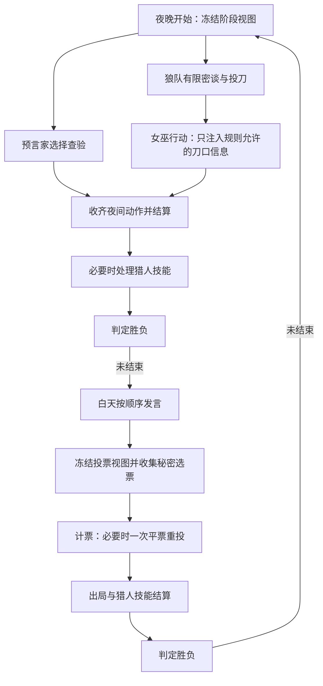

# AI 狼人杀设计草案

状态：讨论稿，尚未实现。2026-09-21。

已确认的产品方向：在 AelionBot 中增加狼人杀，用户可以和 AI 一起玩，也可以旁观全 AI 对局。本文提出首版规则、代码边界和小模型实验方法；人数、具体规则和模型分工是建议默认值，不代表已经验证的效果。

## 产品体验

侧栏增加“游乐场”，第一项是“狼人杀”。创建对局时选择“我来参加”或“观看 AI 对局”，沿用已有模型配置，允许邀请已有伙伴、用临时玩家补齐座位。邀请仅复制名字、头像、明确选择的游戏性格和模型选择，不修改伙伴类型，不带入工作职责、聊天和长期记忆。

首版建议九人：3 狼人、1 预言家、1 女巫、1 猎人、3 村民。相比此前六人设想，这个配置能同时覆盖五种角色和狼队协作；对局长度及阵营平衡需要实测。真人模式为 1 人 + 8 AI，观战模式为 9 AI，座位数不受现有群聊 8 Bot 上限约束。

牌桌显示座位、存活状态、当前发言者和公开记录；侧栏显示自己的身份、技能、查验结果和私人笔记；底部只显示本阶段合法操作。白天可自由输入发言，投票、查验、救人等操作使用明确的目标按钮。玩家发言中的“我投 3 号”是公开表态，只有投票按钮提交才改变选票。

支持暂停、继续、结束对局和重启后恢复。真人回合默认等待用户；AI 超时按下面的错误策略处理。用户出局后保留有限视角观战，也可主动切换全知视角，但切换后不能接管仍存活的座位。首版不做中途接管。

全 AI 观战可切换公开、指定玩家和全知视角。切换只影响展示，不改变 AI 输入。赛后可以逐回合查看当时的信息和动作，以及另开实验分支。首版不增加语音、警长竞选、自爆、联网多人和自动策略发布。

## 参考文章带来的设计约束

[内部实践文章](https://bytetech.info/articles/7663486474477649946)通过 bytedcli 阅读。本文吸收其工程经验：规则状态由单一引擎维护；执行顺序服从阶段依赖；推理输入严格按玩家过滤；先用合法随机策略验证完整对局；复盘区分规则错误、策略疑点和单纯输局。

文章的小样本胜率变化不足以证明策略泛化提升。其外部研究数字不作为本方案的性能承诺。重复出现的复盘标签也不能自动晋级为策略经验；需要独立核验和对照评测。

## 建议规则：nine-player-v1

这是产品自定义简化规则，开局前展示并冻结版本。

| 环节 | 建议行为 |
| --- | --- |
| 身份 | 随机分配；狼人知道队友，其他人只知道自己的身份 |
| 狼人行动 | 每位存活狼人按座位顺序获得一次短密谈机会，然后秘密提交刀人目标；得票最多者为刀口，同票由当夜轮值狼队长在同票目标中的选票决定 |
| 狼队长 | 存活狼人按座位排序，按夜次循环选出；不赋予额外信息；只能攻击存活非狼人，首版不空刀 |
| 预言家 | 每夜可查验一名其他存活玩家，私下得到狼人/好人结果；允许重复查验 |
| 女巫 | 解药、毒药各一瓶，每夜最多使用一瓶；解药尚在时可见刀口；首夜可自救，之后不可；毒药可选其他存活玩家 |
| 夜间结算 | 收齐动作后同时结算；解药只抵消刀伤，不抵消毒；当夜被杀的角色仍完成自己的夜间行动 |
| 猎人 | 被刀或被投出局可以开枪一次，也可以放弃；被毒则不能开枪；被刀且被毒按中毒处理；开枪时公开猎人身份 |
| 白天 | 公布死亡座位，不公开死因和完整身份；存活玩家每人一次顺序发言，起点每一天按座位轮换 |
| 投票 | 存活者秘密提交，允许弃票、不允许投自己；收齐后公开票型；最高票同票者各补充一次发言，再由其他存活者投同票候选；再次同票或全部弃票则无人出局 |
| 胜负 | 处理完死亡与猎人技能后判定：狼人全部死亡，好人胜；否则存活狼人数量大于等于存活好人，狼人胜；全员死亡算平局 |
| 终止 | 不做遗言回合；达到预设最大天数或模型调用预算则暂停并标记“未完成”，不伪装成阵营胜负 |

狼队同票若轮值队长投票不属于最高票集合，则由最高票集合按持久化种子随机选定，并记录选择事件。公开规则让分歧处理可预测，后续再实验更复杂的协商。

## 阶段与信息边界

预言家结果只提交到其私人事件流，不能影响其他夜间玩家收到的视图。投票阶段所有人基于同一个公开版本作出决定，先返回的选票不能被后返回者看见。逻辑独立的调用可以并行，实际并发受每个 provider 的额度和本机推理资源限制；九个角色不意味着九份模型权重或九路同时推理。

信息分为公开事件、本人私人事件、狼队频道和引擎内部记录。每条事件由引擎赋予可见范围，模型不能自行指定读者或写入任意频道。玩家自己的主动跳身份、狼人伪装和诈唬属于允许的游戏行为；引擎把别人的身份塞进上下文属于信息泄露，两者必须分开。

Electron 主进程维护完整状态，发给 renderer 的也是经过过滤的 DTO。完整身份、随机种子、其他玩家私人记录不能进入通用 app snapshot 后仅靠 CSS 隐藏。全知回放接口按当前模式及是否已结束授权。这里保证应用正常使用和 Agent API 的隔离，不宣称能防止设备拥有者调试本地进程或数据库。

## 决策、发言与记忆

所有玩家控制器共用一个边界：输入 PlayerObservation、合法动作、阶段请求 ID 和截止时间，输出候选动作。人类按钮、规则策略、本地模型和远端模型都通过相同的提交校验。

规则引擎负责 actor、phase、合法目标、次数、资源和去重校验。提交携带 gameId、phaseId、requestId；迟到、重复和过期回答不能推进状态。并行阶段采用阶段请求及独立槽位校验，不能因另一人的合法提交递增全局 revision 而误拒绝剩余回答。

首版发言阶段由同一个决策模型生成公开台词和可选的简短私有策略备注，一次调用完成。狼人杀的语言本身是动作，不能默认先决定投票再让无上下文的小模型随意润色。私有备注仅为模型报告，回放中不标为真实内心或隐藏推理。

上下文包含冻结的游戏人格、规则摘要、当前结构化事实、本人私人结果、公开发言及本人可见的阵营记录。发言记录是带来源的数据，不能升级成规则指令。游戏运行时不开放文件、Shell、MCP、工作历史搜索和跨局聊天读取。

事实与说法分开保存。例如“3 号声称 7 号是狼”是一条引用发言的 claim；只有预言家自己的合法查验结果才是其私人事实。模型抽取或总结必须保留原事件引用，失败时回退原文。关键查验、药品、存活状态和票型由结构化代码维护，不依赖有损摘要。

记忆以 gameId + seatId 隔离。首版不自动把游戏内容写回工作记忆。未来允许保存的跨局内容应是独立游戏偏好和经验证的策略版本，不能把“某人在上一局是狼”作为新局身份依据。

## 端侧模型与 Laya 的具体作用

**首版游戏能用现有模型跑通；本地模型是可替换的控制器和可测量的辅助组件。** 不让额外模型成为启动狼人杀的前提。

| 工作 | 第一版默认 | 小模型实验 | 判断是否值得保留 |
| --- | --- | --- | --- |
| 回合、计票、技能和胜负 | 确定性代码 | 无需模型 | 规则测试和回放一致性 |
| 发言、投票、夜间策略 | 已配置的模型 | Qwen3-0.6B/1.7B 作为独立对手 | 合法率、策略表现、响应时间 |
| 发言的有限标签 | 不额外调用模型 | Laya 判断指控/辩护/身份声明等 | 人工标注测试集上的准确率 |
| 从发言提取对象和主张 | 保留原文及来源 | Qwen 抽取 claim，代码验证 seat ID 与引用 | 抽取精确率、遗漏、串人情况 |
| 候选策略排序 | 不增加中间层 | Laya 在少量候选间选择 | 对照收益、选项顺序敏感性 |
| 何时求助较强模型 | 每座位固定策略，预算显式限制 | 规则触发基线，再比较学得的升级路由 | 同等质量下的总成本与端到端耗时 |
| 娱乐性短反应 | 模板或玩家模型 | Qwen 生成受限短句 | 不改变事实、避免泄露策略、主观体验 |

Laya 的 choice 需要预先定义候选；它不能直接生成“谁说了什么”的任意结构化文本，也不能生成狼人杀台词。中文使用 multilingual 版本。官方模型卡明确提示基础模型零样本局限和概率校准需求；置信分数不能直接当作真实身份概率或自动切换依据。狼人杀领域能力尚未测试。[Laya 模型卡](https://huggingface.co/convaiinnovations/laya)

Qwen3-0.6B 支持非 thinking 模式，可以作为端侧实验配置。短输出和窄任务可能更适合互动延迟，但是否足以处理中文博弈需要测量。[Qwen 模型卡](https://huggingface.co/Qwen/Qwen3-0.6B)

具体例子：“我是预言家，昨晚验了 7 号，他是狼。”Laya 可尝试标记“身份声明/指控”，Qwen 可尝试抽取 speaker=3、claimedRole=seer、target=7、claimedResult=wolf。引擎只确认这段话已公开，其他 AI 自己判断可信度；不能把 claimedResult 写入真实身份表。

首个 Laya 实验采用旁路运行：输入与玩家相同的可见片段，记录预测，不改变真实行动。它的运行失败不影响比赛。正式接管前固定模型版本、准备独立标注数据、校准概率并测试领域偏移。模型输出错误仍可能是高置信度，因此置信阈值不是唯一保障。

本地推理放在独立受管进程，权重按需下载，提供校验、启动健康检查、队列、取消、退出和闲置卸载。多个玩家共享模型服务，绝不共享未隔离的对话缓存。先按一个 checkpoint 一条推理队列测量，再调并发。Qwen 可延续 llama.cpp 路径；Laya 优先做官方 Python 适配实验，Electron 分发再比较 ONNX 社区封装与 Python sidecar 的体积和兼容性。

混合路线未必节省：总开销包含本地分类、抽取、云端升级和额外上下文。应与“直接让一个模型完成一次行动”比较，不只展示云端调用数量下降。纯本地模式不得静默升级云端；混合模式在创建对局时明确启用。

## 代码落点

| 模块（拟新增） | 职责 |
| --- | --- |
| electron/core/games/werewolf/rules.ts | 纯规则状态转换、合法动作、结算和版本 |
| electron/core/games/werewolf/observation.ts | 玩家/观众视图和事件可见范围 |
| electron/core/games/session.ts | 阶段调度、请求去重、暂停恢复和预算 |
| electron/core/games/player.ts | Human / Rule / LLM 控制器接口 |
| electron/core/games/store.ts | 专用 SQLite 对局、事件、请求、用量与版本 |
| electron/core/games/model-adapter.ts | 使用冻结的模型选择调用现有传输，扩展结构化输出能力 |
| src/game-types.ts、src/WerewolfPage.tsx | 可见 DTO、创建对局、牌桌、私人面板和回放 |

App.tsx、electron/main.ts、preload.ts、AelionAPI 增加 games 入口和 IPC。已有头像、模型设置、语言主题、请求计时和用量解析可以复用。

不把游戏做成新的持久 Bot 类型。现有 BotRuntime 按 botId 限制并发，GroupChats 收到消息会广播并刷新其他成员推理，Harness 会注入长期记忆和工作工具；因此新增 GameSession，游戏实例不经过通用 Harness，也不修改现有群聊调度。

现有 ModelClient 可以通过配置与密钥回调复用传输，但 provider 的公开方法主要按 botId 取配置。需增加按 ModelSelection 解析配置/凭据的明确接口，以 gameId + seatId 标记游戏调用，不能用临时座位 ID 冒充已存在的工作 Bot。配置在开局冻结，密钥继续由主进程解析，绝不落进回放。

首版只抽取 observation、actions、transition、outcome、events 这些游戏边界，不预建通用 DAG 编辑器。狼人杀跑通后再用斗地主验证通用接口。

## 错误、恢复和回放

状态转换与事件追加在同一数据库事务提交。每个决策请求记录 pending、completed、failed 或 cancelled；重启后对局暂停在最后提交位置，用户继续时只重做未提交决策。记录初始随机状态、规则版本、实际动作、超时与降级事件，按事件重放，无需重新调用模型。

非法结构或目标允许一次受限修复调用，修复只携带本人视图和校验错误；仍失败时投票弃票、技能放弃、发言显示跳过。狼刀等必须执行的动作使用预先声明的合法规则后备策略。连续失败或凭据错误暂停对局，界面解释原因；不无限重试，也不把后备动作计成模型成功。

真人无操作默认等待，用户可显式选择托管。暂停取消未提交推理，晚到结果失效。云端取消不等于一定停止计费。单局达到预算上限时暂停，不悄悄切换模型或增加预算。

回放恢复实际记录。分支重赛复制当时完整引擎状态，但给各玩家的仍是其当时视图，并使用新 gameId/branchId，不能带入原结局。界面应区分历史回放与重新推演。

## 交付顺序与验证

1. 纯规则和随机控制器：覆盖完整比赛、药品与猎人交互、平票、同时死亡、重复/迟到提交和种子重放。用批量种子检测不变量，未完成局单列。
2. 人机牌桌与全 AI 观战：接已有 provider，完成真人操作、有限视图、暂停恢复和实际用量。提供离线假模型完成 UI/错误路径验证，再小规模真实对局验收。
3. Qwen 本地对手：对照 0.6B、已有 1.7B 配置和远端基线，记录冷启动、热态延迟、内存、整局耗时及中文动作质量。
4. Laya 旁路实验：从真实公开发言建立带来源的标注集，先评估分类；收益明确后再实验策略排序或升级路由。
5. 赛后策略改进：候选经验版本化，对照评测后再决定采用。首版只预留事件和版本，不实现自动发布。

信息隔离测试应断言玩家请求、renderer DTO、摘要、日志展示和缓存输入均不含无权读取的信息。对相同公开视图，仅替换某玩家无权知道的身份，其序列化 observation 应保持不变；对实际模型动作不要求跨调用绝对相同。

比赛指标包括完成率、模型原始非法率、修复/后备比例、请求失败、可见信息泄露、各阵营胜率、行动与整局延迟、实际 token 和费用。token 未报告时标记未知；没有可信价格时不显示虚构费用。超预算和失败局都计入完成率，不从报表中悄悄删除。

策略比较固定规则和模型版本，使用多个配对种子、轮换座位与角色、固定对手群，并保留未参与调优的种子。单独更换一侧策略，报告有效样本及置信区间。少量对局只验流程；跨局不断重复看结果再决定停测，需要预设停止规则，不能把偶然领先说成稳定提升。

复盘必须区分引擎可证明的规则错误、模型提出的策略疑点和最终输局。赛后全知信息可用于展示事实，但判断当时决策质量时只提供当时玩家视图。未来学习数据按整局/种子切分，避免同局轨迹同时落入训练和测试。
