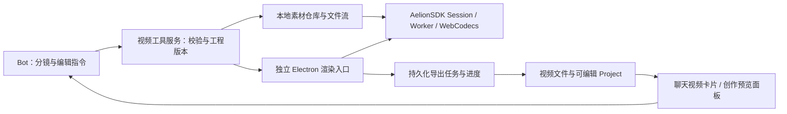

# AelionSDK 集成到 AelionBot 的评估

日期：2026-09-13。范围：源码、发行包元数据、现有 Bot 接入点，以及隔离 Electron 实例的轻量编码探测。本次没有修改 AelionBot 产品代码、安装 SDK 运行依赖或执行完整 SDK 导出。

## 结论

值得集成。AelionSDK 能成为 AelionBot 的视频编辑与渲染引擎，提供可反复修改的本地创作工程。推荐先交付「对话驱动创作 + 视频预览 + 可编辑工程 + 异步导出」，之后根据实际使用再扩展完整手动时间线。

技术适配性较高，产品化工作量中等。主要工作不是让 TS 调用 TS，而是素材读写、独立渲染运行环境、任务生命周期、视频交付和设备兼容。

## 已核对的依据

- AelionSDK main：`aba1191a42891781ce293b2deabca4e8baf2abba`；仓库版本、GitHub 正式发行与 npm latest 均为 2.0.0（查询时间为本评估日期）。
- SDK：浏览器优先、框架无关；Composition/Project/Session API，事务编辑、撤销重做、字幕、音频、动画和导出已存在。
- 开发依赖要求 Node `>=24 <25`。本次探测 AelionBot 使用的 Electron 44.2.0 内嵌 Node 24.20.0、Chromium 152.0.7977.76，运行时版本方向吻合。
- SDK Vite 插件的 peerDependency 是 `vite ^7.3.6`，Bot 当前为 Vite 8。这是需要验证的构建适配点，不能用忽略 peerDependencies 代替验证。
- SDK 是 MIT；内部 Mediabunny 为 MPL-2.0。应保留第三方许可记录，并按实际引入/修改的文件处理分发要求。

## 能给 Bot 带来的创作能力

| 创作任务 | SDK 已有基础 | AelionBot 要补的部分 |
|---|---|---|
| 图片、文案生成讲解/宣传短片 | 图片、文本、形状、关键帧、Composition | 分镜规划、模板、素材选择、工具封装 |
| 用户上传视频后剪辑 | 素材探测、时间线、trim/split/move、转场 | 视频素材入口、可见编辑结果、修改指令映射 |
| 字幕、背景音乐、已有旁白编排 | Caption、SRT/WebVTT、混音与淡入淡出 | 字幕编辑交互、素材授权、音视频检查 |
| 多轮自然语言修改 | Project JSON、revision、事务与 undo/redo | 工程持久化、版本冲突处理、修改摘要 |
| 导出并在聊天交付 | MP4/WebM/GIF/图片/WAV，导出 Job/sink | 文件落盘、视频播放、取消/失败/重启状态 |

「创作」首先是把素材与程序化视觉效果编排成作品。文字生成真实拍摄风格镜头、语音合成、语音识别和语义选镜不由这个剪辑引擎自动提供。需要时再接入明确选择的生成/识别服务，并明确其成本；首版可用用户提供的图片、视频、音乐、旁白和字幕完成本地创作。

SDK 的完整参考编辑器是独立仓库 AelionStudio；SDK 自身并不提供可直接嵌入的完整 React 剪辑器。可以借鉴其 Session 生命周期和交互模式，不能把引擎接入等同于获得成品编辑 UI。

## 本机 Electron 探测

使用独立 userData、隐藏 BrowserWindow、`nodeIntegration:false`、`contextIsolation:true`、`sandbox:true`，加载本地测试页。探测实例已经退出，没有操作用户的 Bot 会话或 VM。

| 项目 | 实测 |
|---|---|
| secureContext | true |
| crossOriginIsolated | false |
| OffscreenCanvas、WebGL2 | 可用 |
| WebGPU | API 存在，未验证实际 adapter/render 路径 |
| H.264 / VP9 / AV1 / HEVC 配置查询 | 1080p30 测试配置均报告支持 |
| H.264 单帧实际编码 | 成功，8,173 字节编码输出 |
| AAC 实际编码 | 按 SDK 四块 f32 音频及 AAC 参数复测成功，1,366 字节输出 |
| Opus 实际编码 | 同类短输入成功，15 字节输出 |

最初简化的单块平面音频测试出现 AAC `Flushing error`；按 SDK 实际输入方式、bitrateMode 和 AAC 格式设置重新测试后成功。不能把初次结果认定为 Electron 不支持 AAC，也不能仅凭 isConfigSupported=true 宣称所有配置可用。这里没有单独隔离哪一个参数造成差异。

完整证据见 [探测记录](AelionSDK-Electron-Probe-20260913.json)。这只是编码基础验证，不是完整 SDK 时间线、混音、封装、导出质量或长期性能验证。SDK 自带的 Chrome 基准包含高性能 NVIDIA 参考设备，也不能直接当作所有 Bot 用户的性能承诺。

## 推荐架构

- Bot 负责创意、分镜、选择素材与调用有明确 schema 的编辑操作；SDK 负责时间线和渲染。模型不用每次重写整个 Project JSON 或一份 TS 程序。
- Node 主进程管理路径、授权、工程版本、任务队列和文件句柄；Session 在独立的 Chromium 渲染上下文中运行，重活继续使用 SDK Worker。普通 Node 工具进程没有完整 WebCodecs/Canvas 浏览器环境。
- 独立页面按需启动、空闲释放；长导出不能依赖聊天组件是否仍挂载，也不能因切换 Bot 或关闭预览而消失。
- 不建议首版把核心渲染放入 QEMU 工作电脑。宿主 Electron 已具备本机图形/编码基础，VM 的虚拟显卡、软件渲染和素材跨环境复制会增加不确定性。
- 独立 renderer 并不隔离所有 GPU/显存竞争。需要应用级排队；初版最多一个重型导出任务运行，交互预览采用较低分辨率与有界缓存。SDK 资源管理器的默认队列优先级是 export 高于 preview，产品层需要明确自己的调度策略。

## 七项主要接入工作

1. **工具适配层**：建议提供 `video_project_create`、`video_asset_import`、`video_edit`、`video_preview`、`video_export`、`video_job_status`、`video_job_cancel` 等窄接口。这些是建议新增的工具，不是目前已有能力。编辑操作使用 SDK semantic commands，携带 expectedRevision；SDK bigint revision 在 JSON/IPC 边界转换为字符串。查询返回工程摘要或指定时间段，不反复塞入全部时间线。
2. **大文件素材仓库**：当前聊天附件限制单文件 25 MiB、总计 100 MiB。1 分钟 5 Mbps 视频本身约 37.5 MB，尚未计音频。不能只提高数字并继续整文件复制；应采用授权资产 ID、磁盘文件和 Range/分块读取，向 SDK 绑定 File/Blob 或 RangeReader。跨 Bot/群交接同时处理工程与素材权限，不共享任意本机路径。
3. **视频预览与交付**：现有 ArtifactPreview 没有视频分支，部分文件走全量读取/base64。新增流式 video/audio 播放、封面、时长、下载，以及可重新打开的工程附件；不能把大视频塞进聊天状态或工具 JSON。
4. **运行资产与隔离**：打包 renderer/export Workers 与 AudioWorklets，验证生产 ASAR 路径。单独处理 CSP 的 worker/media/connect/font 规则。当前 file 页面 crossOriginIsolated=false，可以先使用 SDK 的有界音频消息回退；若引入 COOP/COEP 或独立安全协议，要验证所有子资源，而不是放宽整个应用的 CSP。
5. **导出任务服务**：把 SDK Job 的进度、取消、完成和诊断接入应用已有任务体系；完成状态以 Job 与 sink 成功落盘为准。主进程负责确认输出路径与附件生成。跨重启恢复要使用显式持久化和 SDK checkpoint 路径；普通 startProfile 是一次性作业，并不会自动支持重启续传。
6. **设备与编码降级**：首先验证 720p/1080p30 SDR、H.264/AAC MP4 和 WebM。预检失败时明确提示、降低分辨率或提供 WebM；若产品要求所有支持设备都能交付 MP4，再评估宿主原生编码/FFmpeg 适配。SDK 声明没有可执行的通用 WASM 编码兜底；远程导出也是要自行实现 Provider 的接口，不是开箱即用的云渲染服务。
7. **创作 Skill 与模板**：加入视频创作流程：需求/分镜 → 素材 → 工程 → 低清预览 → 按反馈修改 → 成片检查 → 附件交付。提供少量可定制的图文、产品讲解和录屏剪辑模板；仅按需读取 SDK/API 参考。字幕和关键帧抽样用于检查，不把每帧图片发给模型。

## 分阶段建议

### 第一阶段：验证完整链路

用真实 Electron 生产构建入口做一个 30 秒、720p、几张图片/视频片段、标题字幕和一段音频的项目。完成 Project 持久化、预览、MP4 导出、重新打开与取消；重启后能清晰识别作业状态。优先验证 Vite 8 运行资产、字体、AAC 封装、时间戳和音画同步。

验收不止看“生成了文件”：重新读取和播放导出物，核对时长、音频轨和关键帧；关闭预览、切换会话、取消导出后仍能恢复正常聊天；重复多轮任务后 Worker、解码器和缓存资源保持有界。

### 第二阶段：Windows 创作 MVP

提供附件导入、结构化编辑工具、视频卡片、轻量创作面板、导出进度、错误诊断和工程版本。默认以一条导出队列控制 CPU/GPU 开销。工程是主要可编辑成果，视频是其导出版本。

### 第三阶段：增强创作体验

按需求再做更完整的时间线交互、素材库、旁白/识别服务、复杂动画和多 Bot 协作。Mac、4K、HDR 和大规模硬件适配作为单独验收范围。

粗略工作量判断：如果由一位熟悉这两个项目的开发者实施，第一阶段可按 2–5 人日验证，Windows MVP 可按 2–4 周规划；这不是承诺工期，不包含全功能 NLE UI、生成式视频服务和大范围硬件认证。先做 PoC，才能把编码、素材与打包方面的不确定性收敛。

## 来源

- [SDK README 与能力边界](https://github.com/FoyonaCZY/AelionSDK/blob/aba1191a42891781ce293b2deabca4e8baf2abba/README.md)
- [正式发行 v2.0.0](https://github.com/FoyonaCZY/AelionSDK/releases/tag/v2.0.0)
- [SDK 包元数据](https://github.com/FoyonaCZY/AelionSDK/blob/aba1191a42891781ce293b2deabca4e8baf2abba/packages/sdk/package.json)
- [Vite 插件元数据](https://github.com/FoyonaCZY/AelionSDK/blob/aba1191a42891781ce293b2deabca4e8baf2abba/packages/vite-plugin/package.json)
- [Composition](https://github.com/FoyonaCZY/AelionSDK/blob/aba1191a42891781ce293b2deabca4e8baf2abba/apps/docs/src/content/docs/guides/composition-api.md)
- [导出实现与 AAC 运行探测](https://github.com/FoyonaCZY/AelionSDK/blob/aba1191a42891781ce293b2deabca4e8baf2abba/packages/export/src/webm-export.ts)
- [运行任务与 sink](https://github.com/FoyonaCZY/AelionSDK/blob/aba1191a42891781ce293b2deabca4e8baf2abba/apps/docs/src/content/docs/export/jobs-sinks.md)
- [设备兼容边界](https://github.com/FoyonaCZY/AelionSDK/blob/aba1191a42891781ce293b2deabca4e8baf2abba/apps/docs/src/content/docs/production/compatibility.md)
- [第三方许可](https://github.com/FoyonaCZY/AelionSDK/blob/aba1191a42891781ce293b2deabca4e8baf2abba/THIRD_PARTY_NOTICES.md)

AelionBot 本地接入点：`src/attachment-types.ts`、`electron/core/artifacts.ts`、`src/FilePreview.tsx`、`electron/core/harness.ts`、`electron/main.ts`、`index.html` 和 `package.json`。
